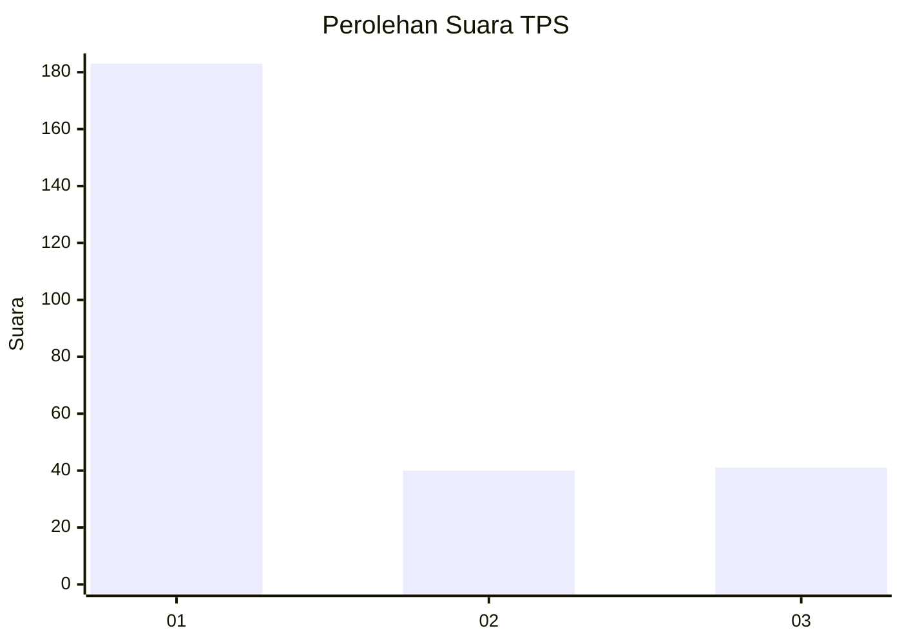
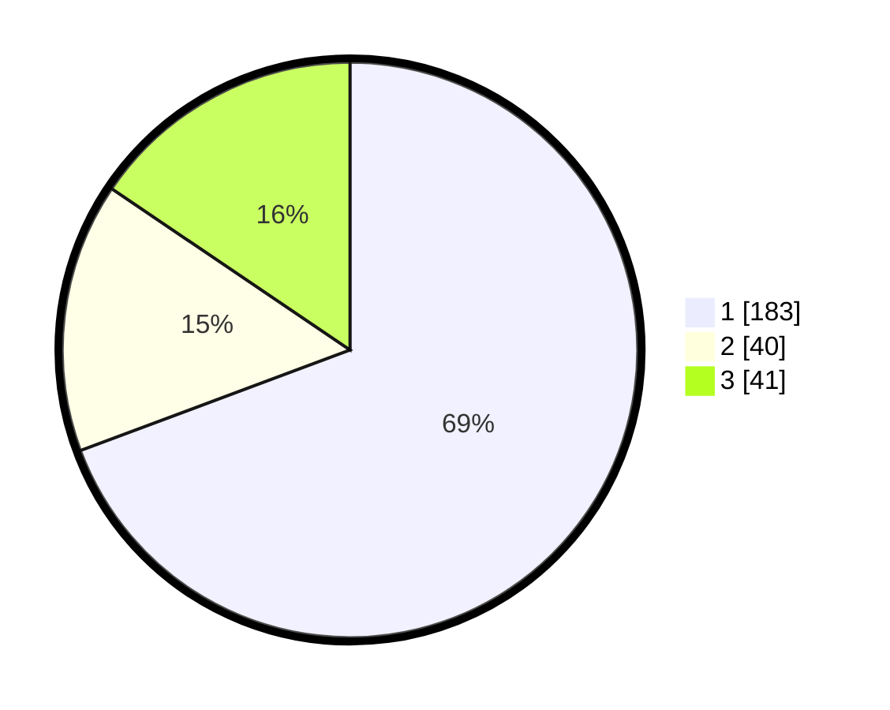

# Hasil

## Grafik

## Tabel

| No. | Nama Paslon    | Suara | Suara (raw) | Persentase |
|:--- |:-------------- | -----:| -----------:| ----------:|
| 1   | ANIES MUHAIMIN | 183   | [183][p-1]  | 69,32      |
| 2   | PRABOWO GIBRAN | 40    | [40][p-2]   | 15,15      |
| 3   | GANJAR MAHFUD  | 41    | [41][p-3]   | 15,53      |

[p-1]: https://github.com/gigit-pemilu/pemilu-2024/blob/main/pilpres/hitung-suara/sub/35-jawa-timur/sub/27-sampang/sub/14-karangpenang/sub/2002-tlambah/sub/015-tps/sub/paslon-1.txt
[p-2]: https://github.com/gigit-pemilu/pemilu-2024/blob/main/pilpres/hitung-suara/sub/35-jawa-timur/sub/27-sampang/sub/14-karangpenang/sub/2002-tlambah/sub/015-tps/sub/paslon-2.txt
[p-3]: https://github.com/gigit-pemilu/pemilu-2024/blob/main/pilpres/hitung-suara/sub/35-jawa-timur/sub/27-sampang/sub/14-karangpenang/sub/2002-tlambah/sub/015-tps/sub/paslon-3.txt

## Foto C Plano

https://sirekap-obj-formc.kpu.go.id/063e/pemilu/ppwp/35/27/14/20/02/3527142002015-20240214-235140--0a382691-2955-486a-97bf-7d35fd2717b8.jpg

https://sirekap-obj-formc.kpu.go.id/063e/pemilu/ppwp/35/27/14/20/02/3527142002015-20240214-235402--81b08581-ac74-4ae1-8920-4487060e4a68.jpg

https://sirekap-obj-formc.kpu.go.id/063e/pemilu/ppwp/35/27/14/20/02/3527142002015-20240214-235439--8f25b9d6-84de-4ab3-9491-648fbeadd75a.jpg

## Metadata

| Key        | Value               |
| ---------- | ------------------- |
| Time Stamp | 2024-02-16 11:00:29 |

