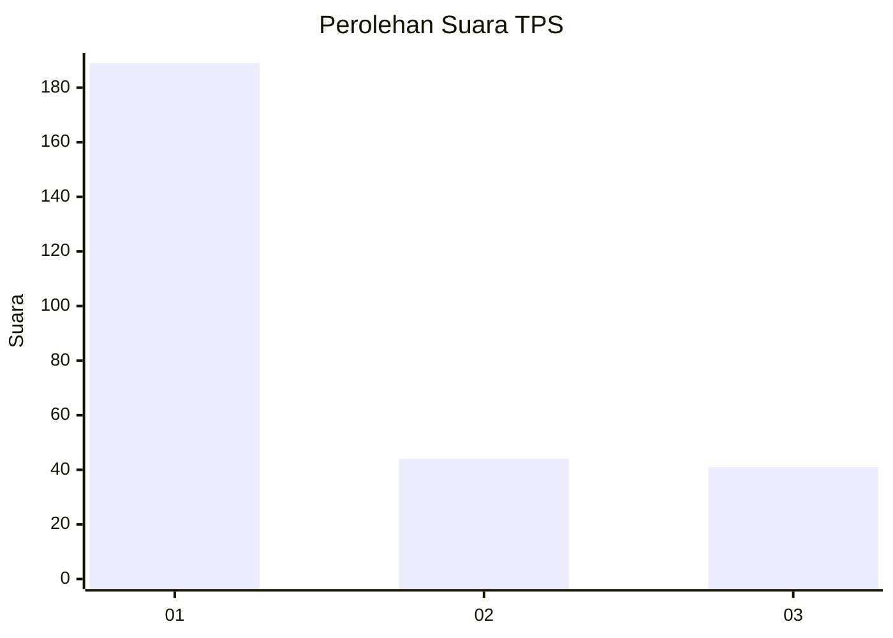
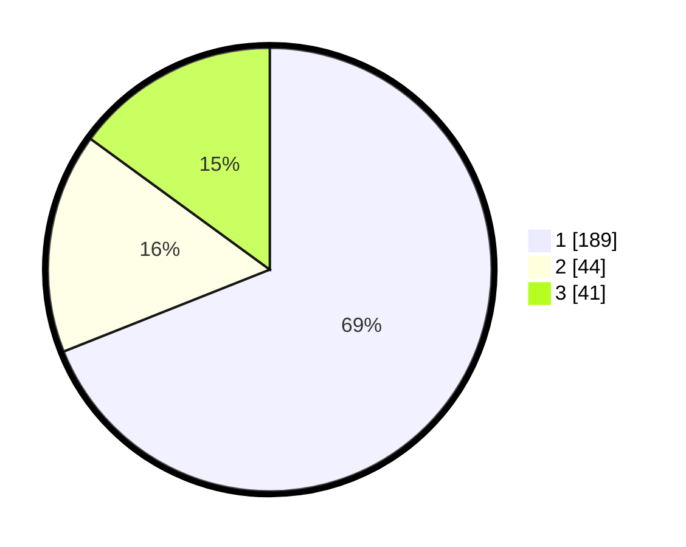

# Hasil

## Grafik

## Tabel

| No. | Nama Paslon    | Suara | Suara (raw) | Persentase |
|:--- |:-------------- | -----:| -----------:| ----------:|
| 1   | ANIES MUHAIMIN | 189   | [189][p-1]  | 68,98      |
| 2   | PRABOWO GIBRAN | 44    | [44][p-2]   | 16,06      |
| 3   | GANJAR MAHFUD  | 41    | [41][p-3]   | 14,96      |

[p-1]: https://github.com/gigit-pemilu/pemilu-2024/blob/main/pilpres/hitung-suara/sub/35-jawa-timur/sub/27-sampang/sub/14-karangpenang/sub/2002-tlambah/sub/016-tps/sub/paslon-1.txt
[p-2]: https://github.com/gigit-pemilu/pemilu-2024/blob/main/pilpres/hitung-suara/sub/35-jawa-timur/sub/27-sampang/sub/14-karangpenang/sub/2002-tlambah/sub/016-tps/sub/paslon-2.txt
[p-3]: https://github.com/gigit-pemilu/pemilu-2024/blob/main/pilpres/hitung-suara/sub/35-jawa-timur/sub/27-sampang/sub/14-karangpenang/sub/2002-tlambah/sub/016-tps/sub/paslon-3.txt

## Foto C Plano

https://sirekap-obj-formc.kpu.go.id/dcb8/pemilu/ppwp/35/27/14/20/02/3527142002016-20240214-214256--5eb33efb-413c-4211-bb66-caa9a9004c92.jpg

https://sirekap-obj-formc.kpu.go.id/dcb8/pemilu/ppwp/35/27/14/20/02/3527142002016-20240214-214432--a1624395-7575-4136-bf10-24aa89b5daea.jpg

https://sirekap-obj-formc.kpu.go.id/dcb8/pemilu/ppwp/35/27/14/20/02/3527142002016-20240214-214605--031f1e70-e521-4f68-8220-0d4c66659fcd.jpg

## Metadata

| Key        | Value               |
| ---------- | ------------------- |
| Time Stamp | 2024-02-16 11:00:29 |

