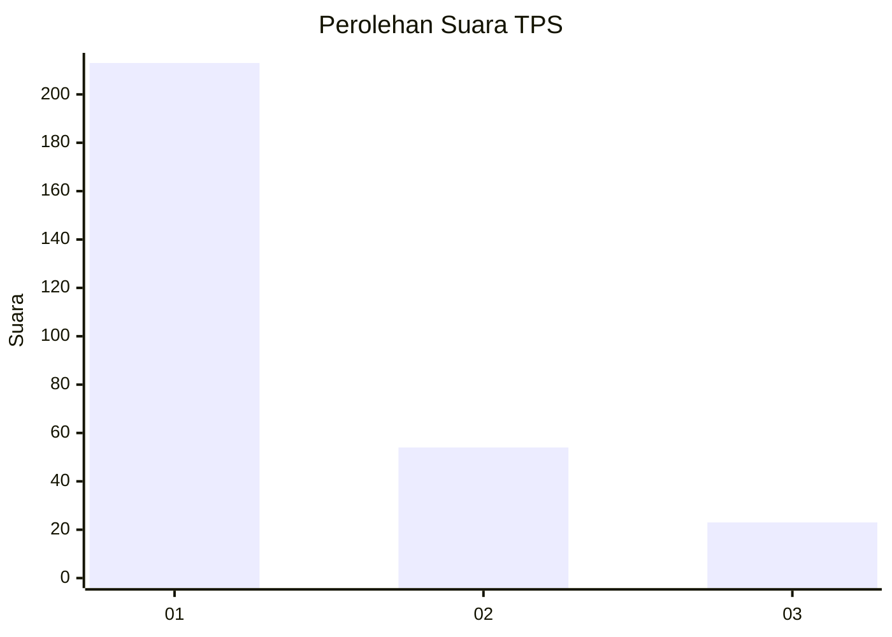
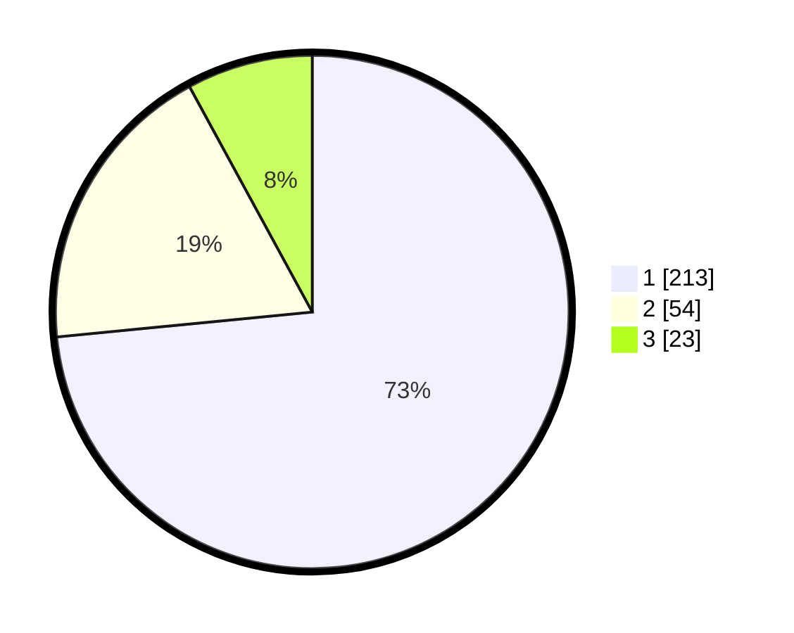

# Hasil

## Grafik

## Tabel

| No. | Nama Paslon    | Suara | Suara (raw) | Persentase |
|:--- |:-------------- | -----:| -----------:| ----------:|
| 1   | ANIES MUHAIMIN | 213   | [213][p-1]  | 73,45      |
| 2   | PRABOWO GIBRAN | 54    | [54][p-2]   | 18,62      |
| 3   | GANJAR MAHFUD  | 23    | [23][p-3]   | 7,93       |

[p-1]: https://github.com/gigit-pemilu/pemilu-2024/blob/main/pilpres/hitung-suara/sub/35-jawa-timur/sub/27-sampang/sub/14-karangpenang/sub/2002-tlambah/sub/018-tps/sub/paslon-1.txt
[p-2]: https://github.com/gigit-pemilu/pemilu-2024/blob/main/pilpres/hitung-suara/sub/35-jawa-timur/sub/27-sampang/sub/14-karangpenang/sub/2002-tlambah/sub/018-tps/sub/paslon-2.txt
[p-3]: https://github.com/gigit-pemilu/pemilu-2024/blob/main/pilpres/hitung-suara/sub/35-jawa-timur/sub/27-sampang/sub/14-karangpenang/sub/2002-tlambah/sub/018-tps/sub/paslon-3.txt

## Foto C Plano

https://sirekap-obj-formc.kpu.go.id/dcad/pemilu/ppwp/35/27/14/20/02/3527142002018-20240215-151320--079eab88-7ff6-424b-bb5d-e89e954f28e9.jpg

https://sirekap-obj-formc.kpu.go.id/dcad/pemilu/ppwp/35/27/14/20/02/3527142002018-20240215-151443--72e11b95-d879-4751-8cb0-883cdaf1a8c5.jpg

https://sirekap-obj-formc.kpu.go.id/dcad/pemilu/ppwp/35/27/14/20/02/3527142002018-20240215-130734--a6ad3a08-96c1-4acb-b3a7-65df075d734d.jpg

## Metadata

| Key        | Value               |
| ---------- | ------------------- |
| Time Stamp | 2024-02-16 11:00:29 |

