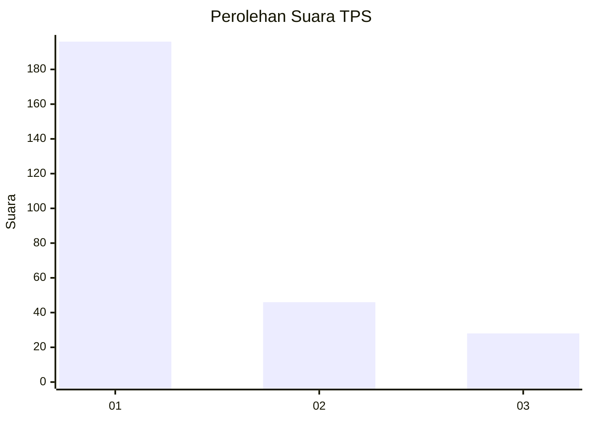
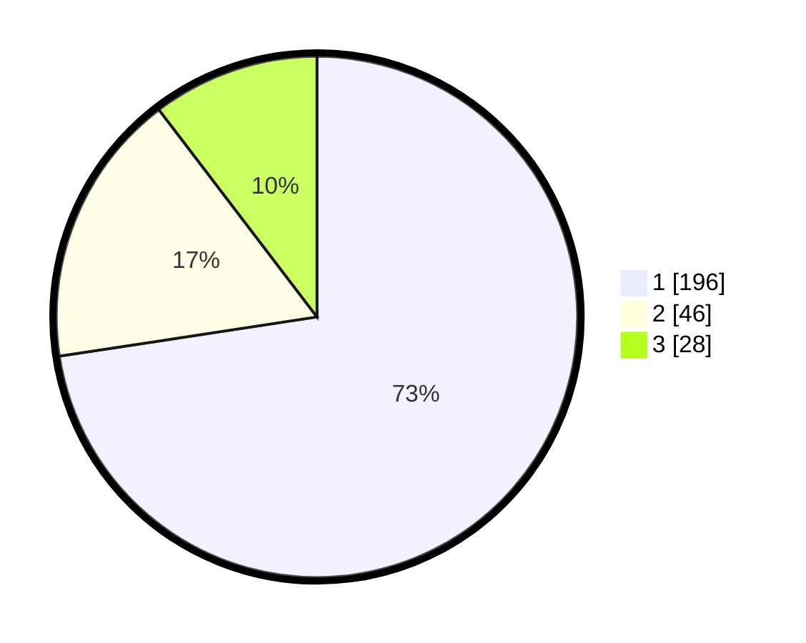

# Hasil

## Grafik

## Tabel

| No. | Nama Paslon    | Suara | Suara (raw) | Persentase |
|:--- |:-------------- | -----:| -----------:| ----------:|
| 1   | ANIES MUHAIMIN | 196   | [196][p-1]  | 72,59      |
| 2   | PRABOWO GIBRAN | 46    | [46][p-2]   | 17,04      |
| 3   | GANJAR MAHFUD  | 28    | [28][p-3]   | 10,37      |

[p-1]: https://github.com/gigit-pemilu/pemilu-2024-35-jawa-timur/blob/main/pilpres/hitung-suara/sub/35-jawa-timur/sub/27-sampang/sub/14-karangpenang/sub/2002-tlambah/sub/020-tps/sub/paslon-1.txt
[p-2]: https://github.com/gigit-pemilu/pemilu-2024-35-jawa-timur/blob/main/pilpres/hitung-suara/sub/35-jawa-timur/sub/27-sampang/sub/14-karangpenang/sub/2002-tlambah/sub/020-tps/sub/paslon-2.txt
[p-3]: https://github.com/gigit-pemilu/pemilu-2024-35-jawa-timur/blob/main/pilpres/hitung-suara/sub/35-jawa-timur/sub/27-sampang/sub/14-karangpenang/sub/2002-tlambah/sub/020-tps/sub/paslon-3.txt

## Foto C Plano

https://sirekap-obj-formc.kpu.go.id/b6ea/pemilu/ppwp/35/27/14/20/02/3527142002020-20240215-140329--4c0c3e75-7d5e-44b4-b87d-28100a9e9fc0.jpg

https://sirekap-obj-formc.kpu.go.id/b6ea/pemilu/ppwp/35/27/14/20/02/3527142002020-20240215-140501--0e8a763d-19de-4310-96e0-904fca7963b3.jpg

https://sirekap-obj-formc.kpu.go.id/b6ea/pemilu/ppwp/35/27/14/20/02/3527142002020-20240215-140606--3460d851-157e-452b-a91b-4be4f44353ee.jpg

## Metadata

| Key        | Value               |
| ---------- | ------------------- |
| Time Stamp | 2024-02-16 11:00:29 |

