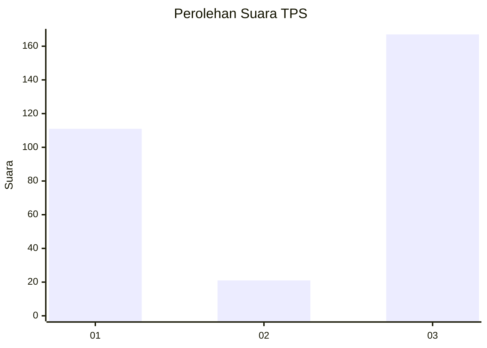
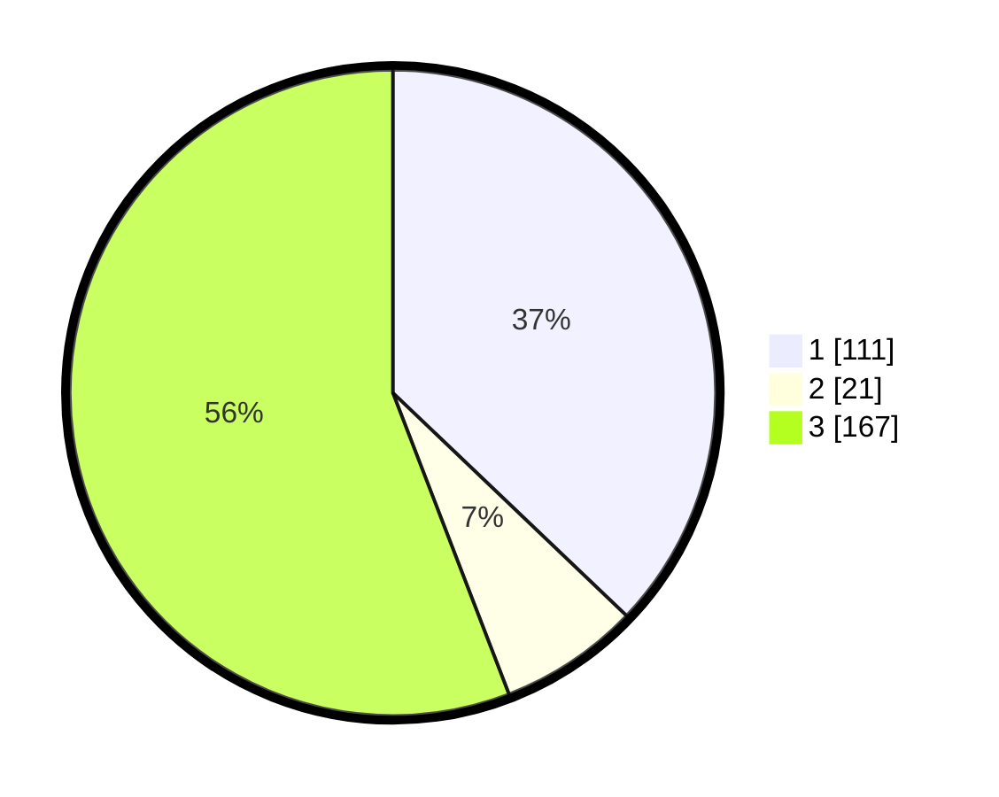

# Hasil

## Grafik

## Tabel

| No. | Nama Paslon    | Suara | Suara (raw) | Persentase |
|:--- |:-------------- | -----:| -----------:| ----------:|
| 1   | ANIES MUHAIMIN | 111   | [111][p-1]  | 37,12      |
| 2   | PRABOWO GIBRAN | 21    | [21][p-2]   | 7,02       |
| 3   | GANJAR MAHFUD  | 167   | [167][p-3]  | 55,85      |

[p-1]: https://github.com/gigit-pemilu/pemilu-2024/blob/main/pilpres/hitung-suara/sub/35-jawa-timur/sub/27-sampang/sub/14-karangpenang/sub/2002-tlambah/sub/021-tps/sub/paslon-1.txt
[p-2]: https://github.com/gigit-pemilu/pemilu-2024/blob/main/pilpres/hitung-suara/sub/35-jawa-timur/sub/27-sampang/sub/14-karangpenang/sub/2002-tlambah/sub/021-tps/sub/paslon-2.txt
[p-3]: https://github.com/gigit-pemilu/pemilu-2024/blob/main/pilpres/hitung-suara/sub/35-jawa-timur/sub/27-sampang/sub/14-karangpenang/sub/2002-tlambah/sub/021-tps/sub/paslon-3.txt

## Foto C Plano

https://sirekap-obj-formc.kpu.go.id/3bf6/pemilu/ppwp/35/27/14/20/02/3527142002021-20240215-091208--744d5044-8e6c-4d2f-bcf4-d1002c197d42.jpg

https://sirekap-obj-formc.kpu.go.id/3bf6/pemilu/ppwp/35/27/14/20/02/3527142002021-20240215-121519--8e6c09de-bcdd-4eea-bee4-d32c313ad671.jpg

https://sirekap-obj-formc.kpu.go.id/3bf6/pemilu/ppwp/35/27/14/20/02/3527142002021-20240215-121653--13c6a707-82bf-4b12-9f0d-f2741ea2d574.jpg

## Metadata

| Key        | Value               |
| ---------- | ------------------- |
| Time Stamp | 2024-02-20 11:00:00 |

