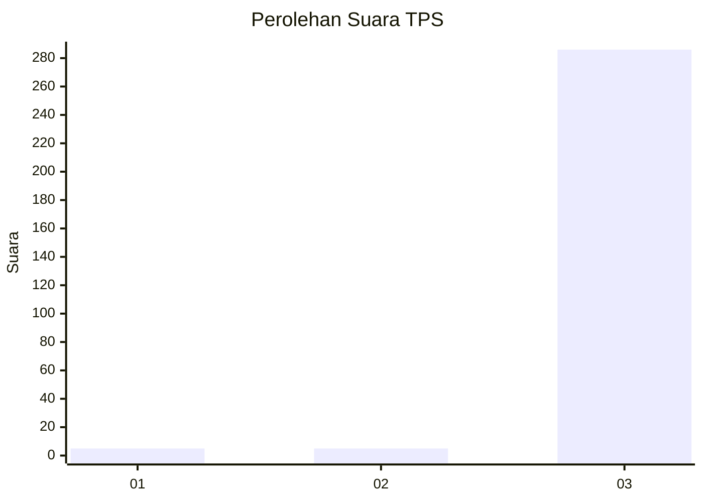
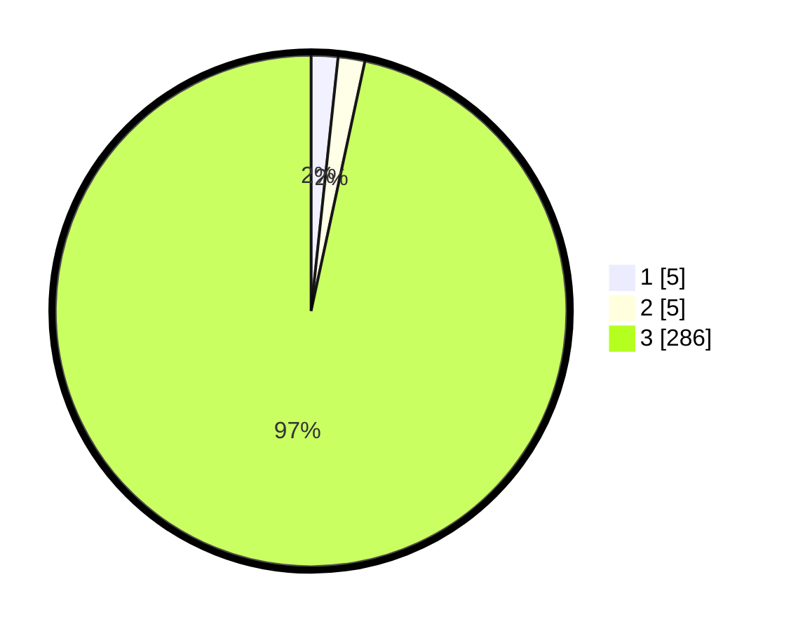

# Hasil

## Grafik

## Tabel

| No. | Nama Paslon    | Suara | Suara (raw) | Persentase |
|:--- |:-------------- | -----:| -----------:| ----------:|
| 1   | ANIES MUHAIMIN | 5     | [5][p-1]    | 1,69       |
| 2   | PRABOWO GIBRAN | 5     | [5][p-2]    | 1,69       |
| 3   | GANJAR MAHFUD  | 286   | [286][p-3]  | 96,62      |

[p-1]: https://github.com/gigit-pemilu/pemilu-2024/blob/main/pilpres/hitung-suara/sub/35-jawa-timur/sub/27-sampang/sub/14-karangpenang/sub/2002-tlambah/sub/023-tps/sub/paslon-1.txt
[p-2]: https://github.com/gigit-pemilu/pemilu-2024/blob/main/pilpres/hitung-suara/sub/35-jawa-timur/sub/27-sampang/sub/14-karangpenang/sub/2002-tlambah/sub/023-tps/sub/paslon-2.txt
[p-3]: https://github.com/gigit-pemilu/pemilu-2024/blob/main/pilpres/hitung-suara/sub/35-jawa-timur/sub/27-sampang/sub/14-karangpenang/sub/2002-tlambah/sub/023-tps/sub/paslon-3.txt

## Foto C Plano

https://sirekap-obj-formc.kpu.go.id/01a4/pemilu/ppwp/35/27/14/20/02/3527142002023-20240215-111218--2a2dbb3d-f8f7-47a3-b1f2-5cfadbbcfcf6.jpg

https://sirekap-obj-formc.kpu.go.id/01a4/pemilu/ppwp/35/27/14/20/02/3527142002023-20240215-105720--615dae06-b56c-4826-bc1a-048cadaf5e91.jpg

https://sirekap-obj-formc.kpu.go.id/01a4/pemilu/ppwp/35/27/14/20/02/3527142002023-20240215-110613--5ffb81a6-c0a6-473a-a12c-e1edc3482106.jpg

## Metadata

| Key        | Value               |
| ---------- | ------------------- |
| Time Stamp | 2024-02-16 11:00:29 |

