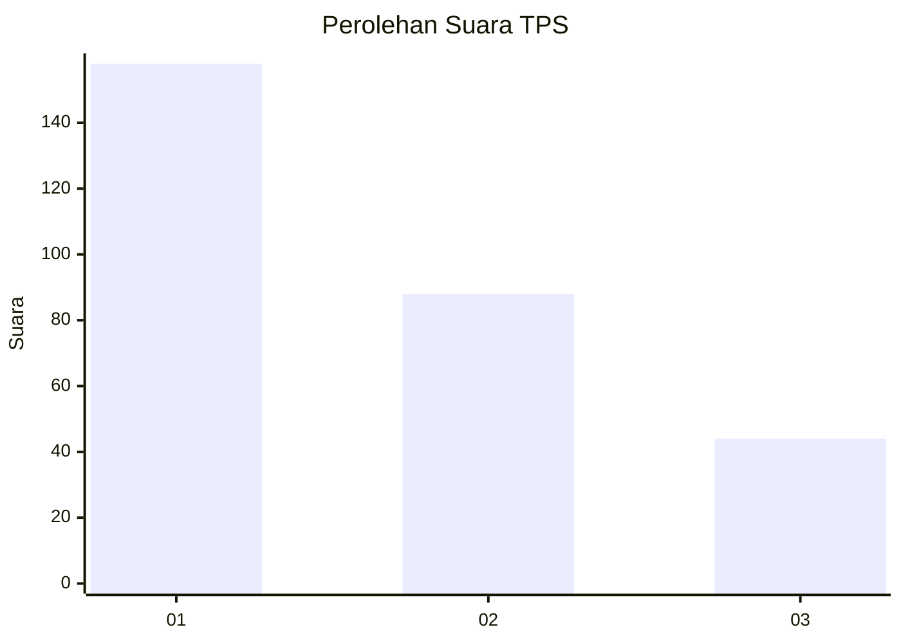
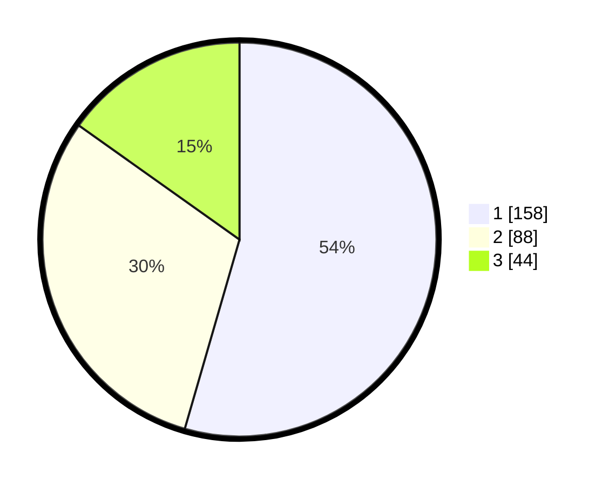

# Hasil

## Grafik

## Tabel

| No. | Nama Paslon    | Suara | Suara (raw) | Persentase |
|:--- |:-------------- | -----:| -----------:| ----------:|
| 1   | ANIES MUHAIMIN | 158   | [158][p-1]  | 54,48      |
| 2   | PRABOWO GIBRAN | 88    | [88][p-2]   | 30,34      |
| 3   | GANJAR MAHFUD  | 44    | [44][p-3]   | 15,17      |

[p-1]: https://github.com/gigit-pemilu/pemilu-2024-35-jawa-timur/blob/main/pilpres/hitung-suara/sub/35-jawa-timur/sub/27-sampang/sub/14-karangpenang/sub/2002-tlambah/sub/024-tps/sub/paslon-1.txt
[p-2]: https://github.com/gigit-pemilu/pemilu-2024-35-jawa-timur/blob/main/pilpres/hitung-suara/sub/35-jawa-timur/sub/27-sampang/sub/14-karangpenang/sub/2002-tlambah/sub/024-tps/sub/paslon-2.txt
[p-3]: https://github.com/gigit-pemilu/pemilu-2024-35-jawa-timur/blob/main/pilpres/hitung-suara/sub/35-jawa-timur/sub/27-sampang/sub/14-karangpenang/sub/2002-tlambah/sub/024-tps/sub/paslon-3.txt

## Foto C Plano

https://sirekap-obj-formc.kpu.go.id/d4bd/pemilu/ppwp/35/27/14/20/02/3527142002024-20240215-065701--81d2ef6a-da37-4914-bcff-ea525cc4da9e.jpg

https://sirekap-obj-formc.kpu.go.id/d4bd/pemilu/ppwp/35/27/14/20/02/3527142002024-20240215-142417--da9ab24d-fe26-4c95-82af-3249fb1f9b3c.jpg

https://sirekap-obj-formc.kpu.go.id/d4bd/pemilu/ppwp/35/27/14/20/02/3527142002024-20240215-142508--4fee4099-7f53-4c6f-a985-e7632904111c.jpg

## Metadata

| Key        | Value               |
| ---------- | ------------------- |
| Time Stamp | 2024-02-15 22:30:27 |

