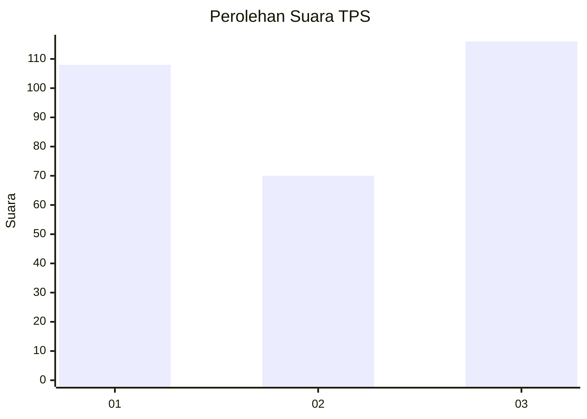
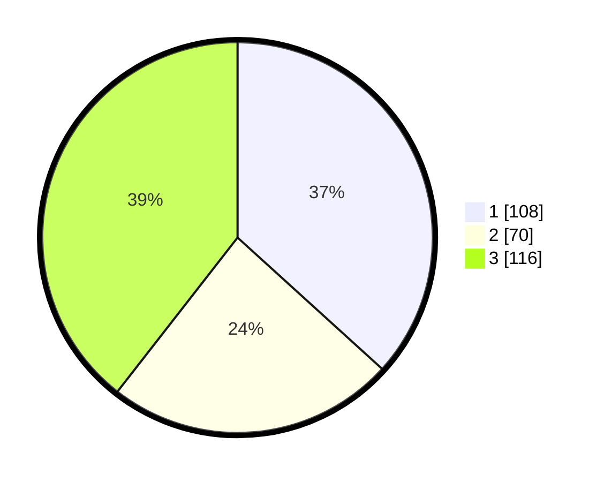

# Hasil

## Grafik

## Tabel

| No. | Nama Paslon    | Suara | Suara (raw) | Persentase |
|:--- |:-------------- | -----:| -----------:| ----------:|
| 1   | ANIES MUHAIMIN | 108   | [108][p-1]  | 36,73      |
| 2   | PRABOWO GIBRAN | 70    | [70][p-2]   | 23,81      |
| 3   | GANJAR MAHFUD  | 116   | [116][p-3]  | 39,46      |

[p-1]: https://github.com/gigit-pemilu/pemilu-2024-35-jawa-timur/blob/main/pilpres/hitung-suara/sub/35-jawa-timur/sub/27-sampang/sub/14-karangpenang/sub/2002-tlambah/sub/025-tps/sub/paslon-1.txt
[p-2]: https://github.com/gigit-pemilu/pemilu-2024-35-jawa-timur/blob/main/pilpres/hitung-suara/sub/35-jawa-timur/sub/27-sampang/sub/14-karangpenang/sub/2002-tlambah/sub/025-tps/sub/paslon-2.txt
[p-3]: https://github.com/gigit-pemilu/pemilu-2024-35-jawa-timur/blob/main/pilpres/hitung-suara/sub/35-jawa-timur/sub/27-sampang/sub/14-karangpenang/sub/2002-tlambah/sub/025-tps/sub/paslon-3.txt

## Foto C Plano

https://sirekap-obj-formc.kpu.go.id/b691/pemilu/ppwp/35/27/14/20/02/3527142002025-20240215-151815--565543d5-be8e-4618-9887-b3fe58cfa8c1.jpg

https://sirekap-obj-formc.kpu.go.id/b691/pemilu/ppwp/35/27/14/20/02/3527142002025-20240215-151910--e718d844-b1d9-4301-a274-519f0b5815b5.jpg

https://sirekap-obj-formc.kpu.go.id/b691/pemilu/ppwp/35/27/14/20/02/3527142002025-20240215-152158--828a8979-bed2-4a72-a5c9-a59e297a9c9e.jpg

## Metadata

| Key        | Value               |
| ---------- | ------------------- |
| Time Stamp | 2024-02-16 11:00:29 |

