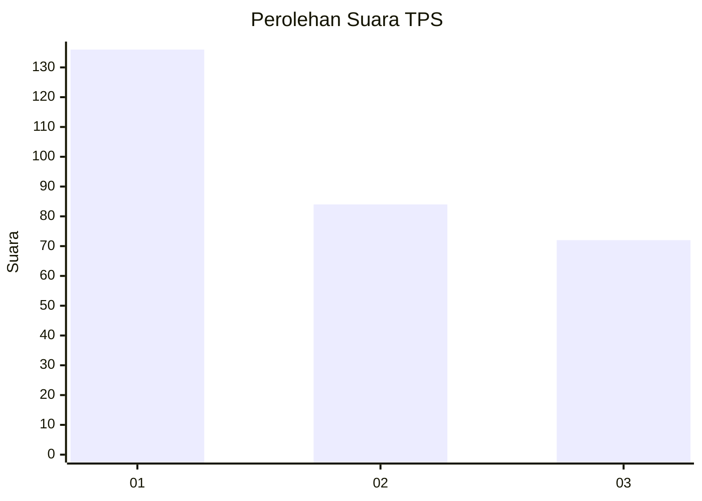
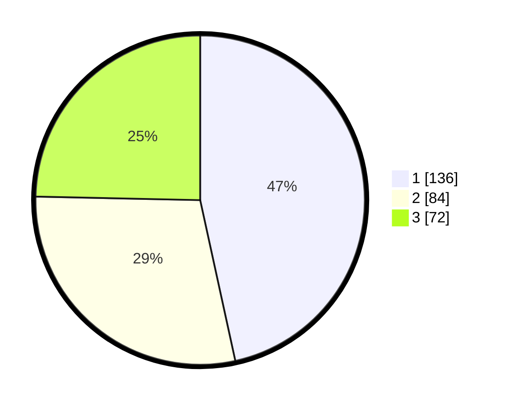

# Hasil

## Grafik

## Tabel

| No. | Nama Paslon    | Suara | Suara (raw) | Persentase |
|:--- |:-------------- | -----:| -----------:| ----------:|
| 1   | ANIES MUHAIMIN | 136   | [136][p-1]  | 46,58      |
| 2   | PRABOWO GIBRAN | 84    | [84][p-2]   | 28,77      |
| 3   | GANJAR MAHFUD  | 72    | [72][p-3]   | 24,66      |

[p-1]: https://github.com/gigit-pemilu/pemilu-2024-35-jawa-timur/blob/main/pilpres/hitung-suara/sub/35-jawa-timur/sub/27-sampang/sub/14-karangpenang/sub/2002-tlambah/sub/027-tps/sub/paslon-1.txt
[p-2]: https://github.com/gigit-pemilu/pemilu-2024-35-jawa-timur/blob/main/pilpres/hitung-suara/sub/35-jawa-timur/sub/27-sampang/sub/14-karangpenang/sub/2002-tlambah/sub/027-tps/sub/paslon-2.txt
[p-3]: https://github.com/gigit-pemilu/pemilu-2024-35-jawa-timur/blob/main/pilpres/hitung-suara/sub/35-jawa-timur/sub/27-sampang/sub/14-karangpenang/sub/2002-tlambah/sub/027-tps/sub/paslon-3.txt

## Foto C Plano

https://sirekap-obj-formc.kpu.go.id/610c/pemilu/ppwp/35/27/14/20/02/3527142002027-20240215-150943--0878cf88-b2c5-4e1e-8880-c2c3fabcc715.jpg

https://sirekap-obj-formc.kpu.go.id/610c/pemilu/ppwp/35/27/14/20/02/3527142002027-20240215-151119--0750b869-7aa7-4fb3-8e3f-8cf905a4121e.jpg

https://sirekap-obj-formc.kpu.go.id/610c/pemilu/ppwp/35/27/14/20/02/3527142002027-20240215-151238--f7eb3ccd-8c7c-4530-833c-ff1a9cd49c32.jpg

## Metadata

| Key        | Value               |
| ---------- | ------------------- |
| Time Stamp | 2024-02-16 10:30:29 |

