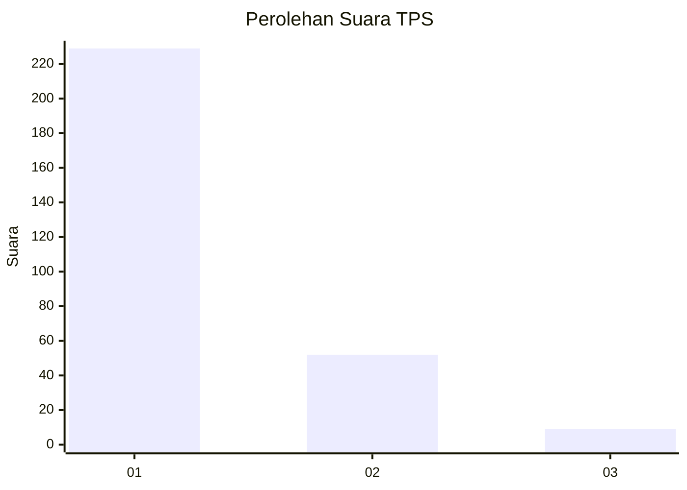
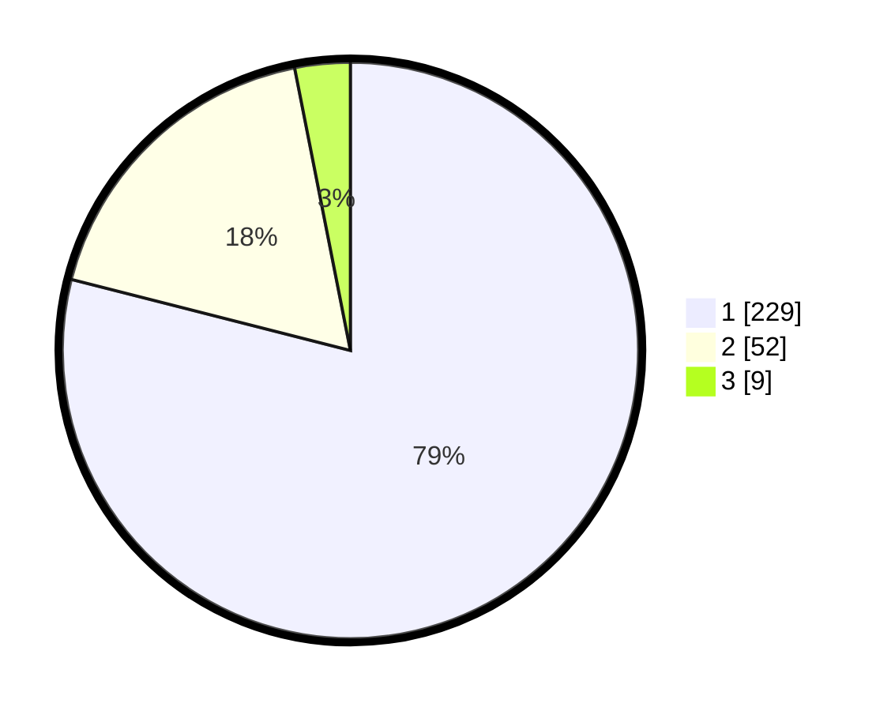

# Hasil

## Grafik

## Tabel

| No. | Nama Paslon    | Suara | Suara (raw) | Persentase |
|:--- |:-------------- | -----:| -----------:| ----------:|
| 1   | ANIES MUHAIMIN | 229   | [229][p-1]  | 78,97      |
| 2   | PRABOWO GIBRAN | 52    | [52][p-2]   | 17,93      |
| 3   | GANJAR MAHFUD  | 9     | [9][p-3]    | 3,10       |

[p-1]: https://github.com/gigit-pemilu/pemilu-2024-35-jawa-timur/blob/main/pilpres/hitung-suara/sub/35-jawa-timur/sub/27-sampang/sub/14-karangpenang/sub/2002-tlambah/sub/033-tps/sub/paslon-1.txt
[p-2]: https://github.com/gigit-pemilu/pemilu-2024-35-jawa-timur/blob/main/pilpres/hitung-suara/sub/35-jawa-timur/sub/27-sampang/sub/14-karangpenang/sub/2002-tlambah/sub/033-tps/sub/paslon-2.txt
[p-3]: https://github.com/gigit-pemilu/pemilu-2024-35-jawa-timur/blob/main/pilpres/hitung-suara/sub/35-jawa-timur/sub/27-sampang/sub/14-karangpenang/sub/2002-tlambah/sub/033-tps/sub/paslon-3.txt

## Foto C Plano

https://sirekap-obj-formc.kpu.go.id/e834/pemilu/ppwp/35/27/14/20/02/3527142002033-20240214-205835--ed6ecd72-efdf-4226-8f73-f7d6e71d0fc0.jpg

https://sirekap-obj-formc.kpu.go.id/e834/pemilu/ppwp/35/27/14/20/02/3527142002033-20240214-210121--04a89dbe-769f-45d7-b820-2eb6e78a5e6e.jpg

https://sirekap-obj-formc.kpu.go.id/e834/pemilu/ppwp/35/27/14/20/02/3527142002033-20240214-210914--f83947ca-1c1a-4df3-b4a7-12539129057f.jpg

## Metadata

| Key        | Value               |
| ---------- | ------------------- |
| Time Stamp | 2024-02-16 10:30:29 |

