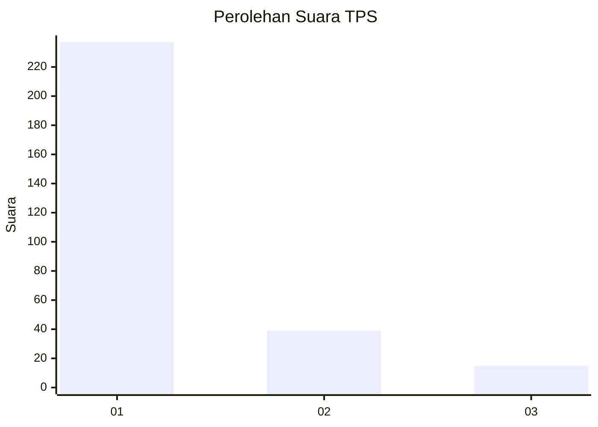
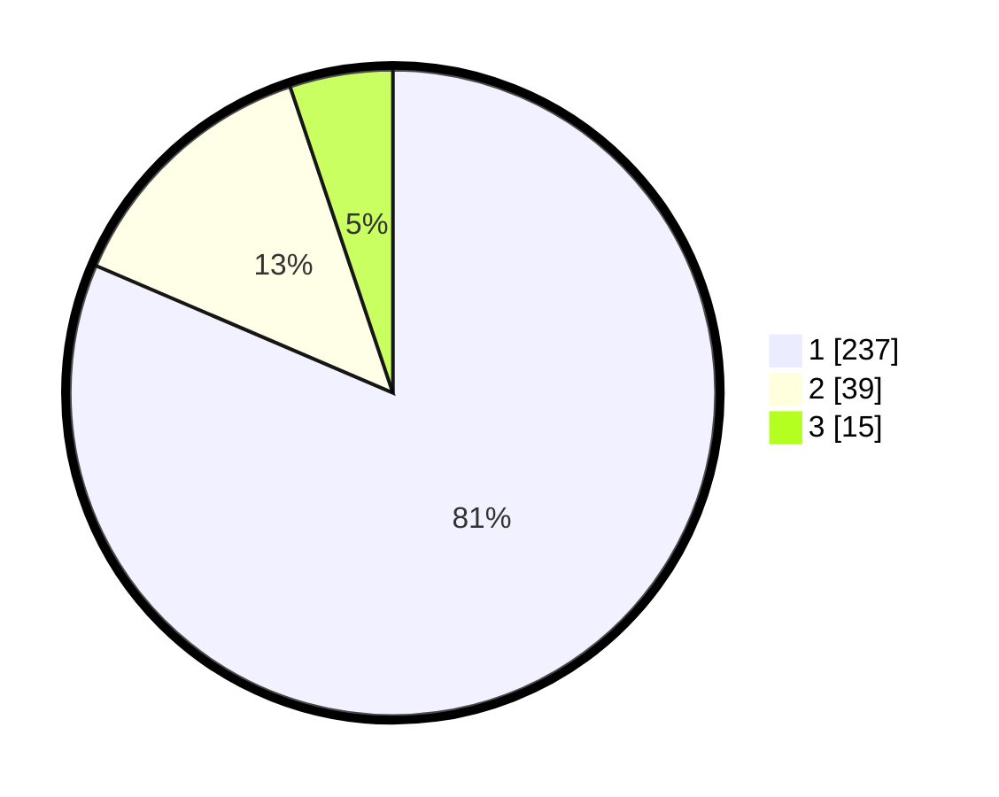

# Hasil

## Grafik

## Tabel

| No. | Nama Paslon    | Suara | Suara (raw) | Persentase |
|:--- |:-------------- | -----:| -----------:| ----------:|
| 1   | ANIES MUHAIMIN | 237   | [237][p-1]  | 81,44      |
| 2   | PRABOWO GIBRAN | 39    | [39][p-2]   | 13,40      |
| 3   | GANJAR MAHFUD  | 15    | [15][p-3]   | 5,15       |

[p-1]: https://github.com/gigit-pemilu/pemilu-2024-35-jawa-timur/blob/main/pilpres/hitung-suara/sub/35-jawa-timur/sub/27-sampang/sub/14-karangpenang/sub/2002-tlambah/sub/035-tps/sub/paslon-1.txt
[p-2]: https://github.com/gigit-pemilu/pemilu-2024-35-jawa-timur/blob/main/pilpres/hitung-suara/sub/35-jawa-timur/sub/27-sampang/sub/14-karangpenang/sub/2002-tlambah/sub/035-tps/sub/paslon-2.txt
[p-3]: https://github.com/gigit-pemilu/pemilu-2024-35-jawa-timur/blob/main/pilpres/hitung-suara/sub/35-jawa-timur/sub/27-sampang/sub/14-karangpenang/sub/2002-tlambah/sub/035-tps/sub/paslon-3.txt

## Foto C Plano

https://sirekap-obj-formc.kpu.go.id/2ef5/pemilu/ppwp/35/27/14/20/02/3527142002035-20240215-072825--534aea12-6804-4c17-8b1e-bce4d70649ef.jpg

https://sirekap-obj-formc.kpu.go.id/2ef5/pemilu/ppwp/35/27/14/20/02/3527142002035-20240215-073108--2998eae9-e092-46a9-90c8-7dde941ef0b6.jpg

https://sirekap-obj-formc.kpu.go.id/2ef5/pemilu/ppwp/35/27/14/20/02/3527142002035-20240215-075237--9a1e16cf-2d43-48b5-a186-8cd3b59af989.jpg

## Metadata

| Key        | Value               |
| ---------- | ------------------- |
| Time Stamp | 2024-02-16 10:30:29 |

