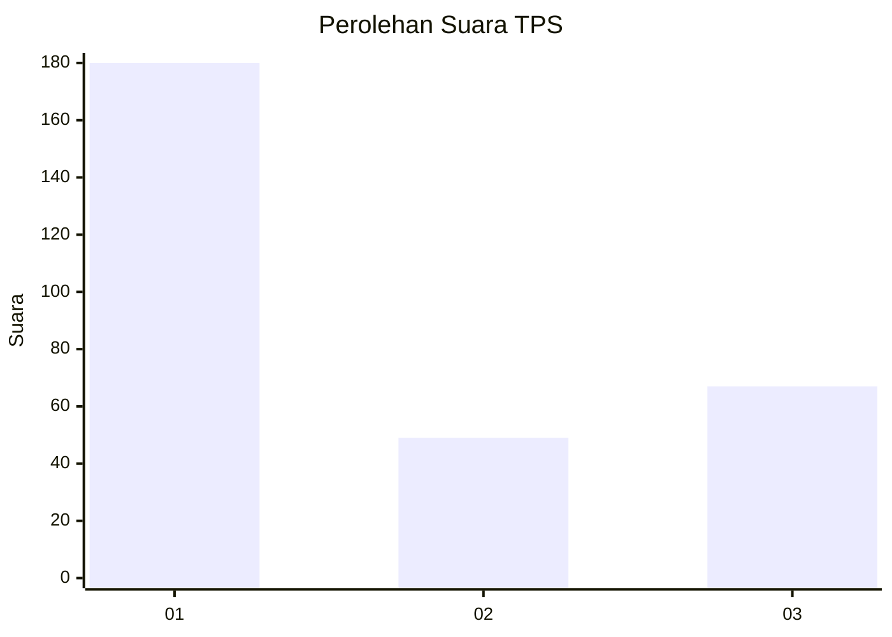
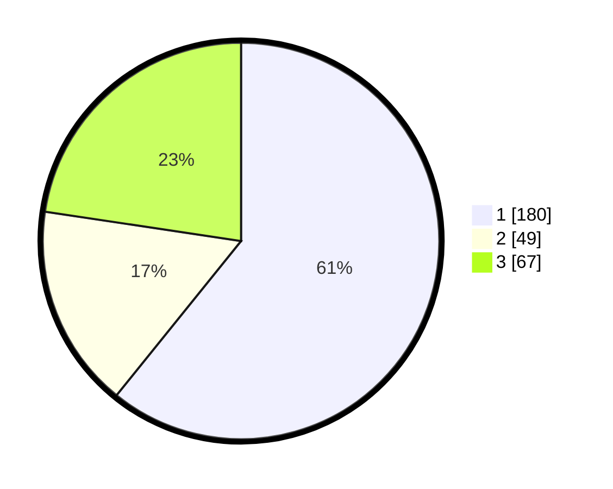

# Hasil

## Grafik

## Tabel

| No. | Nama Paslon    | Suara | Suara (raw) | Persentase |
|:--- |:-------------- | -----:| -----------:| ----------:|
| 1   | ANIES MUHAIMIN | 180   | [180][p-1]  | 60,81      |
| 2   | PRABOWO GIBRAN | 49    | [49][p-2]   | 16,55      |
| 3   | GANJAR MAHFUD  | 67    | [67][p-3]   | 22,64      |

[p-1]: https://github.com/gigit-pemilu/pemilu-2024/blob/main/pilpres/hitung-suara/sub/35-jawa-timur/sub/27-sampang/sub/14-karangpenang/sub/2005-karangpenang-oloh/sub/001-tps/sub/paslon-1.txt
[p-2]: https://github.com/gigit-pemilu/pemilu-2024/blob/main/pilpres/hitung-suara/sub/35-jawa-timur/sub/27-sampang/sub/14-karangpenang/sub/2005-karangpenang-oloh/sub/001-tps/sub/paslon-2.txt
[p-3]: https://github.com/gigit-pemilu/pemilu-2024/blob/main/pilpres/hitung-suara/sub/35-jawa-timur/sub/27-sampang/sub/14-karangpenang/sub/2005-karangpenang-oloh/sub/001-tps/sub/paslon-3.txt

## Foto C Plano

https://sirekap-obj-formc.kpu.go.id/4d79/pemilu/ppwp/35/27/14/20/05/3527142005001-20240214-214451--5a5c1fa0-60d4-4162-8579-9352d6677df7.jpg

https://sirekap-obj-formc.kpu.go.id/4d79/pemilu/ppwp/35/27/14/20/05/3527142005001-20240214-214541--a61bd21b-b2d4-4251-8aa6-c86723f4e2aa.jpg

https://sirekap-obj-formc.kpu.go.id/4d79/pemilu/ppwp/35/27/14/20/05/3527142005001-20240214-214624--77f305dc-0216-4563-bc66-dfa93f50ce11.jpg

## Metadata

| Key        | Value               |
| ---------- | ------------------- |
| Time Stamp | 2024-02-16 11:00:29 |

