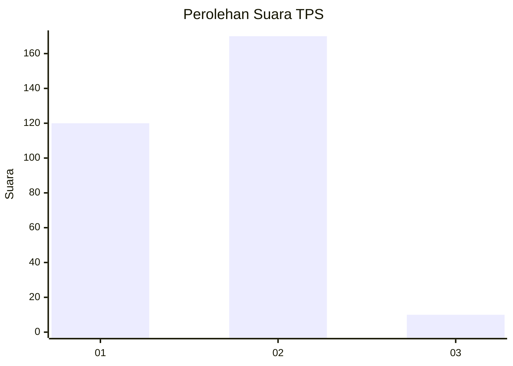
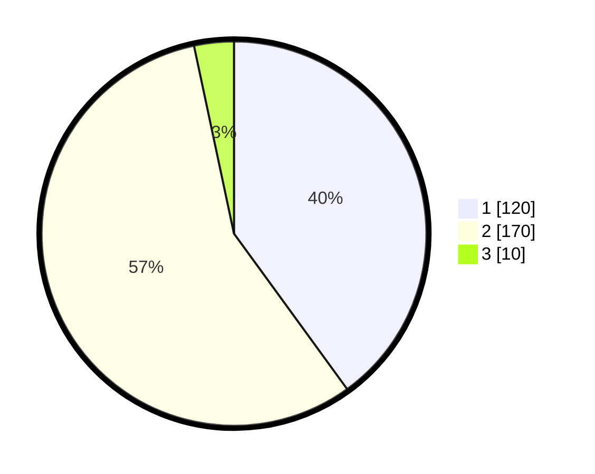

# Hasil

## Grafik

## Tabel

| No. | Nama Paslon    | Suara | Suara (raw) | Persentase |
|:--- |:-------------- | -----:| -----------:| ----------:|
| 1   | ANIES MUHAIMIN | 120   | [120][p-1]  | 40,00      |
| 2   | PRABOWO GIBRAN | 170   | [170][p-2]  | 56,67      |
| 3   | GANJAR MAHFUD  | 10    | [10][p-3]   | 3,33       |

[p-1]: https://github.com/gigit-pemilu/pemilu-2024-35-jawa-timur/blob/main/pilpres/hitung-suara/sub/35-jawa-timur/sub/27-sampang/sub/14-karangpenang/sub/2005-karangpenang-oloh/sub/018-tps/sub/paslon-1.txt
[p-2]: https://github.com/gigit-pemilu/pemilu-2024-35-jawa-timur/blob/main/pilpres/hitung-suara/sub/35-jawa-timur/sub/27-sampang/sub/14-karangpenang/sub/2005-karangpenang-oloh/sub/018-tps/sub/paslon-2.txt
[p-3]: https://github.com/gigit-pemilu/pemilu-2024-35-jawa-timur/blob/main/pilpres/hitung-suara/sub/35-jawa-timur/sub/27-sampang/sub/14-karangpenang/sub/2005-karangpenang-oloh/sub/018-tps/sub/paslon-3.txt

## Foto C Plano

https://sirekap-obj-formc.kpu.go.id/1bdf/pemilu/ppwp/35/27/14/20/05/3527142005018-20240214-212158--d1b9c425-adfb-47b4-964a-84739c68f62a.jpg

https://sirekap-obj-formc.kpu.go.id/1bdf/pemilu/ppwp/35/27/14/20/05/3527142005018-20240214-212436--1401d54a-001d-4d06-936e-7788c68f95ef.jpg

## Metadata

| Key        | Value               |
| ---------- | ------------------- |
| Time Stamp | 2024-02-24 22:31:28 |

