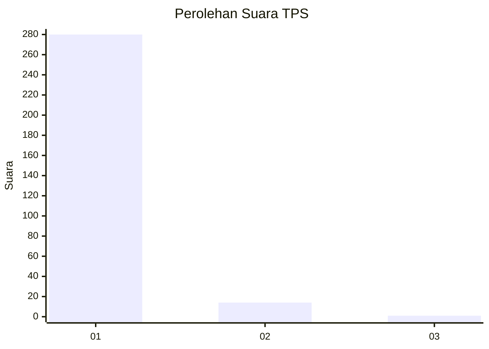
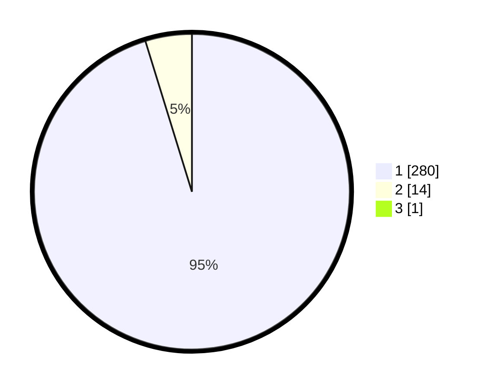

# Hasil

## Grafik

## Tabel

| No. | Nama Paslon    | Suara | Suara (raw) | Persentase |
|:--- |:-------------- | -----:| -----------:| ----------:|
| 1   | ANIES MUHAIMIN | 280   | [280][p-1]  | 94,92      |
| 2   | PRABOWO GIBRAN | 14    | [14][p-2]   | 4,75       |
| 3   | GANJAR MAHFUD  | 1     | [1][p-3]    | 0,34       |

[p-1]: https://github.com/gigit-pemilu/pemilu-2024-35-jawa-timur/blob/main/pilpres/hitung-suara/sub/35-jawa-timur/sub/27-sampang/sub/14-karangpenang/sub/2005-karangpenang-oloh/sub/021-tps/sub/paslon-1.txt
[p-2]: https://github.com/gigit-pemilu/pemilu-2024-35-jawa-timur/blob/main/pilpres/hitung-suara/sub/35-jawa-timur/sub/27-sampang/sub/14-karangpenang/sub/2005-karangpenang-oloh/sub/021-tps/sub/paslon-2.txt
[p-3]: https://github.com/gigit-pemilu/pemilu-2024-35-jawa-timur/blob/main/pilpres/hitung-suara/sub/35-jawa-timur/sub/27-sampang/sub/14-karangpenang/sub/2005-karangpenang-oloh/sub/021-tps/sub/paslon-3.txt

## Foto C Plano

https://sirekap-obj-formc.kpu.go.id/feda/pemilu/ppwp/35/27/14/20/05/3527142005021-20240214-213716--4b4d382b-70f8-4e07-b640-e3c680f562b2.jpg

https://sirekap-obj-formc.kpu.go.id/feda/pemilu/ppwp/35/27/14/20/05/3527142005021-20240214-213801--87b5abac-b7ec-4ecf-9b7e-b2ce1183c4b3.jpg

https://sirekap-obj-formc.kpu.go.id/feda/pemilu/ppwp/35/27/14/20/05/3527142005021-20240214-213847--4e9f1992-cc2b-45e6-8ab3-7e5ff2017711.jpg

## Metadata

| Key        | Value               |
| ---------- | ------------------- |
| Time Stamp | 2024-02-16 10:30:29 |

