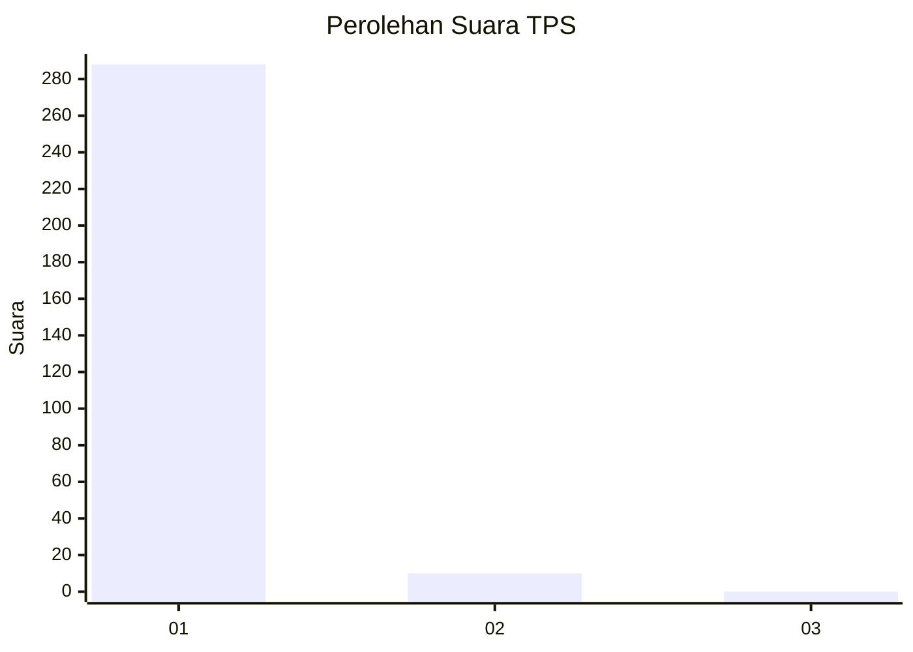
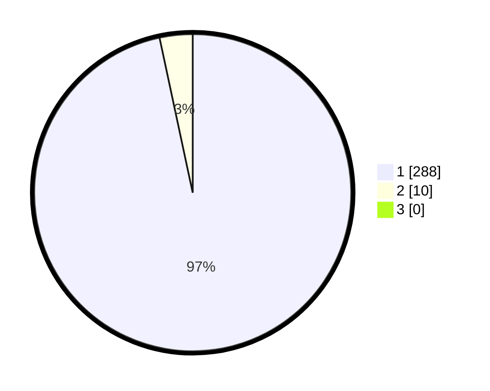

# Hasil

## Grafik

## Tabel

| No. | Nama Paslon    | Suara | Suara (raw) | Persentase |
|:--- |:-------------- | -----:| -----------:| ----------:|
| 1   | ANIES MUHAIMIN | 288   | [288][p-1]  | 96,64      |
| 2   | PRABOWO GIBRAN | 10    | [10][p-2]   | 3,36       |
| 3   | GANJAR MAHFUD  | 0     | [0][p-3]    | 0,00       |

[p-1]: https://github.com/gigit-pemilu/pemilu-2024-35-jawa-timur/blob/main/pilpres/hitung-suara/sub/35-jawa-timur/sub/27-sampang/sub/14-karangpenang/sub/2005-karangpenang-oloh/sub/022-tps/sub/paslon-1.txt
[p-2]: https://github.com/gigit-pemilu/pemilu-2024-35-jawa-timur/blob/main/pilpres/hitung-suara/sub/35-jawa-timur/sub/27-sampang/sub/14-karangpenang/sub/2005-karangpenang-oloh/sub/022-tps/sub/paslon-2.txt
[p-3]: https://github.com/gigit-pemilu/pemilu-2024-35-jawa-timur/blob/main/pilpres/hitung-suara/sub/35-jawa-timur/sub/27-sampang/sub/14-karangpenang/sub/2005-karangpenang-oloh/sub/022-tps/sub/paslon-3.txt

## Foto C Plano

https://sirekap-obj-formc.kpu.go.id/ac91/pemilu/ppwp/35/27/14/20/05/3527142005022-20240214-203937--91b9b1f3-e02e-4db0-83b8-ea73ab450225.jpg

https://sirekap-obj-formc.kpu.go.id/ac91/pemilu/ppwp/35/27/14/20/05/3527142005022-20240214-204445--5c16a425-7b8c-4818-8042-b141fae28200.jpg

https://sirekap-obj-formc.kpu.go.id/ac91/pemilu/ppwp/35/27/14/20/05/3527142005022-20240214-204717--104eb772-10c7-4ac4-863b-fa107e9c84d7.jpg

## Metadata

| Key        | Value               |
| ---------- | ------------------- |
| Time Stamp | 2024-02-16 10:30:29 |

