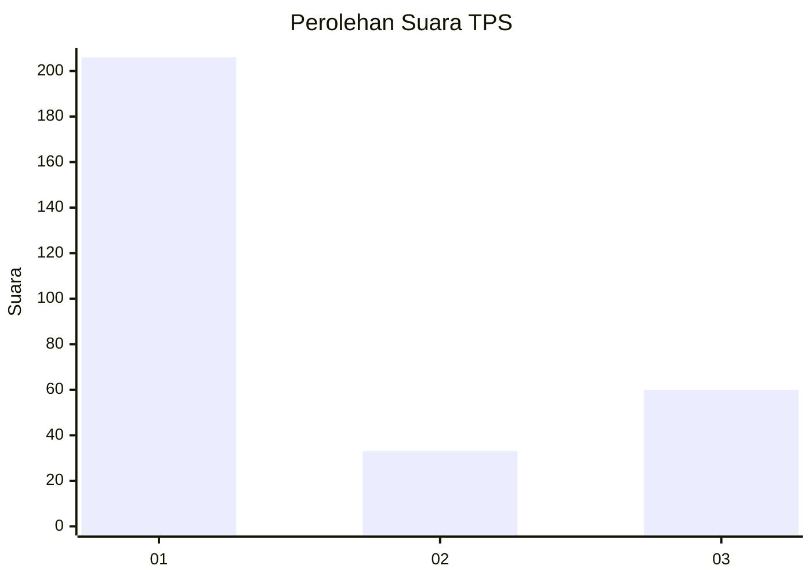
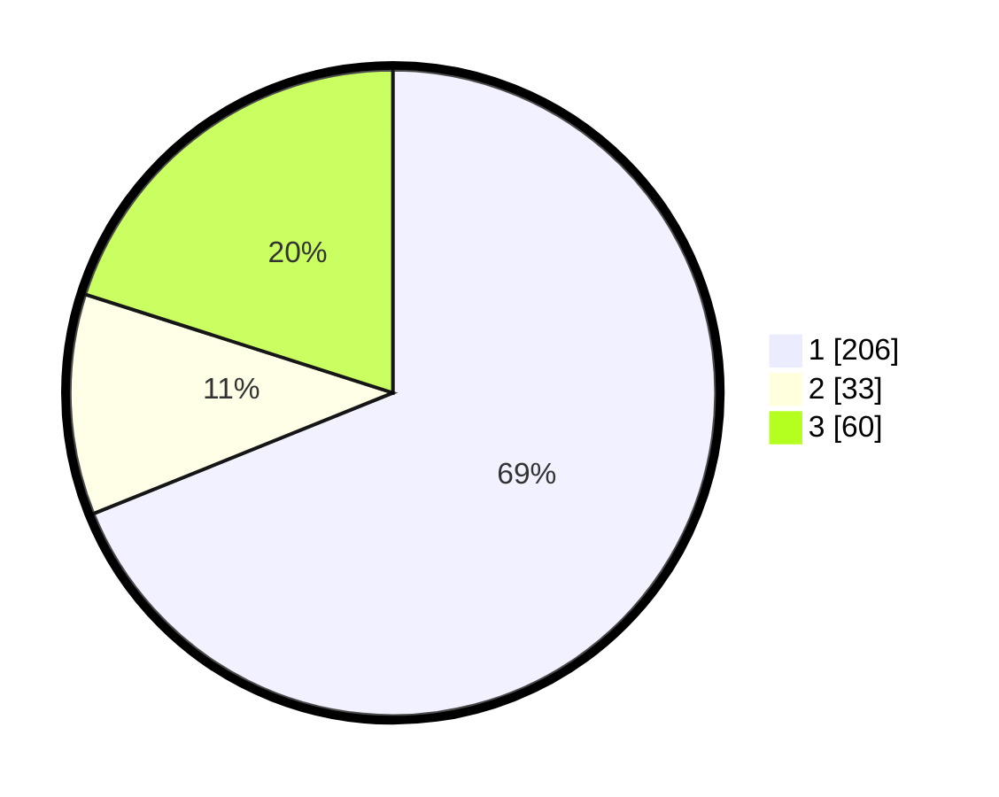

# Hasil

## Grafik

## Tabel

| No. | Nama Paslon    | Suara | Suara (raw) | Persentase |
|:--- |:-------------- | -----:| -----------:| ----------:|
| 1   | ANIES MUHAIMIN | 206   | [206][p-1]  | 68,90      |
| 2   | PRABOWO GIBRAN | 33    | [33][p-2]   | 11,04      |
| 3   | GANJAR MAHFUD  | 60    | [60][p-3]   | 20,07      |

[p-1]: https://github.com/gigit-pemilu/pemilu-2024-35-jawa-timur/blob/main/pilpres/hitung-suara/sub/35-jawa-timur/sub/27-sampang/sub/14-karangpenang/sub/2005-karangpenang-oloh/sub/024-tps/sub/paslon-1.txt
[p-2]: https://github.com/gigit-pemilu/pemilu-2024-35-jawa-timur/blob/main/pilpres/hitung-suara/sub/35-jawa-timur/sub/27-sampang/sub/14-karangpenang/sub/2005-karangpenang-oloh/sub/024-tps/sub/paslon-2.txt
[p-3]: https://github.com/gigit-pemilu/pemilu-2024-35-jawa-timur/blob/main/pilpres/hitung-suara/sub/35-jawa-timur/sub/27-sampang/sub/14-karangpenang/sub/2005-karangpenang-oloh/sub/024-tps/sub/paslon-3.txt

## Foto C Plano

https://sirekap-obj-formc.kpu.go.id/a1d3/pemilu/ppwp/35/27/14/20/05/3527142005024-20240214-203529--3c148cea-f233-476d-82d1-45219bc821a7.jpg

https://sirekap-obj-formc.kpu.go.id/a1d3/pemilu/ppwp/35/27/14/20/05/3527142005024-20240214-203209--e45cba9d-8aff-4ecb-be2c-be24d7ca98c1.jpg

https://sirekap-obj-formc.kpu.go.id/a1d3/pemilu/ppwp/35/27/14/20/05/3527142005024-20240214-203314--6155e900-8cad-44cf-a200-0d117166cec2.jpg

## Metadata

| Key        | Value               |
| ---------- | ------------------- |
| Time Stamp | 2024-02-16 11:00:29 |

