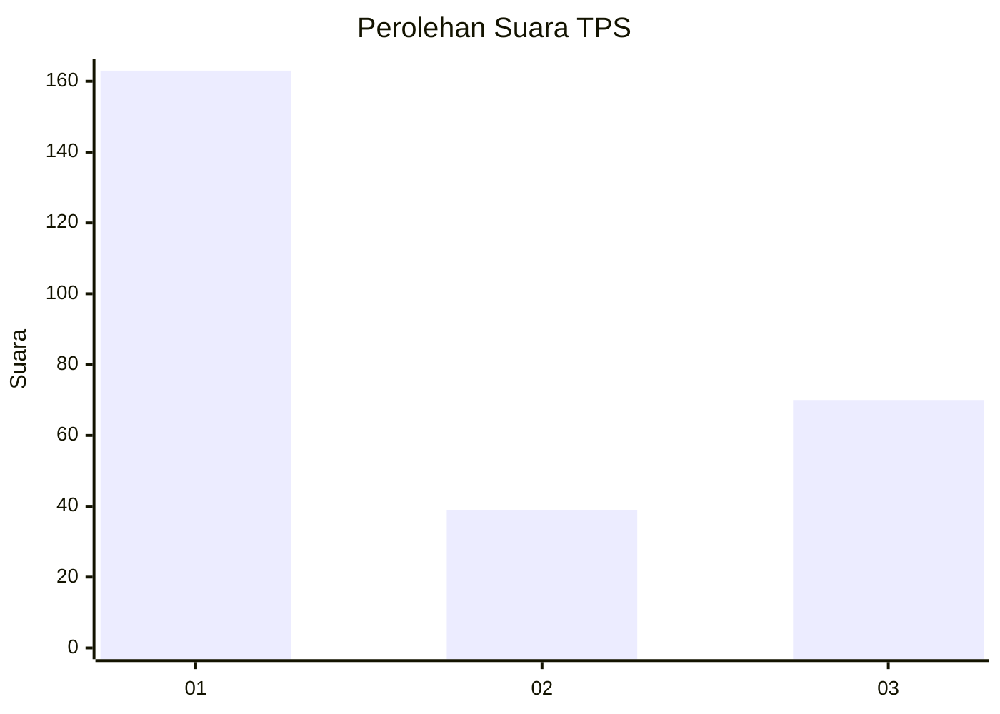
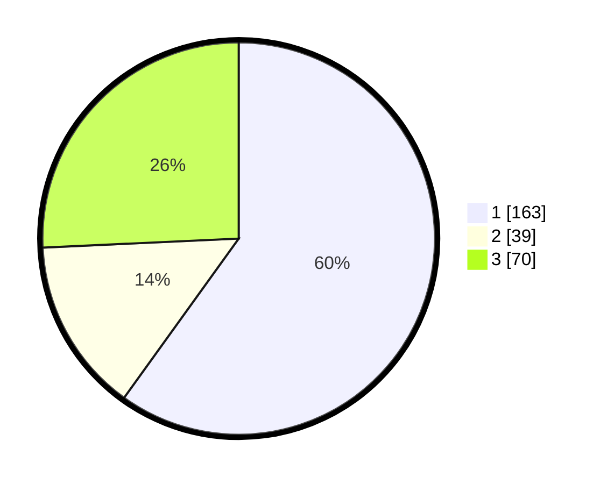

# Hasil

## Grafik

## Tabel

| No. | Nama Paslon    | Suara | Suara (raw) | Persentase |
|:--- |:-------------- | -----:| -----------:| ----------:|
| 1   | ANIES MUHAIMIN | 163   | [163][p-1]  | 59,93      |
| 2   | PRABOWO GIBRAN | 39    | [39][p-2]   | 14,34      |
| 3   | GANJAR MAHFUD  | 70    | [70][p-3]   | 25,74      |

[p-1]: https://github.com/gigit-pemilu/pemilu-2024/blob/main/pilpres/hitung-suara/sub/35-jawa-timur/sub/27-sampang/sub/14-karangpenang/sub/2006-karangpenang-onjur/sub/001-tps/sub/paslon-1.txt
[p-2]: https://github.com/gigit-pemilu/pemilu-2024/blob/main/pilpres/hitung-suara/sub/35-jawa-timur/sub/27-sampang/sub/14-karangpenang/sub/2006-karangpenang-onjur/sub/001-tps/sub/paslon-2.txt
[p-3]: https://github.com/gigit-pemilu/pemilu-2024/blob/main/pilpres/hitung-suara/sub/35-jawa-timur/sub/27-sampang/sub/14-karangpenang/sub/2006-karangpenang-onjur/sub/001-tps/sub/paslon-3.txt

## Foto C Plano

https://sirekap-obj-formc.kpu.go.id/7dce/pemilu/ppwp/35/27/14/20/06/3527142006001-20240215-074558--4ca7ecd6-171d-487f-83a7-fbfcb2e3e3b3.jpg

https://sirekap-obj-formc.kpu.go.id/7dce/pemilu/ppwp/35/27/14/20/06/3527142006001-20240215-074655--82d7bf37-092d-4559-89e6-12a6cddc202f.jpg

https://sirekap-obj-formc.kpu.go.id/7dce/pemilu/ppwp/35/27/14/20/06/3527142006001-20240215-074823--39b0457a-8463-460c-81bb-3ea5b52ef157.jpg

## Metadata

| Key        | Value               |
| ---------- | ------------------- |
| Time Stamp | 2024-02-25 15:00:00 |

