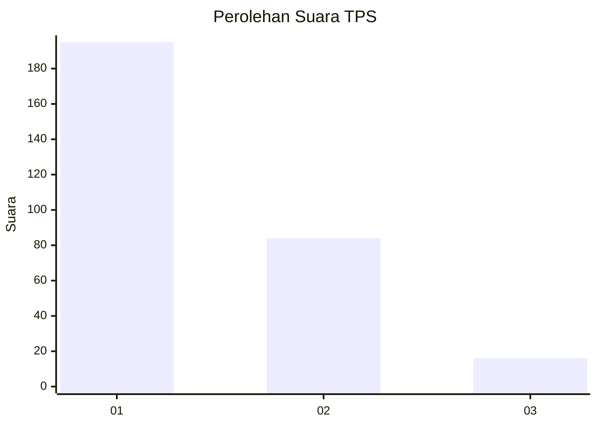
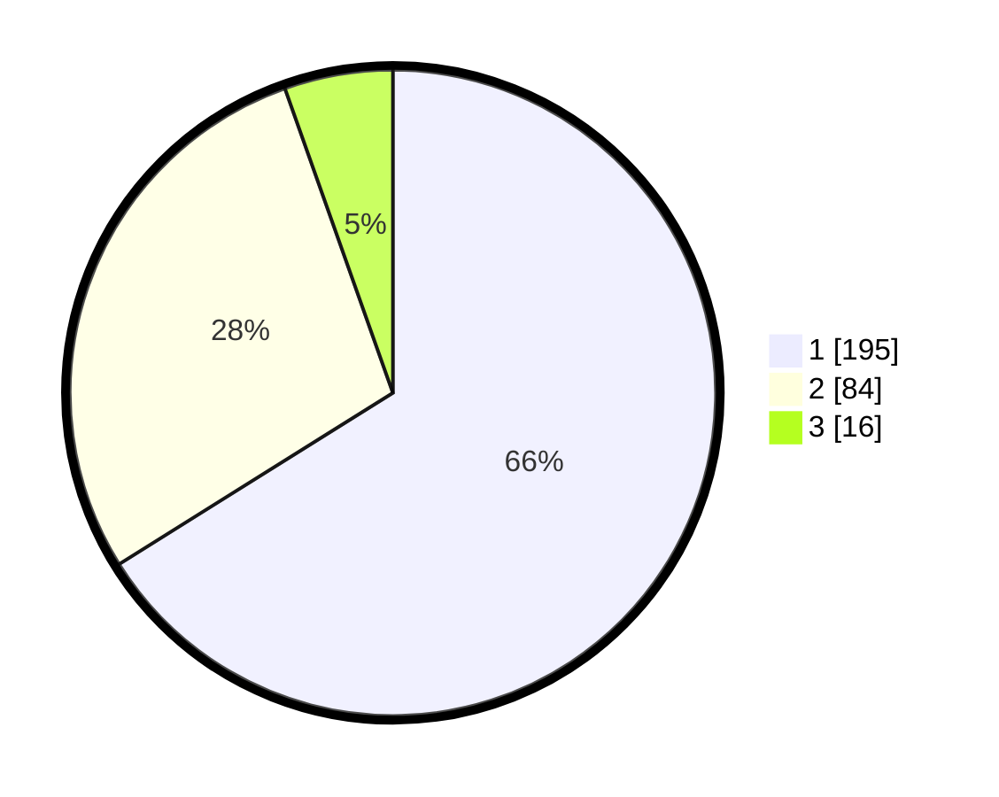

# Hasil

## Grafik

## Tabel

| No. | Nama Paslon    | Suara | Suara (raw) | Persentase |
|:--- |:-------------- | -----:| -----------:| ----------:|
| 1   | ANIES MUHAIMIN | 195   | [195][p-1]  | 66,10      |
| 2   | PRABOWO GIBRAN | 84    | [84][p-2]   | 28,47      |
| 3   | GANJAR MAHFUD  | 16    | [16][p-3]   | 5,42       |

[p-1]: https://github.com/gigit-pemilu/pemilu-2024-35-jawa-timur/blob/main/pilpres/hitung-suara/sub/35-jawa-timur/sub/27-sampang/sub/14-karangpenang/sub/2006-karangpenang-onjur/sub/006-tps/sub/paslon-1.txt
[p-2]: https://github.com/gigit-pemilu/pemilu-2024-35-jawa-timur/blob/main/pilpres/hitung-suara/sub/35-jawa-timur/sub/27-sampang/sub/14-karangpenang/sub/2006-karangpenang-onjur/sub/006-tps/sub/paslon-2.txt
[p-3]: https://github.com/gigit-pemilu/pemilu-2024-35-jawa-timur/blob/main/pilpres/hitung-suara/sub/35-jawa-timur/sub/27-sampang/sub/14-karangpenang/sub/2006-karangpenang-onjur/sub/006-tps/sub/paslon-3.txt

## Foto C Plano

https://sirekap-obj-formc.kpu.go.id/def6/pemilu/ppwp/35/27/14/20/06/3527142006006-20240214-190752--4c71e38c-bd74-41de-9ee8-2cf18541f9f6.jpg

https://sirekap-obj-formc.kpu.go.id/def6/pemilu/ppwp/35/27/14/20/06/3527142006006-20240214-190558--55e828e6-3128-46e6-bdad-236fd9779db7.jpg

https://sirekap-obj-formc.kpu.go.id/def6/pemilu/ppwp/35/27/14/20/06/3527142006006-20240214-190714--2e1f6da5-5d8f-4868-b0d1-a9cac3ab9a71.jpg

## Metadata

| Key        | Value               |
| ---------- | ------------------- |
| Time Stamp | 2024-02-16 10:30:29 |

