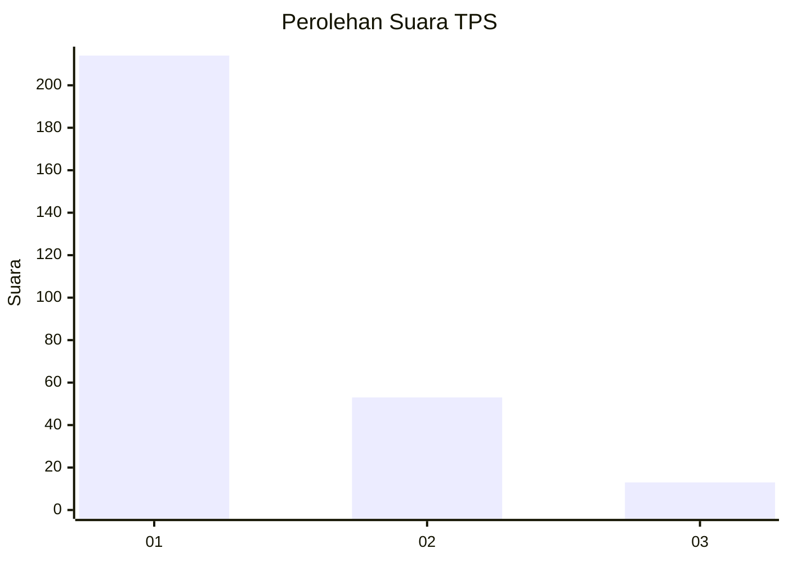
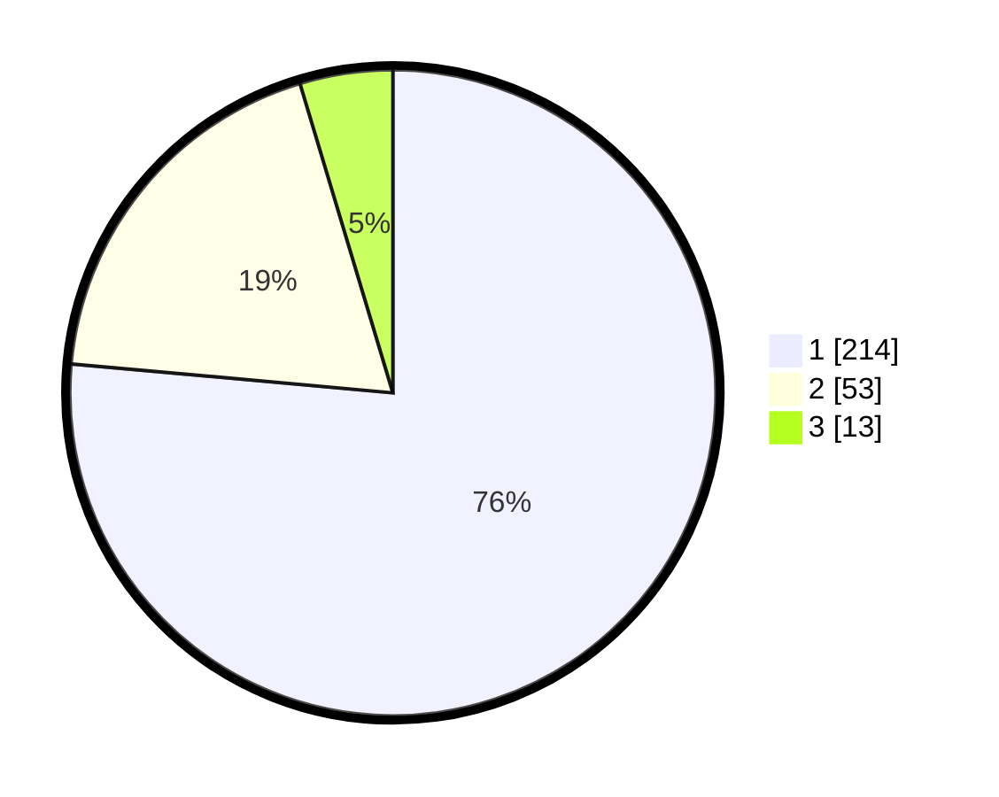

# Hasil

## Grafik

## Tabel

| No. | Nama Paslon    | Suara | Suara (raw) | Persentase |
|:--- |:-------------- | -----:| -----------:| ----------:|
| 1   | ANIES MUHAIMIN | 214   | [214][p-1]  | 76,43      |
| 2   | PRABOWO GIBRAN | 53    | [53][p-2]   | 18,93      |
| 3   | GANJAR MAHFUD  | 13    | [13][p-3]   | 4,64       |

[p-1]: https://github.com/gigit-pemilu/pemilu-2024-35-jawa-timur/blob/main/pilpres/hitung-suara/sub/35-jawa-timur/sub/27-sampang/sub/14-karangpenang/sub/2006-karangpenang-onjur/sub/012-tps/sub/paslon-1.txt
[p-2]: https://github.com/gigit-pemilu/pemilu-2024-35-jawa-timur/blob/main/pilpres/hitung-suara/sub/35-jawa-timur/sub/27-sampang/sub/14-karangpenang/sub/2006-karangpenang-onjur/sub/012-tps/sub/paslon-2.txt
[p-3]: https://github.com/gigit-pemilu/pemilu-2024-35-jawa-timur/blob/main/pilpres/hitung-suara/sub/35-jawa-timur/sub/27-sampang/sub/14-karangpenang/sub/2006-karangpenang-onjur/sub/012-tps/sub/paslon-3.txt

## Foto C Plano

https://sirekap-obj-formc.kpu.go.id/e9f1/pemilu/ppwp/35/27/14/20/06/3527142006012-20240215-111357--bc12a64c-8ef7-4a36-b3a9-3ccfa0041ec7.jpg

https://sirekap-obj-formc.kpu.go.id/e9f1/pemilu/ppwp/35/27/14/20/06/3527142006012-20240215-111459--3d74c261-c2e7-45be-acd0-4ede801caa09.jpg

https://sirekap-obj-formc.kpu.go.id/e9f1/pemilu/ppwp/35/27/14/20/06/3527142006012-20240215-111636--e284b496-3253-4a64-a2e2-ba8947ba40a1.jpg

## Metadata

| Key        | Value               |
| ---------- | ------------------- |
| Time Stamp | 2024-02-16 10:30:29 |

## DATA PEMILIH TETAP

Jumlah pemilih dalam DPT: **300**.
 * L: **33**.
 * P: **125**.

## DATA PENGGUNA HAK PILIH

Jumlah pengguna hak pilih dalam DPT: **300**.
 * L: **233**.
 * P: **824**.

Jumlah pengguna hak pilih dalam DPTb: **0**.
 * L: **80**.
 * P: **0**.

Jumlah pengguna hak pilih dalam DPK: **0**.
 * L: **80**.
 * P: **0**.

Jumlah pengguna hak pilih: **300**.
 * L: **132**.
 * P: **166**.

## JUMLAH SUARA SAH DAN TIDAK SAH

JUMLAH SELURUH SUARA SAH: **280**.

JUMLAH SUARA TIDAK SAH: **20**.

JUMLAH SELURUH SUARA SAH DAN SUARA TIDAK SAH: **300**.

