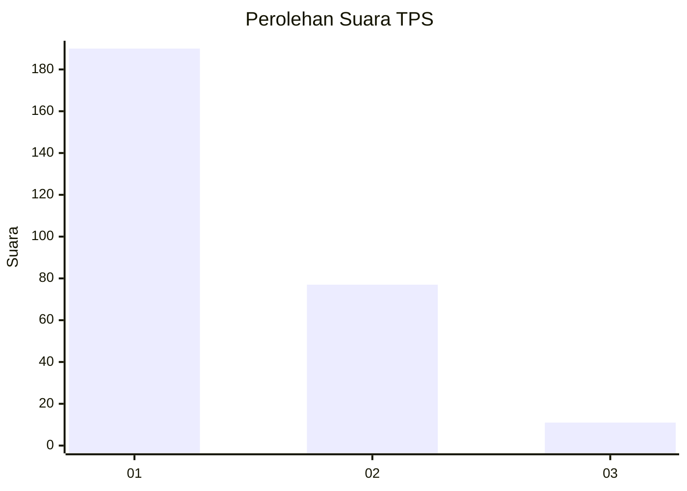
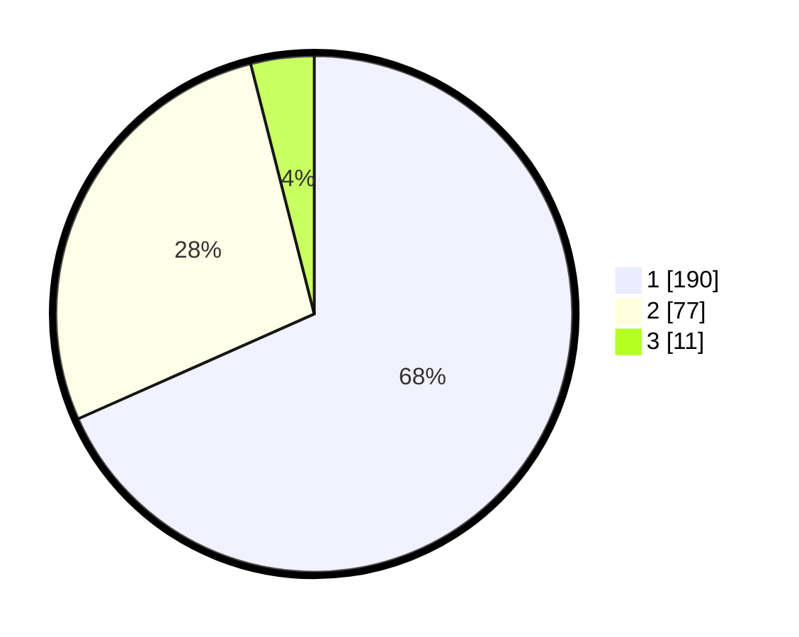

# Hasil

## Grafik

## Tabel

| No. | Nama Paslon    | Suara | Suara (raw) | Persentase |
|:--- |:-------------- | -----:| -----------:| ----------:|
| 1   | ANIES MUHAIMIN | 190   | [190][p-1]  | 68,35      |
| 2   | PRABOWO GIBRAN | 77    | [77][p-2]   | 27,70      |
| 3   | GANJAR MAHFUD  | 11    | [11][p-3]   | 3,96       |

[p-1]: https://github.com/gigit-pemilu/pemilu-2024-35-jawa-timur/blob/main/pilpres/hitung-suara/sub/35-jawa-timur/sub/27-sampang/sub/14-karangpenang/sub/2006-karangpenang-onjur/sub/020-tps/sub/paslon-1.txt
[p-2]: https://github.com/gigit-pemilu/pemilu-2024-35-jawa-timur/blob/main/pilpres/hitung-suara/sub/35-jawa-timur/sub/27-sampang/sub/14-karangpenang/sub/2006-karangpenang-onjur/sub/020-tps/sub/paslon-2.txt
[p-3]: https://github.com/gigit-pemilu/pemilu-2024-35-jawa-timur/blob/main/pilpres/hitung-suara/sub/35-jawa-timur/sub/27-sampang/sub/14-karangpenang/sub/2006-karangpenang-onjur/sub/020-tps/sub/paslon-3.txt

## Foto C Plano

https://sirekap-obj-formc.kpu.go.id/4f40/pemilu/ppwp/35/27/14/20/06/3527142006020-20240216-112508--38ae216a-9486-43a8-80bd-aefefeaf17d2.jpg

https://sirekap-obj-formc.kpu.go.id/4f40/pemilu/ppwp/35/27/14/20/06/3527142006020-20240216-113924--9e547745-8378-4499-9117-befe592629df.jpg

## Metadata

| Key        | Value               |
| ---------- | ------------------- |
| Time Stamp | 2024-02-25 16:00:00 |

