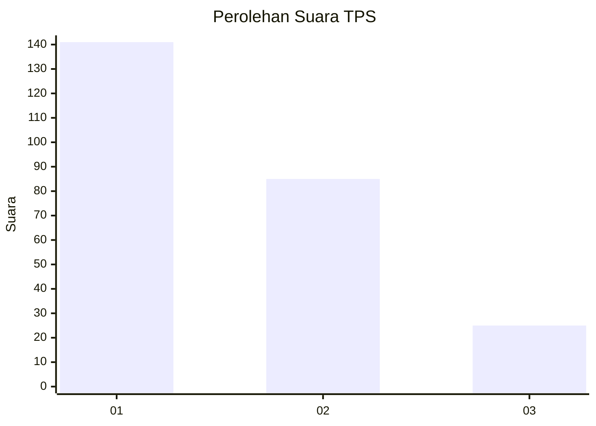
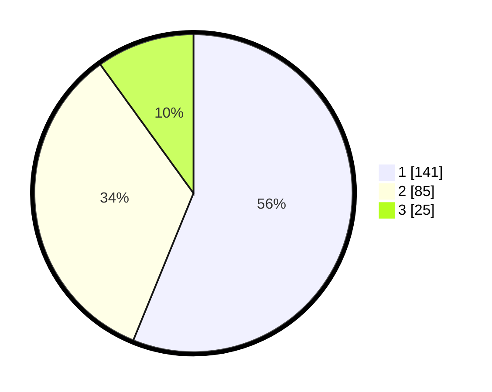

# Hasil

## Grafik

## Tabel

| No. | Nama Paslon    | Suara | Suara (raw) | Persentase |
|:--- |:-------------- | -----:| -----------:| ----------:|
| 1   | ANIES MUHAIMIN | 141   | [141][p-1]  | 56,18      |
| 2   | PRABOWO GIBRAN | 85    | [85][p-2]   | 33,86      |
| 3   | GANJAR MAHFUD  | 25    | [25][p-3]   | 9,96       |

[p-1]: https://github.com/gigit-pemilu/pemilu-2024-35-jawa-timur/blob/main/pilpres/hitung-suara/sub/35-jawa-timur/sub/27-sampang/sub/14-karangpenang/sub/2007-gunung-kesan/sub/015-tps/sub/paslon-1.txt
[p-2]: https://github.com/gigit-pemilu/pemilu-2024-35-jawa-timur/blob/main/pilpres/hitung-suara/sub/35-jawa-timur/sub/27-sampang/sub/14-karangpenang/sub/2007-gunung-kesan/sub/015-tps/sub/paslon-2.txt
[p-3]: https://github.com/gigit-pemilu/pemilu-2024-35-jawa-timur/blob/main/pilpres/hitung-suara/sub/35-jawa-timur/sub/27-sampang/sub/14-karangpenang/sub/2007-gunung-kesan/sub/015-tps/sub/paslon-3.txt

## Foto C Plano

https://sirekap-obj-formc.kpu.go.id/d22d/pemilu/ppwp/35/27/14/20/07/3527142007015-20240214-200711--921142ae-aebf-4102-bfb7-296d1194235c.jpg

https://sirekap-obj-formc.kpu.go.id/d22d/pemilu/ppwp/35/27/14/20/07/3527142007015-20240214-193735--96b8ccd4-3fbb-428c-b64f-e9821401d6ac.jpg

https://sirekap-obj-formc.kpu.go.id/d22d/pemilu/ppwp/35/27/14/20/07/3527142007015-20240214-201014--d16c274d-8dac-40c4-aaac-32da775481df.jpg

## Metadata

| Key        | Value               |
| ---------- | ------------------- |
| Time Stamp | 2024-02-15 22:30:27 |

