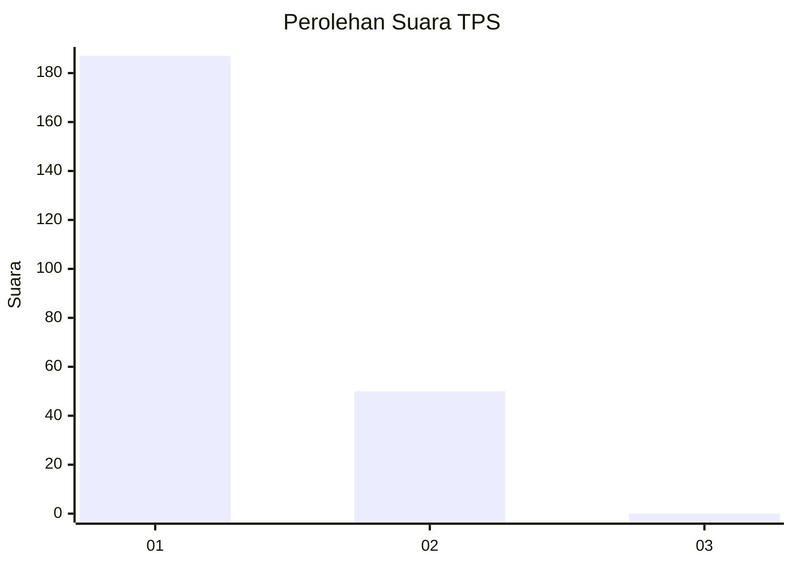
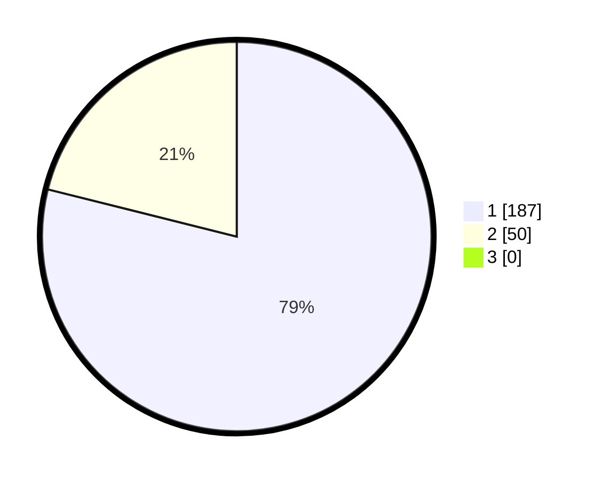

# Hasil

## Grafik

## Tabel

| No. | Nama Paslon    | Suara | Suara (raw) | Persentase |
|:--- |:-------------- | -----:| -----------:| ----------:|
| 1   | ANIES MUHAIMIN | 187   | [187][p-1]  | 78,90      |
| 2   | PRABOWO GIBRAN | 50    | [50][p-2]   | 21,10      |
| 3   | GANJAR MAHFUD  | 0     | [0][p-3]    | 0,00       |

[p-1]: https://github.com/gigit-pemilu/pemilu-2024/blob/main/pilpres/hitung-suara/sub/35-jawa-timur/sub/27-sampang/sub/14-karangpenang/sub/2007-gunung-kesan/sub/022-tps/sub/paslon-1.txt
[p-2]: https://github.com/gigit-pemilu/pemilu-2024/blob/main/pilpres/hitung-suara/sub/35-jawa-timur/sub/27-sampang/sub/14-karangpenang/sub/2007-gunung-kesan/sub/022-tps/sub/paslon-2.txt
[p-3]: https://github.com/gigit-pemilu/pemilu-2024/blob/main/pilpres/hitung-suara/sub/35-jawa-timur/sub/27-sampang/sub/14-karangpenang/sub/2007-gunung-kesan/sub/022-tps/sub/paslon-3.txt

## Foto C Plano

https://sirekap-obj-formc.kpu.go.id/2fd1/pemilu/ppwp/35/27/14/20/07/3527142007022-20240214-213214--16533147-1d0c-41c6-92db-cff926572eb0.jpg

https://sirekap-obj-formc.kpu.go.id/2fd1/pemilu/ppwp/35/27/14/20/07/3527142007022-20240214-213307--a76668d8-9779-40c1-a91b-762664abdff1.jpg

https://sirekap-obj-formc.kpu.go.id/2fd1/pemilu/ppwp/35/27/14/20/07/3527142007022-20240214-213343--043f1e18-ede3-4988-886e-e629cde2e4c8.jpg

## Metadata

| Key        | Value               |
| ---------- | ------------------- |
| Time Stamp | 2024-02-16 10:30:29 |

