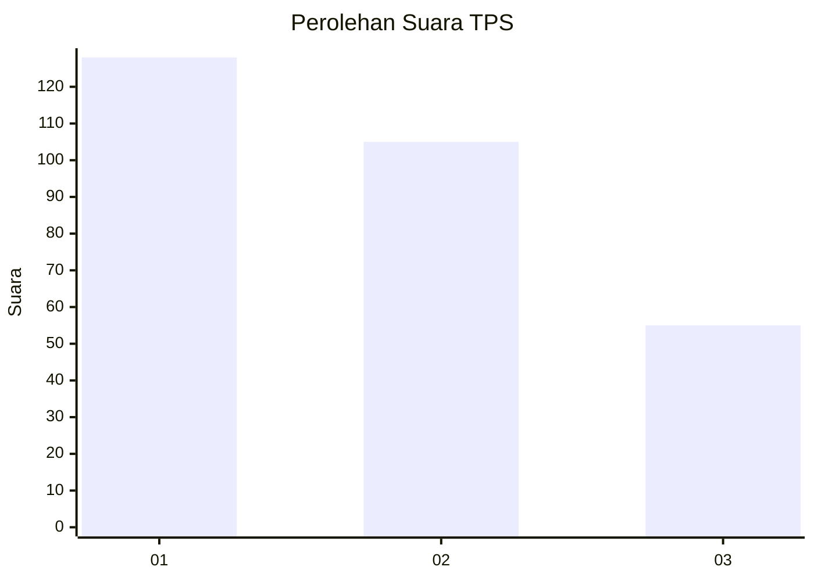
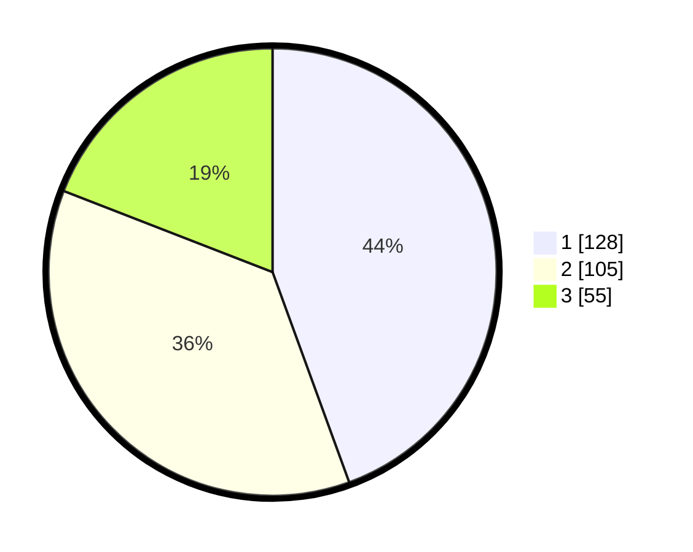

# Hasil

## Grafik

## Tabel

| No. | Nama Paslon    | Suara | Suara (raw) | Persentase |
|:--- |:-------------- | -----:| -----------:| ----------:|
| 1   | ANIES MUHAIMIN | 128   | [128][p-1]  | 44,44      |
| 2   | PRABOWO GIBRAN | 105   | [105][p-2]  | 36,46      |
| 3   | GANJAR MAHFUD  | 55    | [55][p-3]   | 19,10      |

[p-1]: https://github.com/gigit-pemilu/pemilu-2024/blob/main/pilpres/hitung-suara/sub/35-jawa-timur/sub/28-pamekasan/sub/01-tlanakan/sub/2001-dabuan/sub/001-tps/sub/paslon-1.txt
[p-2]: https://github.com/gigit-pemilu/pemilu-2024/blob/main/pilpres/hitung-suara/sub/35-jawa-timur/sub/28-pamekasan/sub/01-tlanakan/sub/2001-dabuan/sub/001-tps/sub/paslon-2.txt
[p-3]: https://github.com/gigit-pemilu/pemilu-2024/blob/main/pilpres/hitung-suara/sub/35-jawa-timur/sub/28-pamekasan/sub/01-tlanakan/sub/2001-dabuan/sub/001-tps/sub/paslon-3.txt

## Foto C Plano

https://sirekap-obj-formc.kpu.go.id/ce35/pemilu/ppwp/35/28/01/20/01/3528012001001-20240215-102938--263daba3-3614-467c-8fd5-326d9e3e2d4d.jpg

https://sirekap-obj-formc.kpu.go.id/ce35/pemilu/ppwp/35/28/01/20/01/3528012001001-20240215-103058--ecc29657-255f-4b84-8560-4c5681bb68a5.jpg

## Metadata

| Key        | Value               |
| ---------- | ------------------- |
| Time Stamp | 2024-02-24 22:31:28 |

