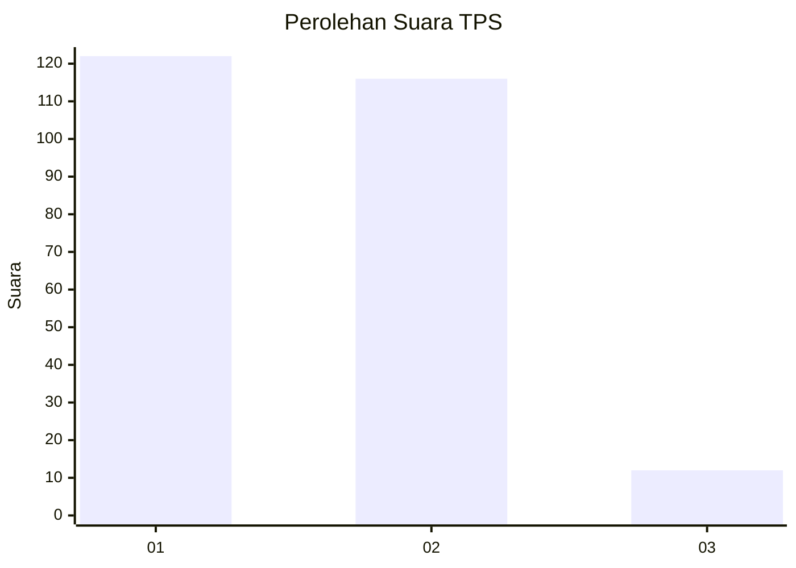
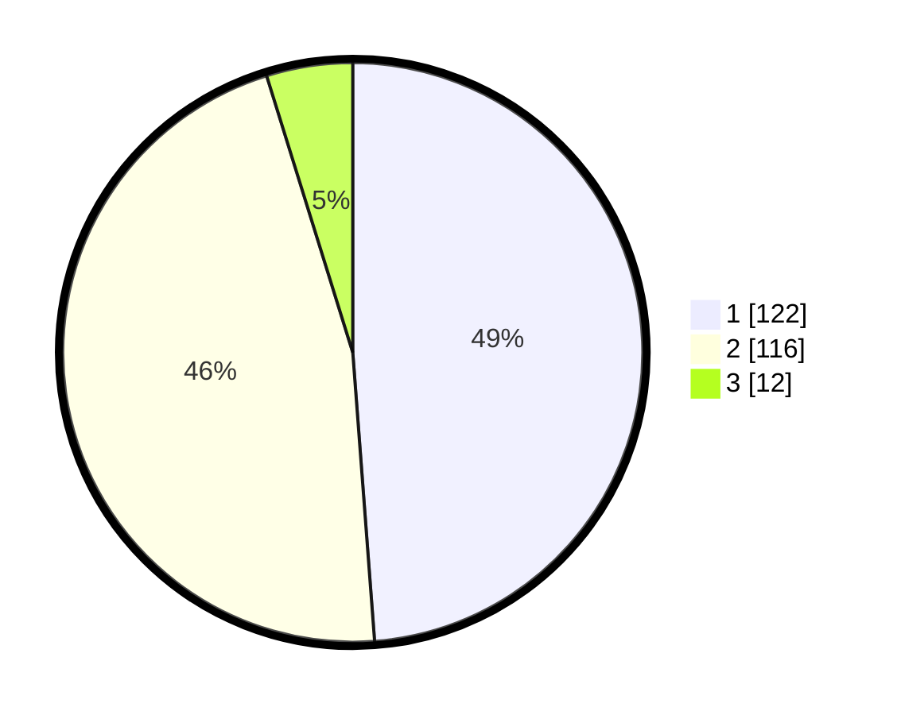

# Hasil

## Grafik

## Tabel

| No. | Nama Paslon    | Suara | Suara (raw) | Persentase |
|:--- |:-------------- | -----:| -----------:| ----------:|
| 1   | ANIES MUHAIMIN | 122   | [122][p-1]  | 48,80      |
| 2   | PRABOWO GIBRAN | 116   | [116][p-2]  | 46,40      |
| 3   | GANJAR MAHFUD  | 12    | [12][p-3]   | 4,80       |

[p-1]: https://github.com/gigit-pemilu/pemilu-2024-35-jawa-timur/blob/main/pilpres/hitung-suara/sub/35-jawa-timur/sub/28-pamekasan/sub/01-tlanakan/sub/2002-terrak/sub/003-tps/sub/paslon-1.txt
[p-2]: https://github.com/gigit-pemilu/pemilu-2024-35-jawa-timur/blob/main/pilpres/hitung-suara/sub/35-jawa-timur/sub/28-pamekasan/sub/01-tlanakan/sub/2002-terrak/sub/003-tps/sub/paslon-2.txt
[p-3]: https://github.com/gigit-pemilu/pemilu-2024-35-jawa-timur/blob/main/pilpres/hitung-suara/sub/35-jawa-timur/sub/28-pamekasan/sub/01-tlanakan/sub/2002-terrak/sub/003-tps/sub/paslon-3.txt

## Foto C Plano

https://sirekap-obj-formc.kpu.go.id/a94a/pemilu/ppwp/35/28/01/20/02/3528012002003-20240214-220804--8fafee8e-057e-4340-92c4-9d4728b5d076.jpg

https://sirekap-obj-formc.kpu.go.id/a94a/pemilu/ppwp/35/28/01/20/02/3528012002003-20240214-220816--6596b117-21b0-4aab-afd9-78fe87c31a6f.jpg

https://sirekap-obj-formc.kpu.go.id/a94a/pemilu/ppwp/35/28/01/20/02/3528012002003-20240214-220822--ea9466eb-acc0-4675-be29-4463e16a3bac.jpg

## Metadata

| Key        | Value               |
| ---------- | ------------------- |
| Time Stamp | 2024-02-15 19:30:26 |

