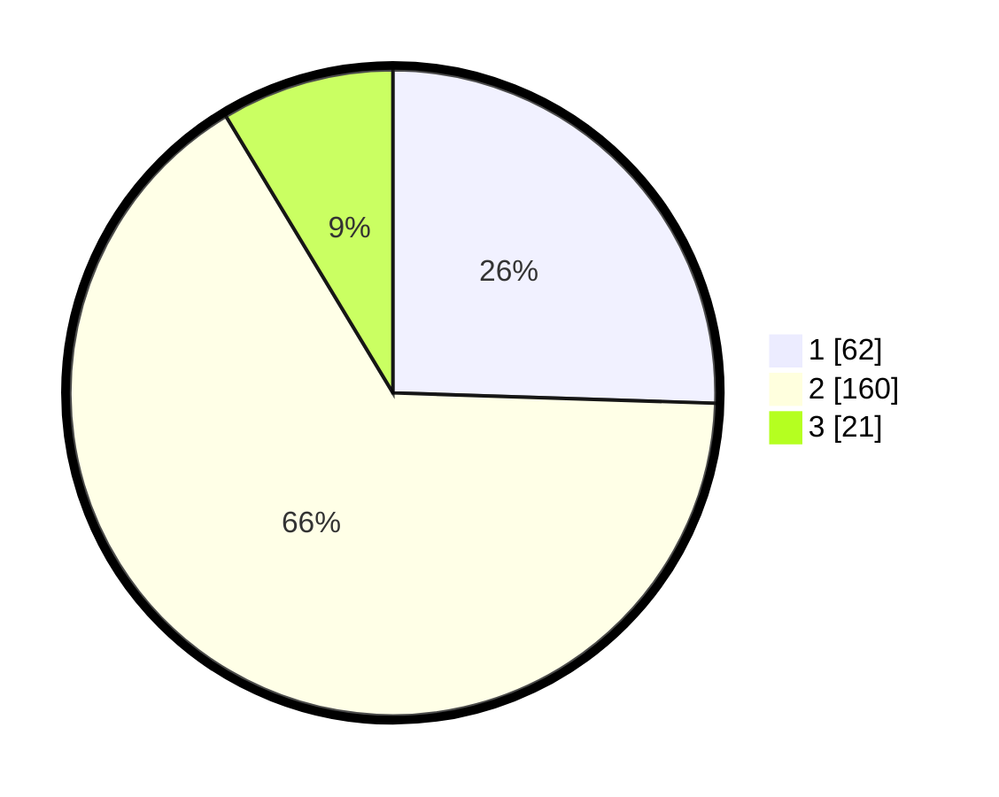

# Hasil

## Grafik

## Tabel

| No. | Nama Paslon    | Suara | Suara (raw) | Persentase |
|:--- |:-------------- | -----:| -----------:| ----------:|
| 1   | ANIES MUHAIMIN | 62    | [62][p-1]   | 25,51      |
| 2   | PRABOWO GIBRAN | 160   | [160][p-2]  | 65,84      |
| 3   | GANJAR MAHFUD  | 21    | [21][p-3]   | 8,64       |

[p-1]: https://github.com/gigit-pemilu/pemilu-2024-35-jawa-timur/blob/main/pilpres/hitung-suara/sub/35-jawa-timur/sub/28-pamekasan/sub/01-tlanakan/sub/2002-terrak/sub/006-tps/sub/paslon-1.txt
[p-2]: https://github.com/gigit-pemilu/pemilu-2024-35-jawa-timur/blob/main/pilpres/hitung-suara/sub/35-jawa-timur/sub/28-pamekasan/sub/01-tlanakan/sub/2002-terrak/sub/006-tps/sub/paslon-2.txt
[p-3]: https://github.com/gigit-pemilu/pemilu-2024-35-jawa-timur/blob/main/pilpres/hitung-suara/sub/35-jawa-timur/sub/28-pamekasan/sub/01-tlanakan/sub/2002-terrak/sub/006-tps/sub/paslon-3.txt

## Foto C Plano

https://sirekap-obj-formc.kpu.go.id/5557/pemilu/ppwp/35/28/01/20/02/3528012002006-20240215-103934--2e647e31-74bf-4c43-aedd-ef3ecbbcc8ae.jpg

https://sirekap-obj-formc.kpu.go.id/5557/pemilu/ppwp/35/28/01/20/02/3528012002006-20240215-104120--73e15889-59f4-488e-9d9b-9f9bb3e29c05.jpg

https://sirekap-obj-formc.kpu.go.id/5557/pemilu/ppwp/35/28/01/20/02/3528012002006-20240215-104321--b647d69f-e75b-4f34-a85c-ae0b1fd33eed.jpg

## Metadata

| Key        | Value               |
| ---------- | ------------------- |
| Time Stamp | 2024-02-15 15:00:29 |

