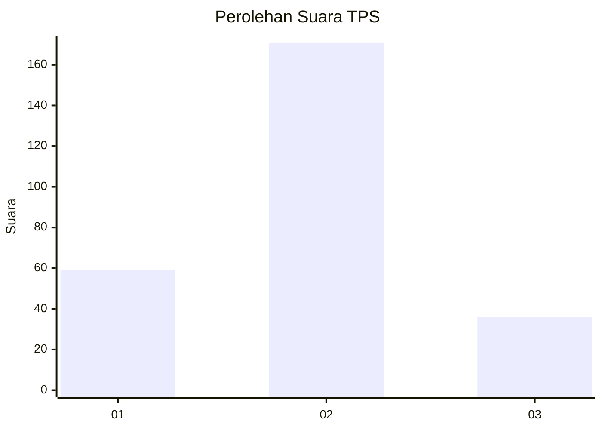
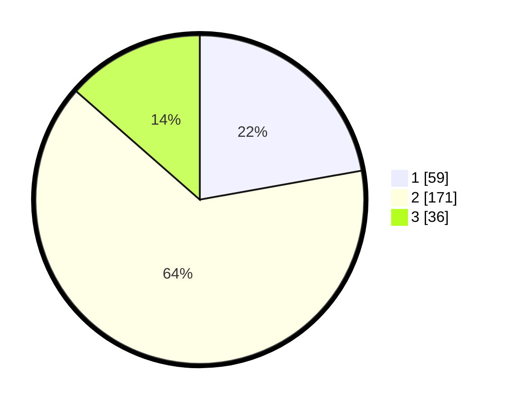

# Hasil

## Grafik

## Tabel

| No. | Nama Paslon    | Suara | Suara (raw) | Persentase |
|:--- |:-------------- | -----:| -----------:| ----------:|
| 1   | ANIES MUHAIMIN | 59    | [59][p-1]   | 22,18      |
| 2   | PRABOWO GIBRAN | 171   | [171][p-2]  | 64,29      |
| 3   | GANJAR MAHFUD  | 36    | [36][p-3]   | 13,53      |

[p-1]: https://github.com/gigit-pemilu/pemilu-2024/blob/main/pilpres/hitung-suara/sub/35-jawa-timur/sub/28-pamekasan/sub/01-tlanakan/sub/2002-terrak/sub/011-tps/sub/paslon-1.txt
[p-2]: https://github.com/gigit-pemilu/pemilu-2024/blob/main/pilpres/hitung-suara/sub/35-jawa-timur/sub/28-pamekasan/sub/01-tlanakan/sub/2002-terrak/sub/011-tps/sub/paslon-2.txt
[p-3]: https://github.com/gigit-pemilu/pemilu-2024/blob/main/pilpres/hitung-suara/sub/35-jawa-timur/sub/28-pamekasan/sub/01-tlanakan/sub/2002-terrak/sub/011-tps/sub/paslon-3.txt

## Foto C Plano

https://sirekap-obj-formc.kpu.go.id/3941/pemilu/ppwp/35/28/01/20/02/3528012002011-20240214-213711--a006ff68-7fa9-4d55-886b-46d5d8dce73d.jpg

https://sirekap-obj-formc.kpu.go.id/3941/pemilu/ppwp/35/28/01/20/02/3528012002011-20240214-213817--4c222cf2-7de4-4a26-8305-6c23872952db.jpg

https://sirekap-obj-formc.kpu.go.id/3941/pemilu/ppwp/35/28/01/20/02/3528012002011-20240214-213932--50ee8c12-b51e-44b4-9e26-82ffa9ed976f.jpg

## Metadata

| Key        | Value               |
| ---------- | ------------------- |
| Time Stamp | 2024-02-17 19:30:00 |

