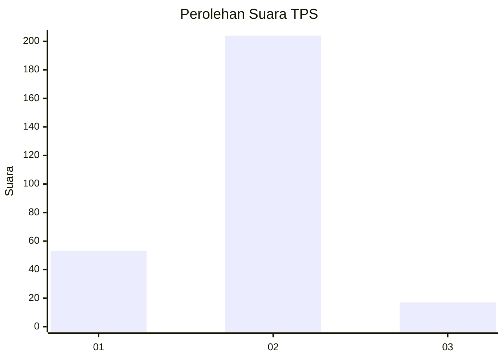
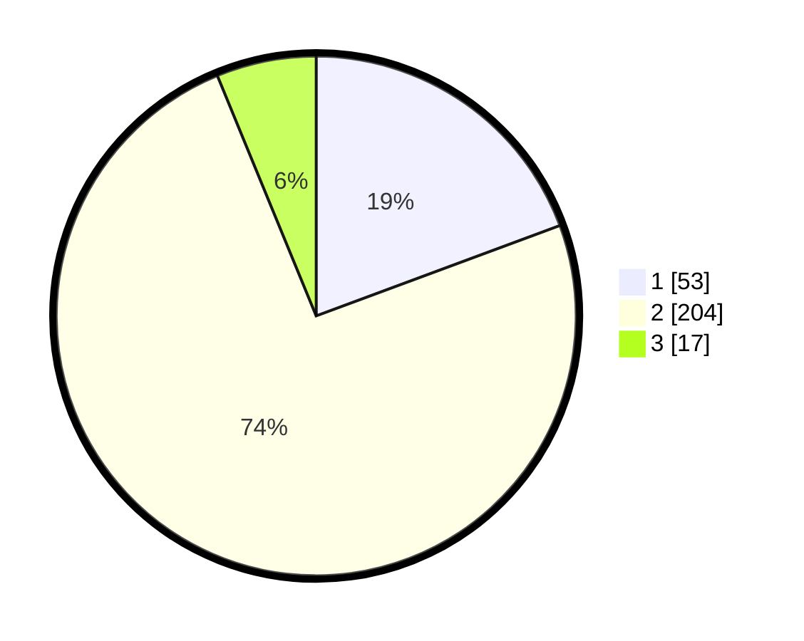

# Hasil

## Grafik

## Tabel

| No. | Nama Paslon    | Suara | Suara (raw) | Persentase |
|:--- |:-------------- | -----:| -----------:| ----------:|
| 1   | ANIES MUHAIMIN | 53    | [53][p-1]   | 19,34      |
| 2   | PRABOWO GIBRAN | 204   | [204][p-2]  | 74,45      |
| 3   | GANJAR MAHFUD  | 17    | [17][p-3]   | 6,20       |

[p-1]: https://github.com/gigit-pemilu/pemilu-2024/blob/main/pilpres/hitung-suara/sub/35-jawa-timur/sub/28-pamekasan/sub/01-tlanakan/sub/2003-mangar/sub/003-tps/sub/paslon-1.txt
[p-2]: https://github.com/gigit-pemilu/pemilu-2024/blob/main/pilpres/hitung-suara/sub/35-jawa-timur/sub/28-pamekasan/sub/01-tlanakan/sub/2003-mangar/sub/003-tps/sub/paslon-2.txt
[p-3]: https://github.com/gigit-pemilu/pemilu-2024/blob/main/pilpres/hitung-suara/sub/35-jawa-timur/sub/28-pamekasan/sub/01-tlanakan/sub/2003-mangar/sub/003-tps/sub/paslon-3.txt

## Foto C Plano

https://sirekap-obj-formc.kpu.go.id/e053/pemilu/ppwp/35/28/01/20/03/3528012003003-20240215-105508--22ac69d8-a215-4df8-a5a6-dc6f5f9c6a31.jpg

https://sirekap-obj-formc.kpu.go.id/e053/pemilu/ppwp/35/28/01/20/03/3528012003003-20240215-105748--1eac4374-d42b-44d7-89d1-7f861f875fbf.jpg

https://sirekap-obj-formc.kpu.go.id/e053/pemilu/ppwp/35/28/01/20/03/3528012003003-20240215-105929--04da55c9-6abd-47dd-b38c-77710dbbeb32.jpg

## Metadata

| Key        | Value               |
| ---------- | ------------------- |
| Time Stamp | 2024-02-17 19:30:00 |

