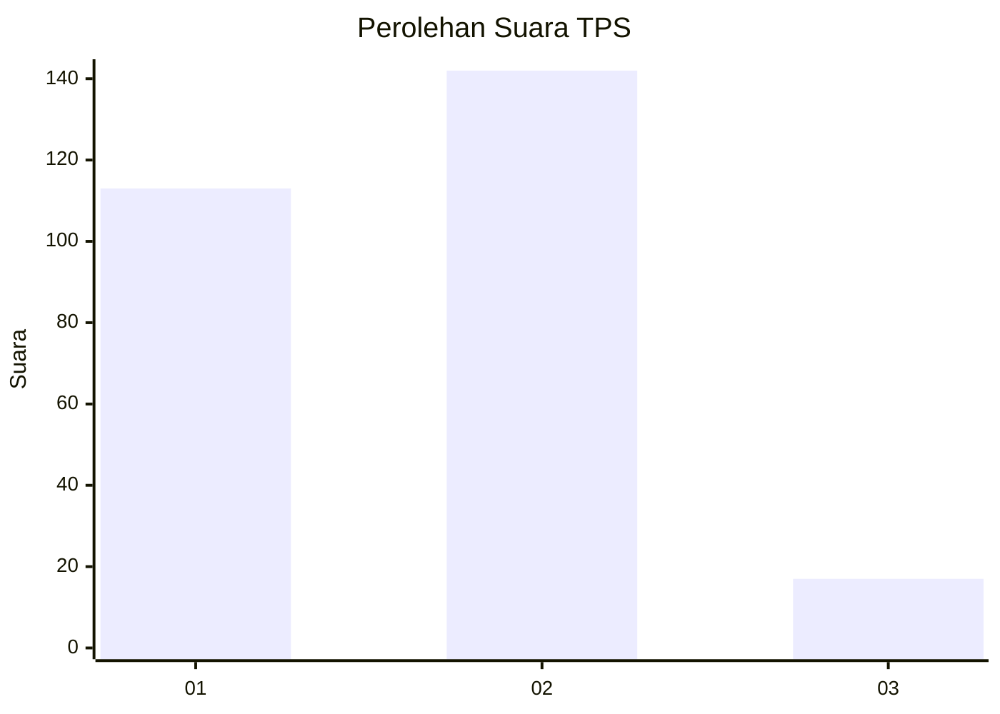

# Hasil

## Grafik

## Tabel

| No. | Nama Paslon    | Suara | Suara (raw) | Persentase |
|:--- |:-------------- | -----:| -----------:| ----------:|
| 1   | ANIES MUHAIMIN | 113   | [113][p-1]  | 41,54      |
| 2   | PRABOWO GIBRAN | 142   | [142][p-2]  | 52,21      |
| 3   | GANJAR MAHFUD  | 17    | [17][p-3]   | 6,25       |

[p-1]: https://github.com/gigit-pemilu/pemilu-2024/blob/main/pilpres/hitung-suara/sub/35-jawa-timur/sub/28-pamekasan/sub/01-tlanakan/sub/2003-mangar/sub/004-tps/sub/paslon-1.txt
[p-2]: https://github.com/gigit-pemilu/pemilu-2024/blob/main/pilpres/hitung-suara/sub/35-jawa-timur/sub/28-pamekasan/sub/01-tlanakan/sub/2003-mangar/sub/004-tps/sub/paslon-2.txt
[p-3]: https://github.com/gigit-pemilu/pemilu-2024/blob/main/pilpres/hitung-suara/sub/35-jawa-timur/sub/28-pamekasan/sub/01-tlanakan/sub/2003-mangar/sub/004-tps/sub/paslon-3.txt

## Foto C Plano

https://sirekap-obj-formc.kpu.go.id/cefe/pemilu/ppwp/35/28/01/20/03/3528012003004-20240215-111340--53ae9f47-6812-4c78-b89c-5426d91c1b90.jpg

https://sirekap-obj-formc.kpu.go.id/cefe/pemilu/ppwp/35/28/01/20/03/3528012003004-20240215-111553--e6d8d697-1bb3-4493-97c3-bb7c9df8cd73.jpg

https://sirekap-obj-formc.kpu.go.id/cefe/pemilu/ppwp/35/28/01/20/03/3528012003004-20240215-111636--43bd5a29-6090-4f58-8c83-314b4db3796f.jpg

## Metadata

| Key        | Value               |
| ---------- | ------------------- |
| Time Stamp | 2024-02-15 16:00:26 |

