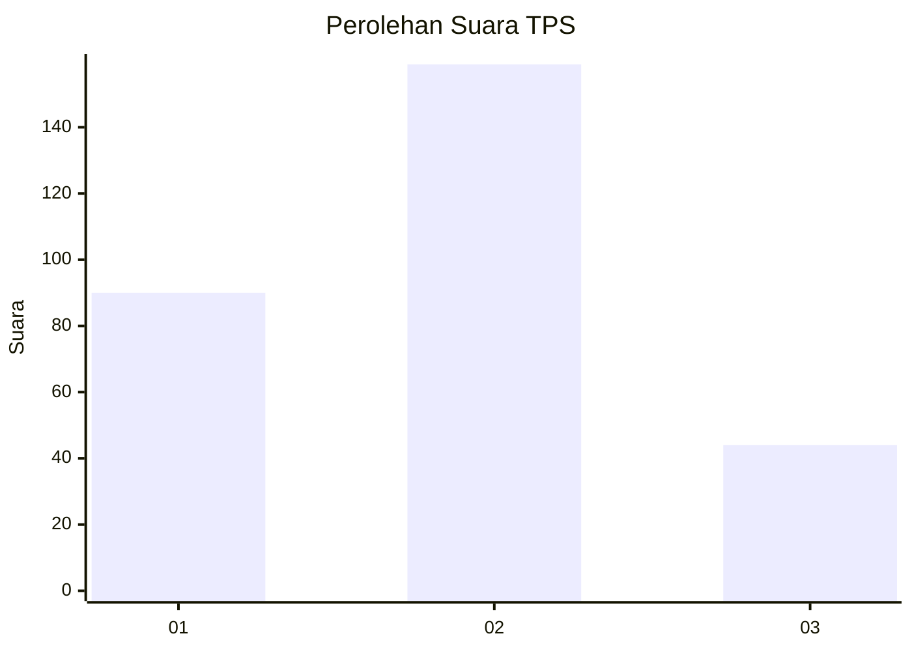
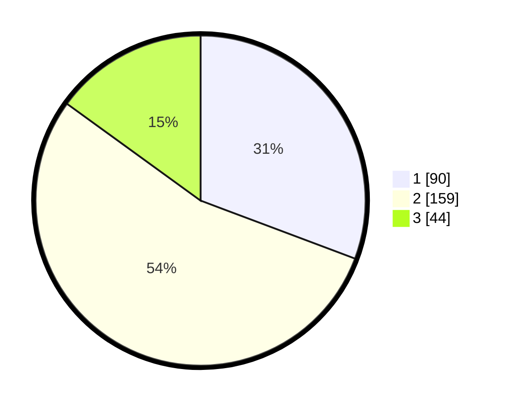

# Hasil

## Grafik

## Tabel

| No. | Nama Paslon    | Suara | Suara (raw) | Persentase |
|:--- |:-------------- | -----:| -----------:| ----------:|
| 1   | ANIES MUHAIMIN | 90    | [90][p-1]   | 30,72      |
| 2   | PRABOWO GIBRAN | 159   | [159][p-2]  | 54,27      |
| 3   | GANJAR MAHFUD  | 44    | [44][p-3]   | 15,02      |

[p-1]: https://github.com/gigit-pemilu/pemilu-2024-35-jawa-timur/blob/main/pilpres/hitung-suara/sub/35-jawa-timur/sub/28-pamekasan/sub/01-tlanakan/sub/2003-mangar/sub/006-tps/sub/paslon-1.txt
[p-2]: https://github.com/gigit-pemilu/pemilu-2024-35-jawa-timur/blob/main/pilpres/hitung-suara/sub/35-jawa-timur/sub/28-pamekasan/sub/01-tlanakan/sub/2003-mangar/sub/006-tps/sub/paslon-2.txt
[p-3]: https://github.com/gigit-pemilu/pemilu-2024-35-jawa-timur/blob/main/pilpres/hitung-suara/sub/35-jawa-timur/sub/28-pamekasan/sub/01-tlanakan/sub/2003-mangar/sub/006-tps/sub/paslon-3.txt

## Foto C Plano

https://sirekap-obj-formc.kpu.go.id/ac91/pemilu/ppwp/35/28/01/20/03/3528012003006-20240214-230346--e33ab1ea-8d77-410a-8414-a15ec65ecdd0.jpg

https://sirekap-obj-formc.kpu.go.id/ac91/pemilu/ppwp/35/28/01/20/03/3528012003006-20240215-111657--519993a6-e262-4f1c-a3eb-da2507f3303e.jpg

https://sirekap-obj-formc.kpu.go.id/ac91/pemilu/ppwp/35/28/01/20/03/3528012003006-20240215-111804--89be8bb9-5e05-4466-a079-1cebd743516f.jpg

## Metadata

| Key        | Value               |
| ---------- | ------------------- |
| Time Stamp | 2024-02-15 15:00:29 |

