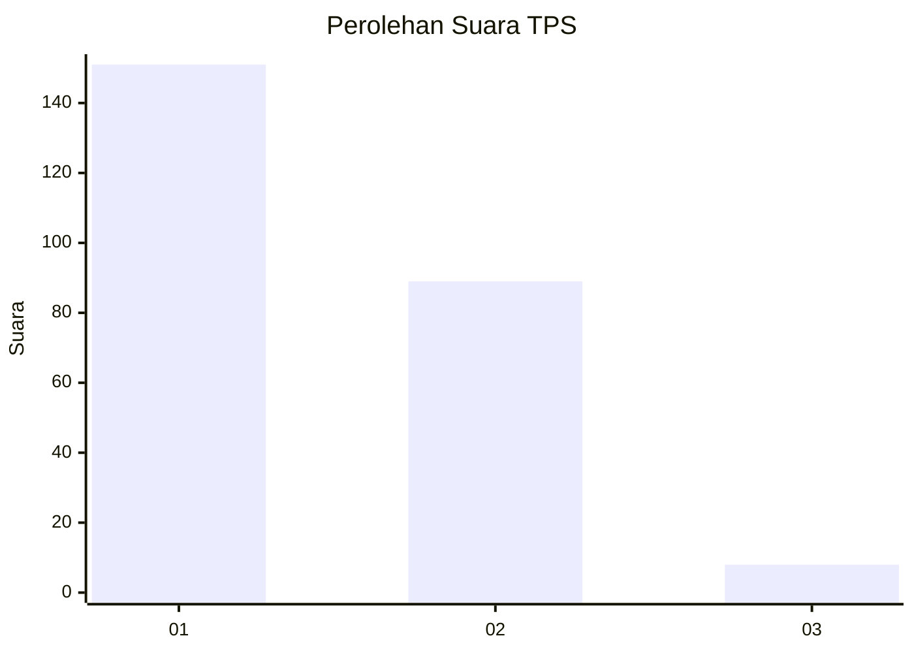
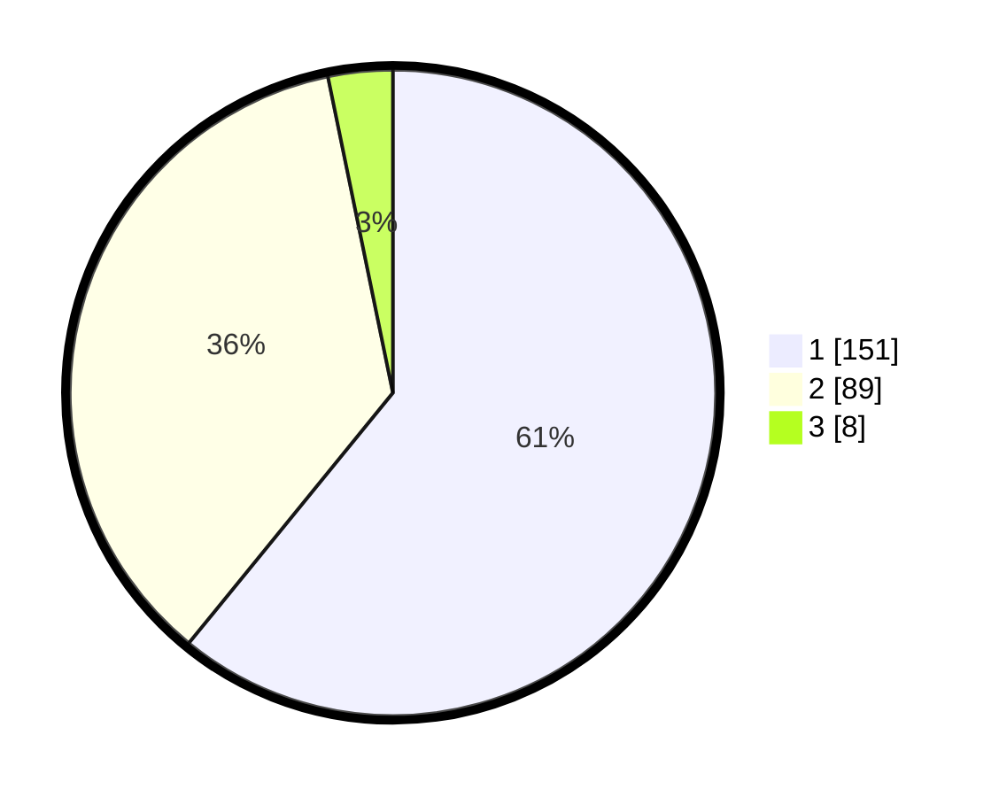

# Hasil

## Grafik

## Tabel

| No. | Nama Paslon    | Suara | Suara (raw) | Persentase |
|:--- |:-------------- | -----:| -----------:| ----------:|
| 1   | ANIES MUHAIMIN | 151   | [151][p-1]  | 60,89      |
| 2   | PRABOWO GIBRAN | 89    | [89][p-2]   | 35,89      |
| 3   | GANJAR MAHFUD  | 8     | [8][p-3]    | 3,23       |

[p-1]: https://github.com/gigit-pemilu/pemilu-2024-35-jawa-timur/blob/main/pilpres/hitung-suara/sub/35-jawa-timur/sub/28-pamekasan/sub/01-tlanakan/sub/2005-kramat/sub/006-tps/sub/paslon-1.txt
[p-2]: https://github.com/gigit-pemilu/pemilu-2024-35-jawa-timur/blob/main/pilpres/hitung-suara/sub/35-jawa-timur/sub/28-pamekasan/sub/01-tlanakan/sub/2005-kramat/sub/006-tps/sub/paslon-2.txt
[p-3]: https://github.com/gigit-pemilu/pemilu-2024-35-jawa-timur/blob/main/pilpres/hitung-suara/sub/35-jawa-timur/sub/28-pamekasan/sub/01-tlanakan/sub/2005-kramat/sub/006-tps/sub/paslon-3.txt

## Foto C Plano

https://sirekap-obj-formc.kpu.go.id/c206/pemilu/ppwp/35/28/01/20/05/3528012005006-20240215-125555--3ddb7e34-0040-4118-b91e-69c3bb44d67c.jpg

https://sirekap-obj-formc.kpu.go.id/c206/pemilu/ppwp/35/28/01/20/05/3528012005006-20240215-112214--0424d166-58a6-4bb2-b041-b6ec8051f5b2.jpg

https://sirekap-obj-formc.kpu.go.id/c206/pemilu/ppwp/35/28/01/20/05/3528012005006-20240214-221405--90ffcea6-2dd0-432b-972e-4fb5d1858b28.jpg

## Metadata

| Key        | Value               |
| ---------- | ------------------- |
| Time Stamp | 2024-02-15 16:30:25 |

