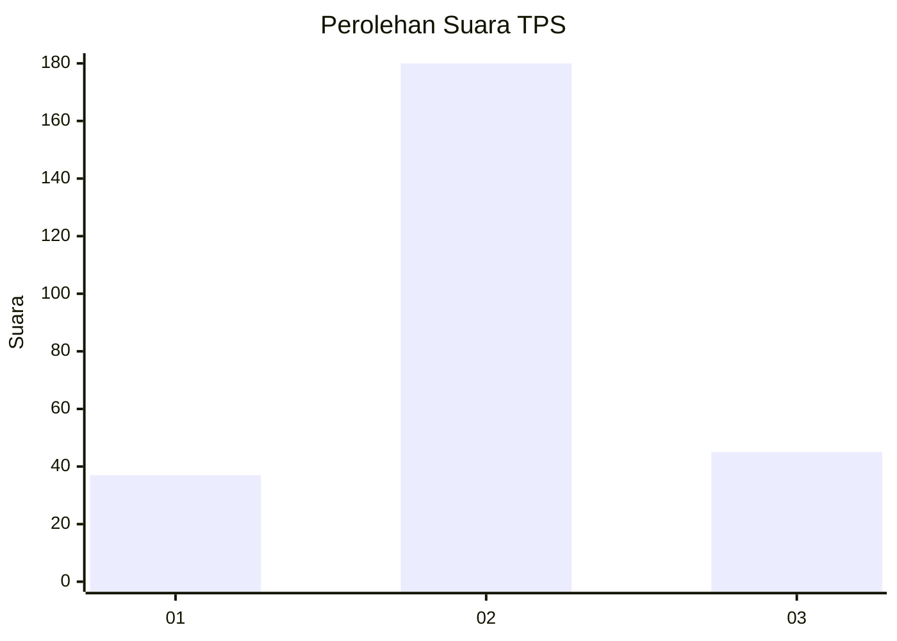
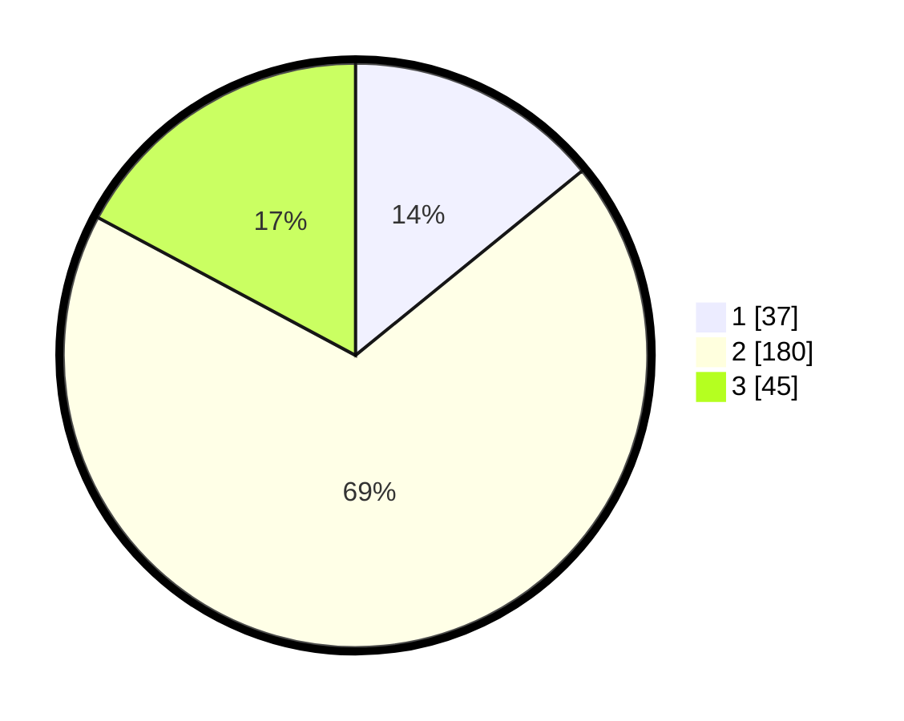

# Hasil

## Grafik

## Tabel

| No. | Nama Paslon    | Suara | Suara (raw) | Persentase |
|:--- |:-------------- | -----:| -----------:| ----------:|
| 1   | ANIES MUHAIMIN | 37    | [37][p-1]   | 14,12      |
| 2   | PRABOWO GIBRAN | 180   | [180][p-2]  | 68,70      |
| 3   | GANJAR MAHFUD  | 45    | [45][p-3]   | 17,18      |

[p-1]: https://github.com/gigit-pemilu/pemilu-2024/blob/main/pilpres/hitung-suara/sub/35-jawa-timur/sub/28-pamekasan/sub/01-tlanakan/sub/2005-kramat/sub/012-tps/sub/paslon-1.txt
[p-2]: https://github.com/gigit-pemilu/pemilu-2024/blob/main/pilpres/hitung-suara/sub/35-jawa-timur/sub/28-pamekasan/sub/01-tlanakan/sub/2005-kramat/sub/012-tps/sub/paslon-2.txt
[p-3]: https://github.com/gigit-pemilu/pemilu-2024/blob/main/pilpres/hitung-suara/sub/35-jawa-timur/sub/28-pamekasan/sub/01-tlanakan/sub/2005-kramat/sub/012-tps/sub/paslon-3.txt

## Foto C Plano

https://sirekap-obj-formc.kpu.go.id/6531/pemilu/ppwp/35/28/01/20/05/3528012005012-20240215-141707--3e421ed8-ffcf-45fd-b75b-46a331468081.jpg

https://sirekap-obj-formc.kpu.go.id/6531/pemilu/ppwp/35/28/01/20/05/3528012005012-20240215-141839--045aa471-806a-4680-81cc-9716cb433a17.jpg

https://sirekap-obj-formc.kpu.go.id/6531/pemilu/ppwp/35/28/01/20/05/3528012005012-20240215-141907--547d636a-02b1-4219-9dad-bdccf5f8f5f3.jpg

## Metadata

| Key        | Value               |
| ---------- | ------------------- |
| Time Stamp | 2024-02-15 19:30:26 |

