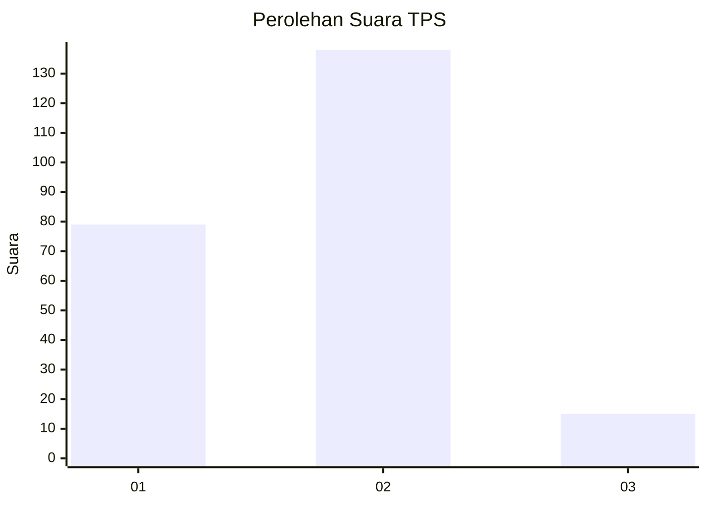
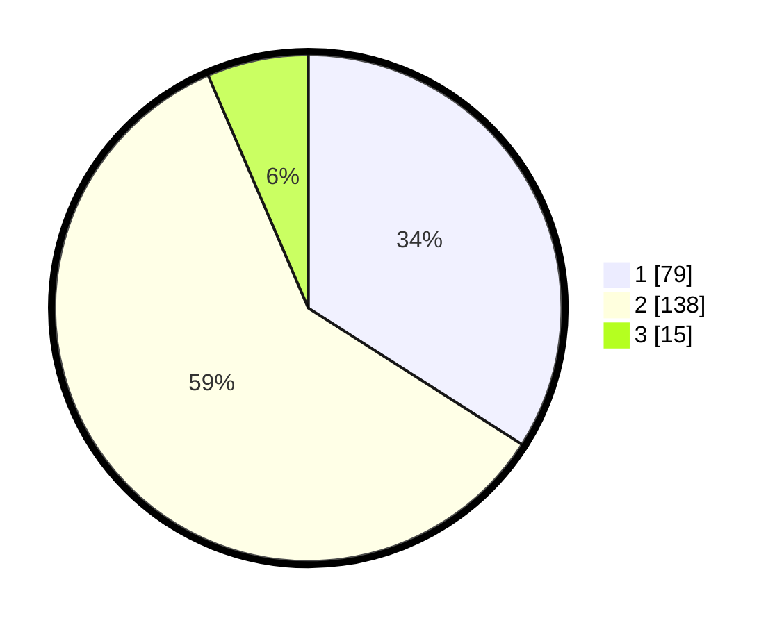

# Hasil

## Grafik

## Tabel

| No. | Nama Paslon    | Suara | Suara (raw) | Persentase |
|:--- |:-------------- | -----:| -----------:| ----------:|
| 1   | ANIES MUHAIMIN | 79    | [79][p-1]   | 34,05      |
| 2   | PRABOWO GIBRAN | 138   | [138][p-2]  | 59,48      |
| 3   | GANJAR MAHFUD  | 15    | [15][p-3]   | 6,47       |

[p-1]: https://github.com/gigit-pemilu/pemilu-2024/blob/main/pilpres/hitung-suara/sub/35-jawa-timur/sub/28-pamekasan/sub/01-tlanakan/sub/2006-ambat/sub/007-tps/sub/paslon-1.txt
[p-2]: https://github.com/gigit-pemilu/pemilu-2024/blob/main/pilpres/hitung-suara/sub/35-jawa-timur/sub/28-pamekasan/sub/01-tlanakan/sub/2006-ambat/sub/007-tps/sub/paslon-2.txt
[p-3]: https://github.com/gigit-pemilu/pemilu-2024/blob/main/pilpres/hitung-suara/sub/35-jawa-timur/sub/28-pamekasan/sub/01-tlanakan/sub/2006-ambat/sub/007-tps/sub/paslon-3.txt

## Foto C Plano

https://sirekap-obj-formc.kpu.go.id/db0c/pemilu/ppwp/35/28/01/20/06/3528012006007-20240214-224837--48fe0c95-5dd6-4cbe-b37c-bd61e4138ca0.jpg

https://sirekap-obj-formc.kpu.go.id/db0c/pemilu/ppwp/35/28/01/20/06/3528012006007-20240214-224918--0fdd1e79-cb5e-4d2e-8cfc-1dd1ff6f3348.jpg

https://sirekap-obj-formc.kpu.go.id/db0c/pemilu/ppwp/35/28/01/20/06/3528012006007-20240214-225117--c9547d23-7dbe-493a-922a-2e57cdeb9a83.jpg

## Metadata

| Key        | Value               |
| ---------- | ------------------- |
| Time Stamp | 2024-02-15 16:00:26 |

