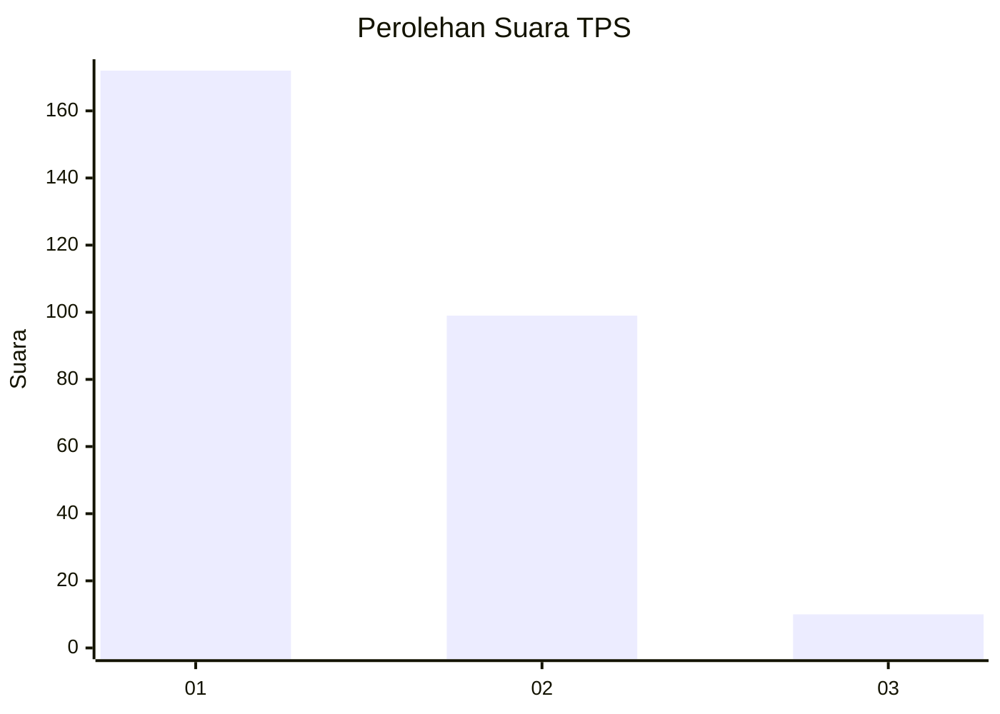
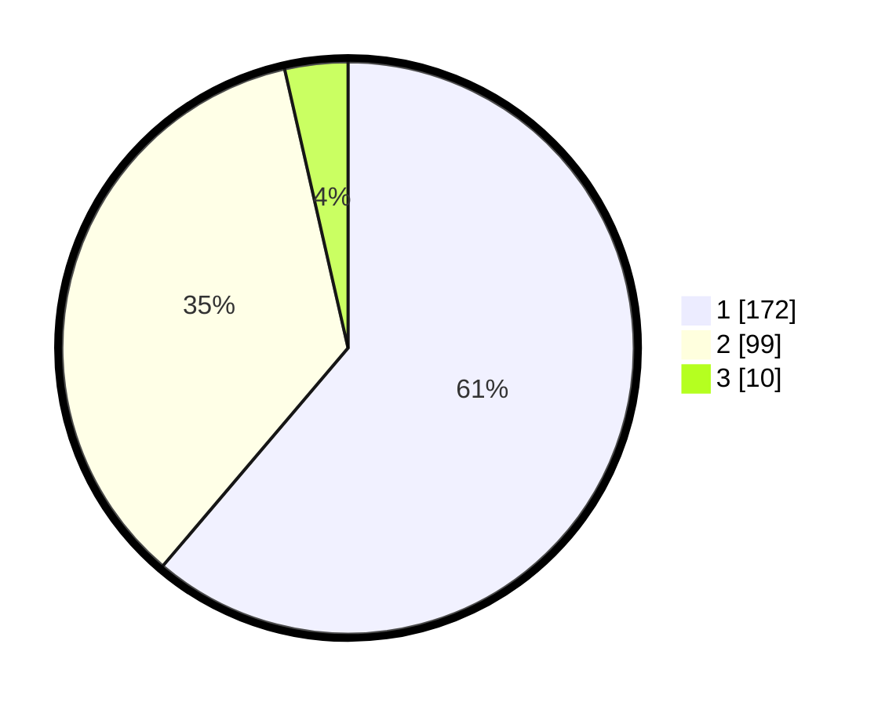

# Hasil

## Grafik

## Tabel

| No. | Nama Paslon    | Suara | Suara (raw) | Persentase |
|:--- |:-------------- | -----:| -----------:| ----------:|
| 1   | ANIES MUHAIMIN | 172   | [172][p-1]  | 61,21      |
| 2   | PRABOWO GIBRAN | 99    | [99][p-2]   | 35,23      |
| 3   | GANJAR MAHFUD  | 10    | [10][p-3]   | 3,56       |

[p-1]: https://github.com/gigit-pemilu/pemilu-2024-35-jawa-timur/blob/main/pilpres/hitung-suara/sub/35-jawa-timur/sub/28-pamekasan/sub/01-tlanakan/sub/2006-ambat/sub/008-tps/sub/paslon-1.txt
[p-2]: https://github.com/gigit-pemilu/pemilu-2024-35-jawa-timur/blob/main/pilpres/hitung-suara/sub/35-jawa-timur/sub/28-pamekasan/sub/01-tlanakan/sub/2006-ambat/sub/008-tps/sub/paslon-2.txt
[p-3]: https://github.com/gigit-pemilu/pemilu-2024-35-jawa-timur/blob/main/pilpres/hitung-suara/sub/35-jawa-timur/sub/28-pamekasan/sub/01-tlanakan/sub/2006-ambat/sub/008-tps/sub/paslon-3.txt

## Foto C Plano

https://sirekap-obj-formc.kpu.go.id/7de3/pemilu/ppwp/35/28/01/20/06/3528012006008-20240215-113916--a8401083-40bc-418e-a273-3413d280334c.jpg

https://sirekap-obj-formc.kpu.go.id/7de3/pemilu/ppwp/35/28/01/20/06/3528012006008-20240215-114014--87e86c81-286a-419a-afb9-8c23e6f603fd.jpg

https://sirekap-obj-formc.kpu.go.id/7de3/pemilu/ppwp/35/28/01/20/06/3528012006008-20240215-114054--51bf550b-0e66-4460-8f30-192f5a9f262c.jpg

## Metadata

| Key        | Value               |
| ---------- | ------------------- |
| Time Stamp | 2024-02-15 16:30:25 |

