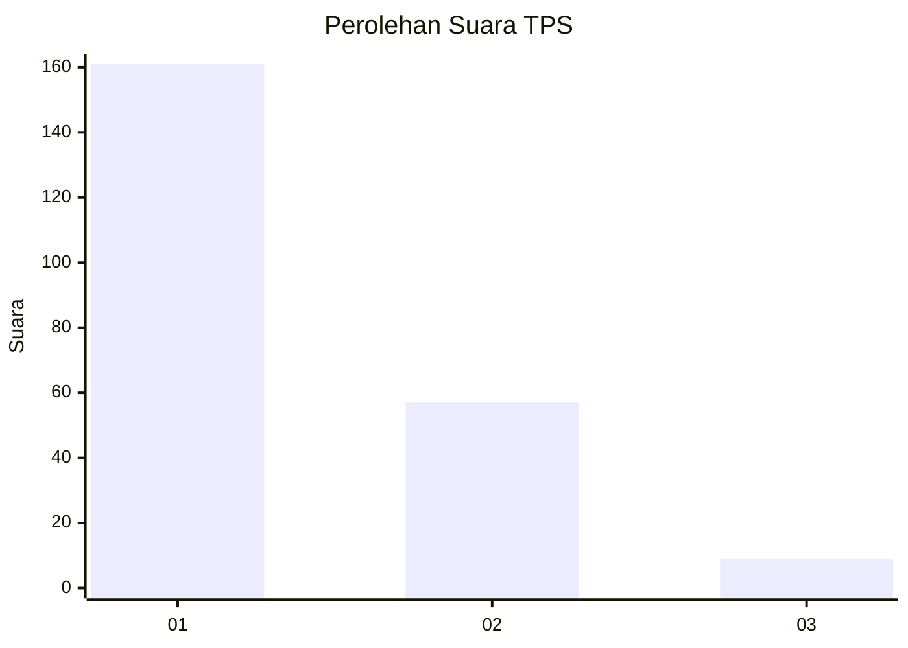
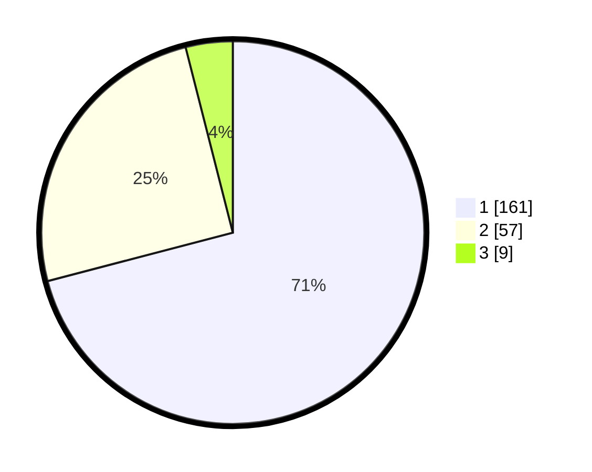

# Hasil

## Grafik

## Tabel

| No. | Nama Paslon    | Suara | Suara (raw) | Persentase |
|:--- |:-------------- | -----:| -----------:| ----------:|
| 1   | ANIES MUHAIMIN | 161   | [161][p-1]  | 70,93      |
| 2   | PRABOWO GIBRAN | 57    | [57][p-2]   | 25,11      |
| 3   | GANJAR MAHFUD  | 9     | [9][p-3]    | 3,96       |

[p-1]: https://github.com/gigit-pemilu/pemilu-2024/blob/main/pilpres/hitung-suara/sub/35-jawa-timur/sub/28-pamekasan/sub/01-tlanakan/sub/2006-ambat/sub/014-tps/sub/paslon-1.txt
[p-2]: https://github.com/gigit-pemilu/pemilu-2024/blob/main/pilpres/hitung-suara/sub/35-jawa-timur/sub/28-pamekasan/sub/01-tlanakan/sub/2006-ambat/sub/014-tps/sub/paslon-2.txt
[p-3]: https://github.com/gigit-pemilu/pemilu-2024/blob/main/pilpres/hitung-suara/sub/35-jawa-timur/sub/28-pamekasan/sub/01-tlanakan/sub/2006-ambat/sub/014-tps/sub/paslon-3.txt

## Foto C Plano

https://sirekap-obj-formc.kpu.go.id/dffc/pemilu/ppwp/35/28/01/20/06/3528012006014-20240215-000651--028c773c-afc9-48e3-a60f-7e4bd67a6901.jpg

https://sirekap-obj-formc.kpu.go.id/dffc/pemilu/ppwp/35/28/01/20/06/3528012006014-20240215-001331--2f1af2d0-3e1c-4940-b3de-b1c46ce51d82.jpg

https://sirekap-obj-formc.kpu.go.id/dffc/pemilu/ppwp/35/28/01/20/06/3528012006014-20240215-111448--7d655d89-1680-4795-9c00-27d4f6a6c23f.jpg

## Metadata

| Key        | Value               |
| ---------- | ------------------- |
| Time Stamp | 2024-02-15 20:00:44 |

