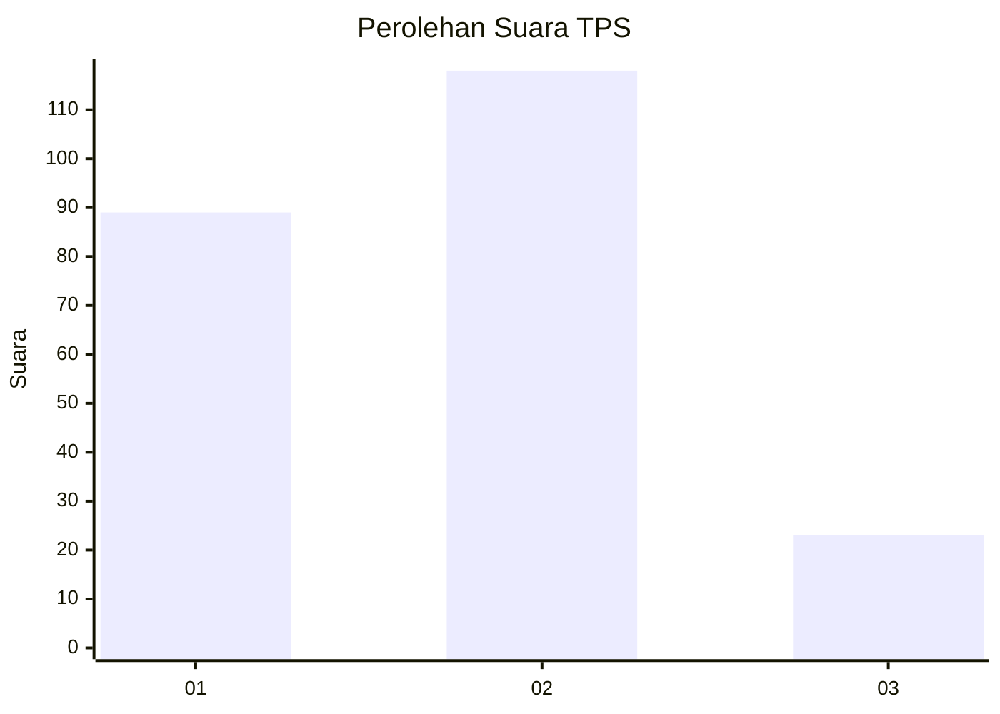
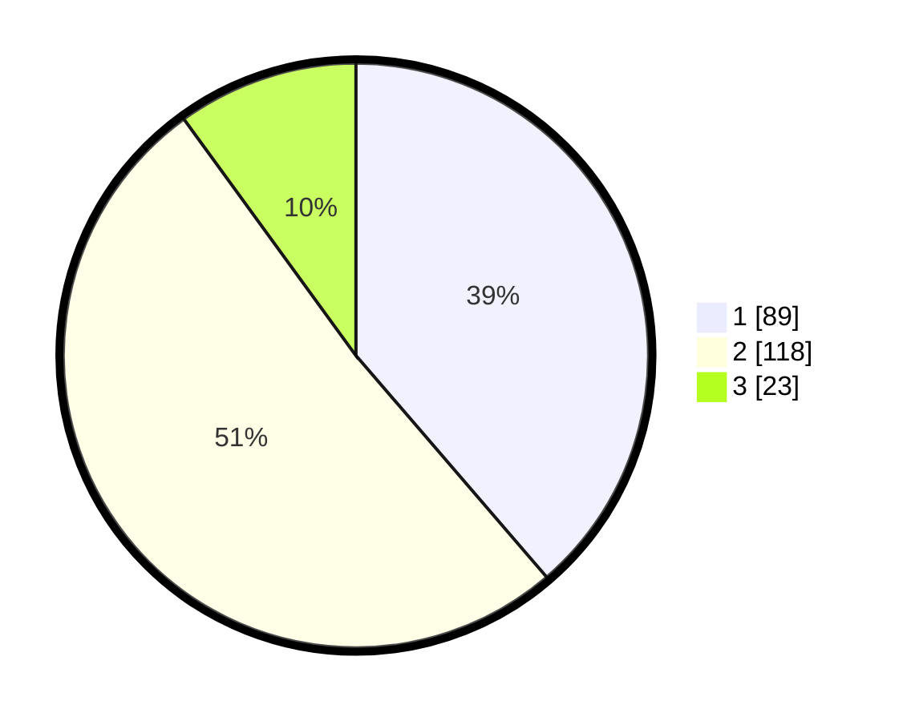

# Hasil

## Grafik

## Tabel

| No. | Nama Paslon    | Suara | Suara (raw) | Persentase |
|:--- |:-------------- | -----:| -----------:| ----------:|
| 1   | ANIES MUHAIMIN | 89    | [89][p-1]   | 38,70      |
| 2   | PRABOWO GIBRAN | 118   | [118][p-2]  | 51,30      |
| 3   | GANJAR MAHFUD  | 23    | [23][p-3]   | 10,00      |

[p-1]: https://github.com/gigit-pemilu/pemilu-2024-35-jawa-timur/blob/main/pilpres/hitung-suara/sub/35-jawa-timur/sub/28-pamekasan/sub/01-tlanakan/sub/2007-branta-pesisir/sub/004-tps/sub/paslon-1.txt
[p-2]: https://github.com/gigit-pemilu/pemilu-2024-35-jawa-timur/blob/main/pilpres/hitung-suara/sub/35-jawa-timur/sub/28-pamekasan/sub/01-tlanakan/sub/2007-branta-pesisir/sub/004-tps/sub/paslon-2.txt
[p-3]: https://github.com/gigit-pemilu/pemilu-2024-35-jawa-timur/blob/main/pilpres/hitung-suara/sub/35-jawa-timur/sub/28-pamekasan/sub/01-tlanakan/sub/2007-branta-pesisir/sub/004-tps/sub/paslon-3.txt

## Foto C Plano

https://sirekap-obj-formc.kpu.go.id/4056/pemilu/ppwp/35/28/01/20/07/3528012007004-20240215-090946--d76b5563-465d-41d5-9cbb-9174605417a8.jpg

https://sirekap-obj-formc.kpu.go.id/4056/pemilu/ppwp/35/28/01/20/07/3528012007004-20240214-205025--023fd368-0364-42e8-ae62-adfc8a25659f.jpg

https://sirekap-obj-formc.kpu.go.id/4056/pemilu/ppwp/35/28/01/20/07/3528012007004-20240215-090956--fcc16729-8fa8-4a8d-bf71-c54237876ae9.jpg

## Metadata

| Key        | Value               |
| ---------- | ------------------- |
| Time Stamp | 2024-02-15 18:30:25 |

