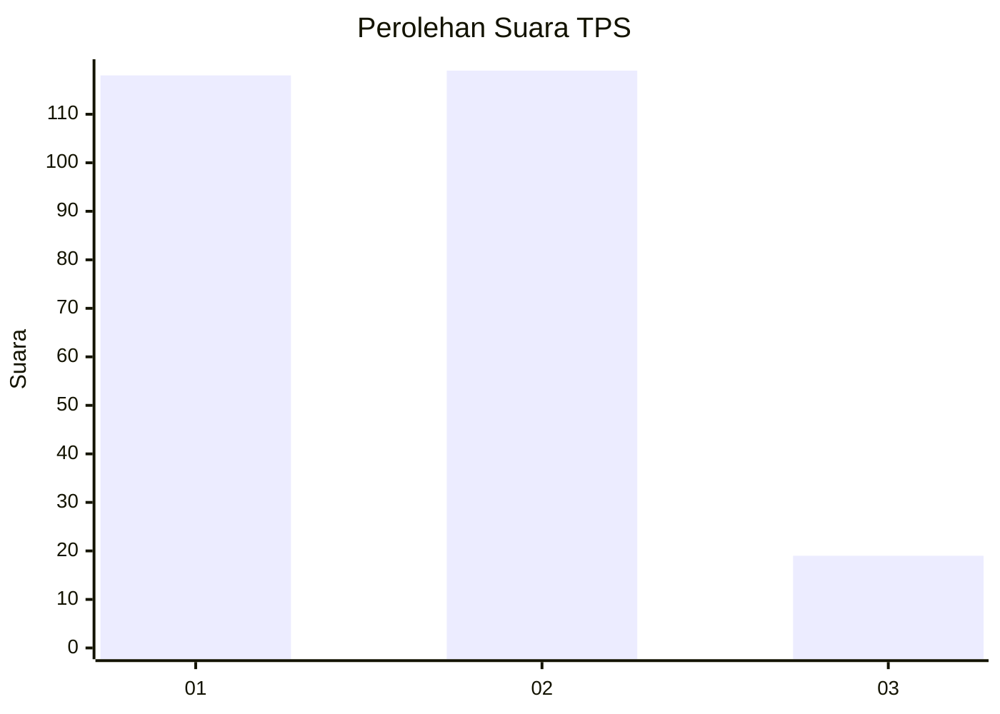
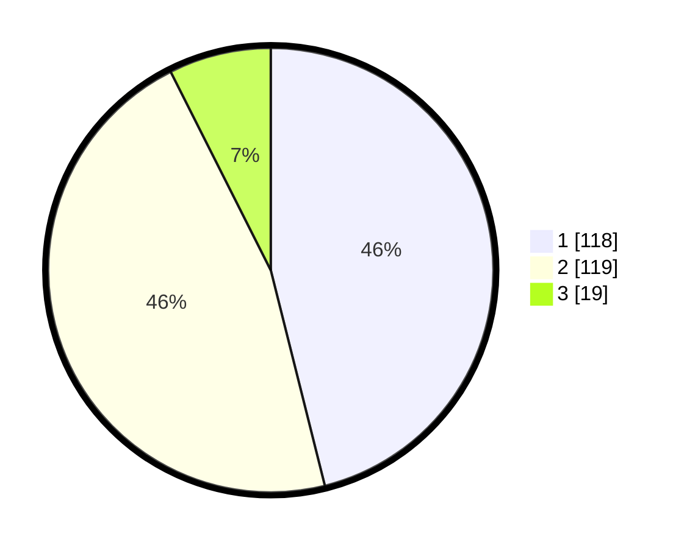

# Hasil

## Grafik

## Tabel

| No. | Nama Paslon    | Suara | Suara (raw) | Persentase |
|:--- |:-------------- | -----:| -----------:| ----------:|
| 1   | ANIES MUHAIMIN | 118   | [118][p-1]  | 46,09      |
| 2   | PRABOWO GIBRAN | 119   | [119][p-2]  | 46,48      |
| 3   | GANJAR MAHFUD  | 19    | [19][p-3]   | 7,42       |

[p-1]: https://github.com/gigit-pemilu/pemilu-2024-35-jawa-timur/blob/main/pilpres/hitung-suara/sub/35-jawa-timur/sub/28-pamekasan/sub/01-tlanakan/sub/2007-branta-pesisir/sub/005-tps/sub/paslon-1.txt
[p-2]: https://github.com/gigit-pemilu/pemilu-2024-35-jawa-timur/blob/main/pilpres/hitung-suara/sub/35-jawa-timur/sub/28-pamekasan/sub/01-tlanakan/sub/2007-branta-pesisir/sub/005-tps/sub/paslon-2.txt
[p-3]: https://github.com/gigit-pemilu/pemilu-2024-35-jawa-timur/blob/main/pilpres/hitung-suara/sub/35-jawa-timur/sub/28-pamekasan/sub/01-tlanakan/sub/2007-branta-pesisir/sub/005-tps/sub/paslon-3.txt

## Foto C Plano

https://sirekap-obj-formc.kpu.go.id/463f/pemilu/ppwp/35/28/01/20/07/3528012007005-20240215-093003--67c32903-26ff-4f87-83b6-4fc36e7659ef.jpg

https://sirekap-obj-formc.kpu.go.id/463f/pemilu/ppwp/35/28/01/20/07/3528012007005-20240215-093141--8a1bf4f5-ecde-47d2-9a39-d925a3da2f9c.jpg

https://sirekap-obj-formc.kpu.go.id/463f/pemilu/ppwp/35/28/01/20/07/3528012007005-20240215-093332--476d6399-bfc7-4d9a-9528-50250cfd85d4.jpg

## Metadata

| Key        | Value               |
| ---------- | ------------------- |
| Time Stamp | 2024-02-15 20:00:44 |

