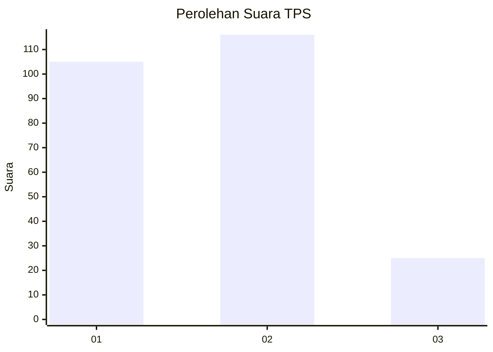
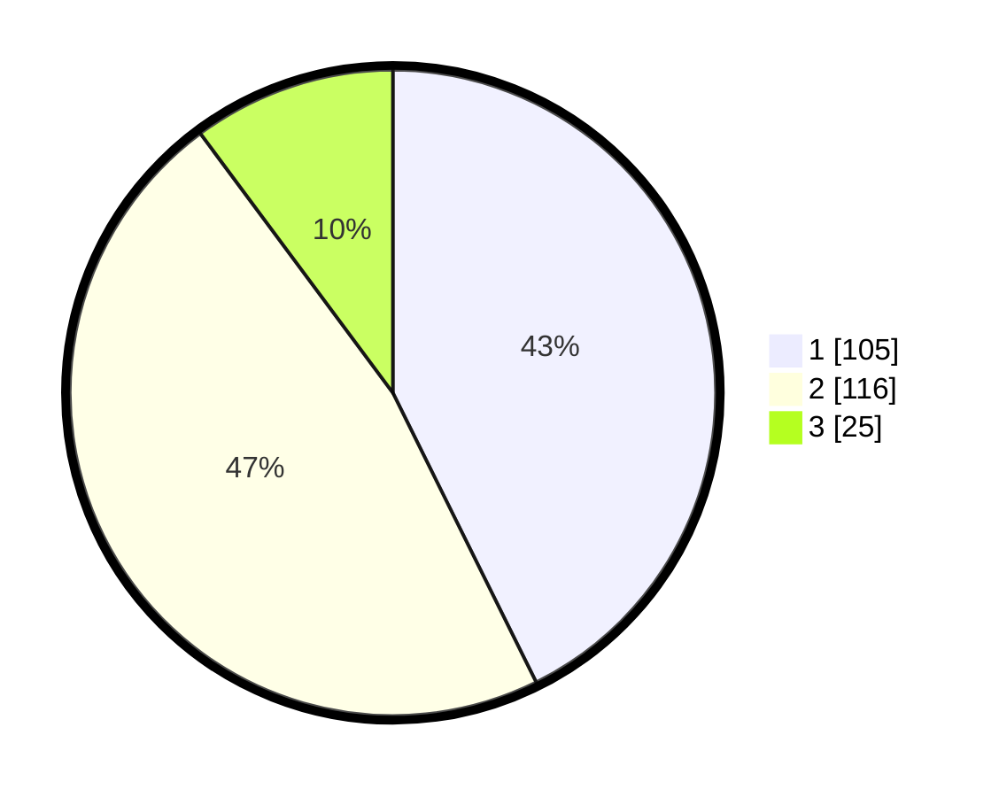

# Hasil

## Grafik

## Tabel

| No. | Nama Paslon    | Suara | Suara (raw) | Persentase |
|:--- |:-------------- | -----:| -----------:| ----------:|
| 1   | ANIES MUHAIMIN | 105   | [105][p-1]  | 42,68      |
| 2   | PRABOWO GIBRAN | 116   | [116][p-2]  | 47,15      |
| 3   | GANJAR MAHFUD  | 25    | [25][p-3]   | 10,16      |

[p-1]: https://github.com/gigit-pemilu/pemilu-2024/blob/main/pilpres/hitung-suara/sub/35-jawa-timur/sub/28-pamekasan/sub/01-tlanakan/sub/2007-branta-pesisir/sub/008-tps/sub/paslon-1.txt
[p-2]: https://github.com/gigit-pemilu/pemilu-2024/blob/main/pilpres/hitung-suara/sub/35-jawa-timur/sub/28-pamekasan/sub/01-tlanakan/sub/2007-branta-pesisir/sub/008-tps/sub/paslon-2.txt
[p-3]: https://github.com/gigit-pemilu/pemilu-2024/blob/main/pilpres/hitung-suara/sub/35-jawa-timur/sub/28-pamekasan/sub/01-tlanakan/sub/2007-branta-pesisir/sub/008-tps/sub/paslon-3.txt

## Foto C Plano

https://sirekap-obj-formc.kpu.go.id/add0/pemilu/ppwp/35/28/01/20/07/3528012007008-20240214-222812--7d8f11f2-2846-40b4-a2a5-540de18709e1.jpg

https://sirekap-obj-formc.kpu.go.id/add0/pemilu/ppwp/35/28/01/20/07/3528012007008-20240214-222720--33dac0e0-1e32-466d-a634-5d27072bd378.jpg

https://sirekap-obj-formc.kpu.go.id/add0/pemilu/ppwp/35/28/01/20/07/3528012007008-20240214-222115--cb0bf2f8-7711-4177-9f5a-d365246072d7.jpg

## Metadata

| Key        | Value               |
| ---------- | ------------------- |
| Time Stamp | 2024-02-19 09:00:00 |

