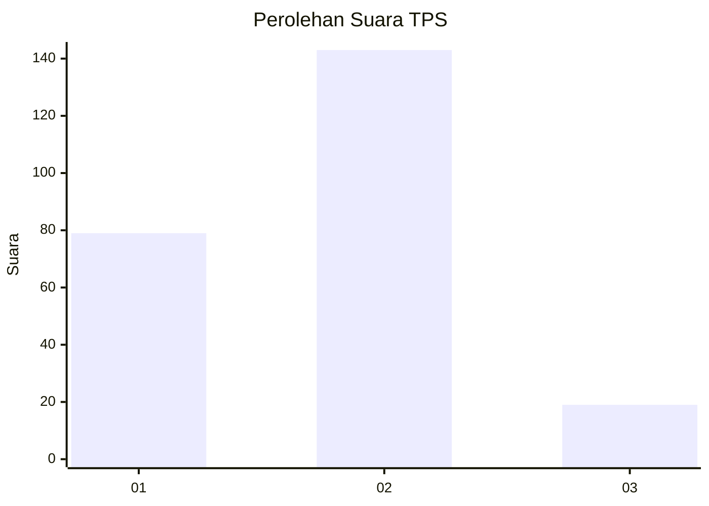
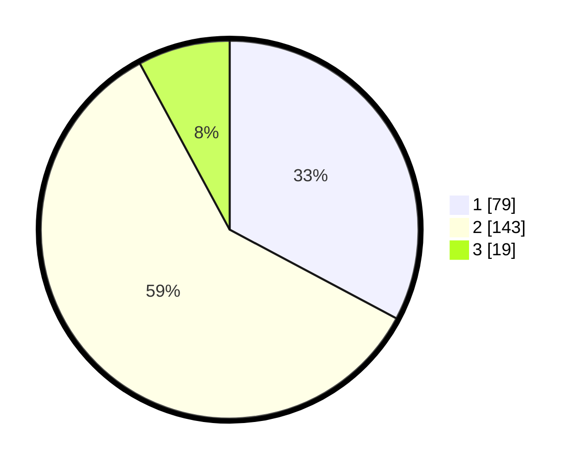

# Hasil

## Grafik

## Tabel

| No. | Nama Paslon    | Suara | Suara (raw) | Persentase |
|:--- |:-------------- | -----:| -----------:| ----------:|
| 1   | ANIES MUHAIMIN | 79    | [79][p-1]   | 32,78      |
| 2   | PRABOWO GIBRAN | 143   | [143][p-2]  | 59,34      |
| 3   | GANJAR MAHFUD  | 19    | [19][p-3]   | 7,88       |

[p-1]: https://github.com/gigit-pemilu/pemilu-2024/blob/main/pilpres/hitung-suara/sub/35-jawa-timur/sub/28-pamekasan/sub/01-tlanakan/sub/2008-tlanakan/sub/007-tps/sub/paslon-1.txt
[p-2]: https://github.com/gigit-pemilu/pemilu-2024/blob/main/pilpres/hitung-suara/sub/35-jawa-timur/sub/28-pamekasan/sub/01-tlanakan/sub/2008-tlanakan/sub/007-tps/sub/paslon-2.txt
[p-3]: https://github.com/gigit-pemilu/pemilu-2024/blob/main/pilpres/hitung-suara/sub/35-jawa-timur/sub/28-pamekasan/sub/01-tlanakan/sub/2008-tlanakan/sub/007-tps/sub/paslon-3.txt

## Foto C Plano

https://sirekap-obj-formc.kpu.go.id/3985/pemilu/ppwp/35/28/01/20/08/3528012008007-20240215-004027--2e56106e-9a3b-4d2b-83fc-54cf33eadcb5.jpg

https://sirekap-obj-formc.kpu.go.id/3985/pemilu/ppwp/35/28/01/20/08/3528012008007-20240214-230428--09d81f0c-cfa1-467d-a920-327933db41fa.jpg

https://sirekap-obj-formc.kpu.go.id/3985/pemilu/ppwp/35/28/01/20/08/3528012008007-20240214-230210--b5b6bb55-357b-4717-8271-a23b335aa37d.jpg

## Metadata

| Key        | Value               |
| ---------- | ------------------- |
| Time Stamp | 2024-02-15 16:30:25 |

