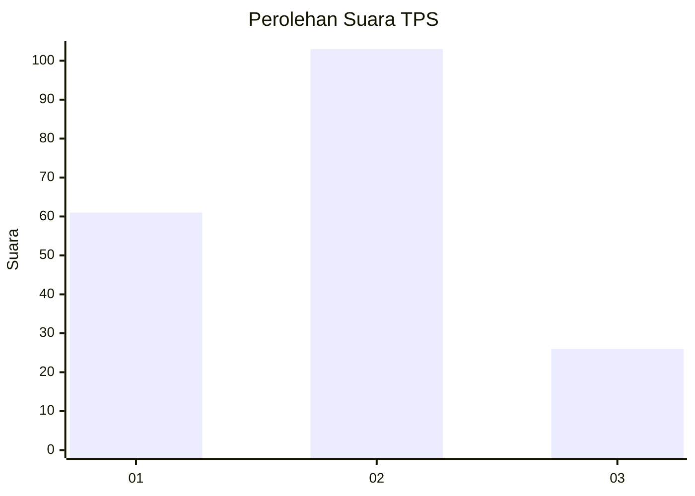
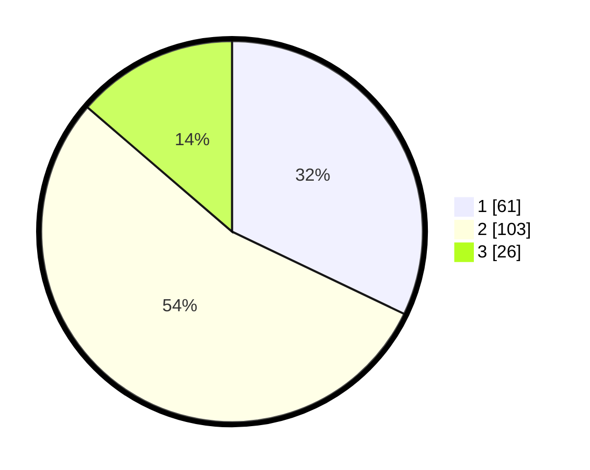

# Hasil

## Grafik

## Tabel

| No. | Nama Paslon    | Suara | Suara (raw) | Persentase |
|:--- |:-------------- | -----:| -----------:| ----------:|
| 1   | ANIES MUHAIMIN | 61    | [61][p-1]   | 32,11      |
| 2   | PRABOWO GIBRAN | 103   | [103][p-2]  | 54,21      |
| 3   | GANJAR MAHFUD  | 26    | [26][p-3]   | 13,68      |

[p-1]: https://github.com/gigit-pemilu/pemilu-2024/blob/main/pilpres/hitung-suara/sub/35-jawa-timur/sub/28-pamekasan/sub/01-tlanakan/sub/2011-larangan-tokol/sub/003-tps/sub/paslon-1.txt
[p-2]: https://github.com/gigit-pemilu/pemilu-2024/blob/main/pilpres/hitung-suara/sub/35-jawa-timur/sub/28-pamekasan/sub/01-tlanakan/sub/2011-larangan-tokol/sub/003-tps/sub/paslon-2.txt
[p-3]: https://github.com/gigit-pemilu/pemilu-2024/blob/main/pilpres/hitung-suara/sub/35-jawa-timur/sub/28-pamekasan/sub/01-tlanakan/sub/2011-larangan-tokol/sub/003-tps/sub/paslon-3.txt

## Foto C Plano

https://sirekap-obj-formc.kpu.go.id/2164/pemilu/ppwp/35/28/01/20/11/3528012011003-20240215-092124--cb628b19-6ada-450c-a0fe-0439d5a049bd.jpg

https://sirekap-obj-formc.kpu.go.id/2164/pemilu/ppwp/35/28/01/20/11/3528012011003-20240215-092213--e93b289a-cf5f-408a-836f-64d331590dc9.jpg

https://sirekap-obj-formc.kpu.go.id/2164/pemilu/ppwp/35/28/01/20/11/3528012011003-20240215-091705--8f02ee72-8e1a-40c7-bbce-7177b46dfffd.jpg

## Metadata

| Key        | Value               |
| ---------- | ------------------- |
| Time Stamp | 2024-02-15 17:00:25 |

