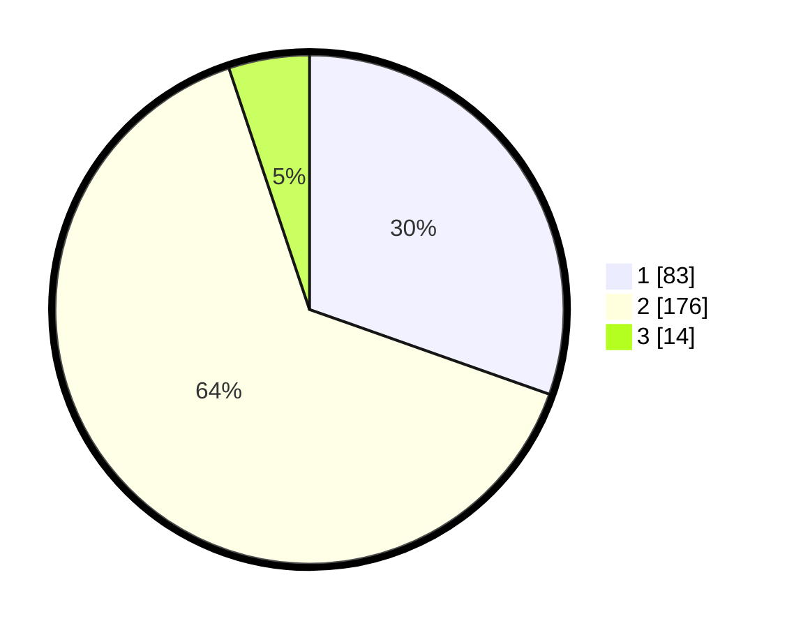

# Hasil

## Grafik

## Tabel

| No. | Nama Paslon    | Suara | Suara (raw) | Persentase |
|:--- |:-------------- | -----:| -----------:| ----------:|
| 1   | ANIES MUHAIMIN | 83    | [83][p-1]   | 30,40      |
| 2   | PRABOWO GIBRAN | 176   | [176][p-2]  | 64,47      |
| 3   | GANJAR MAHFUD  | 14    | [14][p-3]   | 5,13       |

[p-1]: https://github.com/gigit-pemilu/pemilu-2024-35-jawa-timur/blob/main/pilpres/hitung-suara/sub/35-jawa-timur/sub/28-pamekasan/sub/01-tlanakan/sub/2011-larangan-tokol/sub/013-tps/sub/paslon-1.txt
[p-2]: https://github.com/gigit-pemilu/pemilu-2024-35-jawa-timur/blob/main/pilpres/hitung-suara/sub/35-jawa-timur/sub/28-pamekasan/sub/01-tlanakan/sub/2011-larangan-tokol/sub/013-tps/sub/paslon-2.txt
[p-3]: https://github.com/gigit-pemilu/pemilu-2024-35-jawa-timur/blob/main/pilpres/hitung-suara/sub/35-jawa-timur/sub/28-pamekasan/sub/01-tlanakan/sub/2011-larangan-tokol/sub/013-tps/sub/paslon-3.txt

## Foto C Plano

https://sirekap-obj-formc.kpu.go.id/ef4a/pemilu/ppwp/35/28/01/20/11/3528012011013-20240215-032200--ac73c2a9-676b-4b52-8dce-c3ebf6014e81.jpg

https://sirekap-obj-formc.kpu.go.id/ef4a/pemilu/ppwp/35/28/01/20/11/3528012011013-20240215-033803--a3d3cda5-523a-4caf-a1cc-d707e676c40e.jpg

https://sirekap-obj-formc.kpu.go.id/ef4a/pemilu/ppwp/35/28/01/20/11/3528012011013-20240215-033920--c5155f2c-2baf-4338-aea0-d3c5c6ab3916.jpg

## Metadata

| Key        | Value               |
| ---------- | ------------------- |
| Time Stamp | 2024-02-15 17:00:25 |

