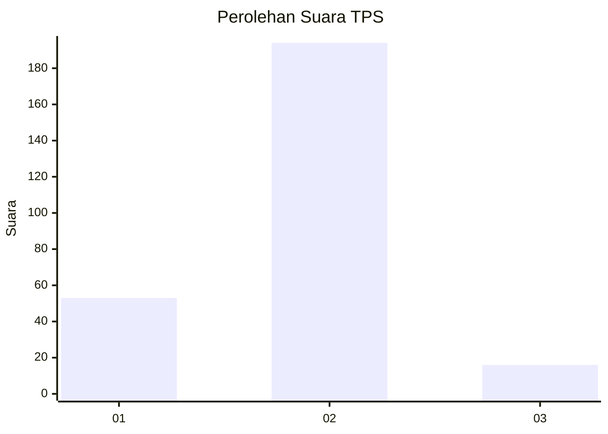

# Hasil

## Grafik

## Tabel

| No. | Nama Paslon    | Suara | Suara (raw) | Persentase |
|:--- |:-------------- | -----:| -----------:| ----------:|
| 1   | ANIES MUHAIMIN | 53    | [53][p-1]   | 20,15      |
| 2   | PRABOWO GIBRAN | 194   | [194][p-2]  | 73,76      |
| 3   | GANJAR MAHFUD  | 16    | [16][p-3]   | 6,08       |

[p-1]: https://github.com/gigit-pemilu/pemilu-2024-35-jawa-timur/blob/main/pilpres/hitung-suara/sub/35-jawa-timur/sub/28-pamekasan/sub/01-tlanakan/sub/2011-larangan-tokol/sub/016-tps/sub/paslon-1.txt
[p-2]: https://github.com/gigit-pemilu/pemilu-2024-35-jawa-timur/blob/main/pilpres/hitung-suara/sub/35-jawa-timur/sub/28-pamekasan/sub/01-tlanakan/sub/2011-larangan-tokol/sub/016-tps/sub/paslon-2.txt
[p-3]: https://github.com/gigit-pemilu/pemilu-2024-35-jawa-timur/blob/main/pilpres/hitung-suara/sub/35-jawa-timur/sub/28-pamekasan/sub/01-tlanakan/sub/2011-larangan-tokol/sub/016-tps/sub/paslon-3.txt

## Foto C Plano

https://sirekap-obj-formc.kpu.go.id/1ce0/pemilu/ppwp/35/28/01/20/11/3528012011016-20240215-123055--1b628054-fc66-4e83-bac9-03b78a4f50e5.jpg

https://sirekap-obj-formc.kpu.go.id/1ce0/pemilu/ppwp/35/28/01/20/11/3528012011016-20240215-123120--001b7ad2-5610-4b8f-a8a9-6d0a22bbe776.jpg

https://sirekap-obj-formc.kpu.go.id/1ce0/pemilu/ppwp/35/28/01/20/11/3528012011016-20240215-123126--9aa401c4-c6ff-45a9-a193-f5b97c7faafe.jpg

## Metadata

| Key        | Value               |
| ---------- | ------------------- |
| Time Stamp | 2024-02-15 17:00:25 |

