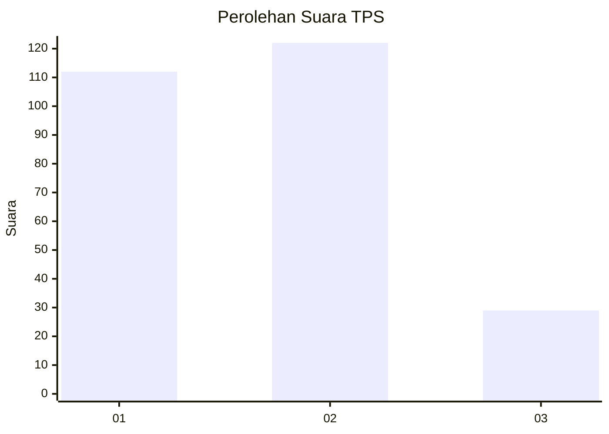
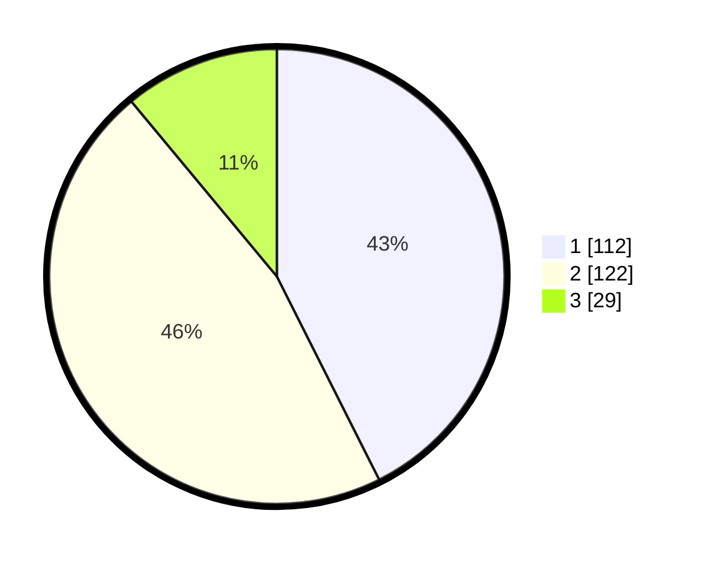

# Hasil

## Grafik

## Tabel

| No. | Nama Paslon    | Suara | Suara (raw) | Persentase |
|:--- |:-------------- | -----:| -----------:| ----------:|
| 1   | ANIES MUHAIMIN | 112   | [112][p-1]  | 42,59      |
| 2   | PRABOWO GIBRAN | 122   | [122][p-2]  | 46,39      |
| 3   | GANJAR MAHFUD  | 29    | [29][p-3]   | 11,03      |

[p-1]: https://github.com/gigit-pemilu/pemilu-2024-35-jawa-timur/blob/main/pilpres/hitung-suara/sub/35-jawa-timur/sub/28-pamekasan/sub/01-tlanakan/sub/2011-larangan-tokol/sub/017-tps/sub/paslon-1.txt
[p-2]: https://github.com/gigit-pemilu/pemilu-2024-35-jawa-timur/blob/main/pilpres/hitung-suara/sub/35-jawa-timur/sub/28-pamekasan/sub/01-tlanakan/sub/2011-larangan-tokol/sub/017-tps/sub/paslon-2.txt
[p-3]: https://github.com/gigit-pemilu/pemilu-2024-35-jawa-timur/blob/main/pilpres/hitung-suara/sub/35-jawa-timur/sub/28-pamekasan/sub/01-tlanakan/sub/2011-larangan-tokol/sub/017-tps/sub/paslon-3.txt

## Foto C Plano

https://sirekap-obj-formc.kpu.go.id/0577/pemilu/ppwp/35/28/01/20/11/3528012011017-20240214-235726--2d35c8bd-e315-4151-9d0c-6774a5a03886.jpg

https://sirekap-obj-formc.kpu.go.id/0577/pemilu/ppwp/35/28/01/20/11/3528012011017-20240214-212417--d81caa07-5898-4c30-a825-8291a3a66d7b.jpg

https://sirekap-obj-formc.kpu.go.id/0577/pemilu/ppwp/35/28/01/20/11/3528012011017-20240214-212414--af9ef45a-e330-400a-8138-718d03e4974d.jpg

## Metadata

| Key        | Value               |
| ---------- | ------------------- |
| Time Stamp | 2024-02-15 18:00:26 |

