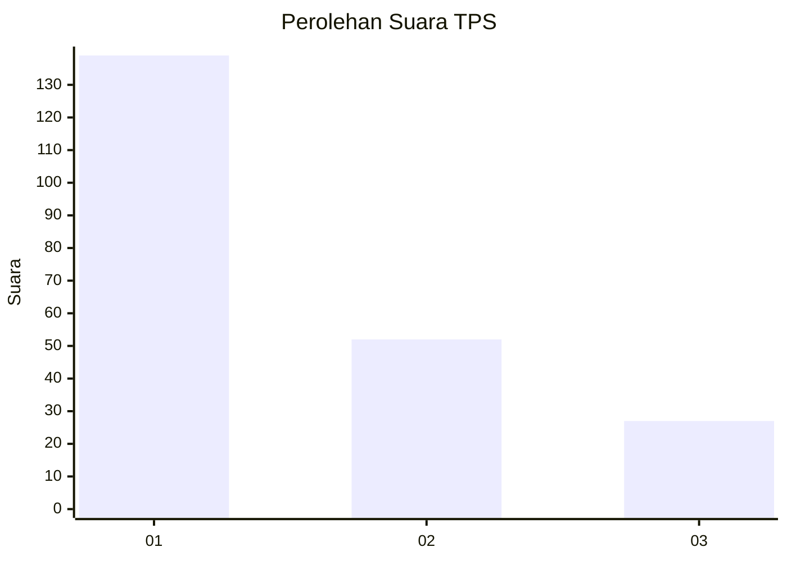
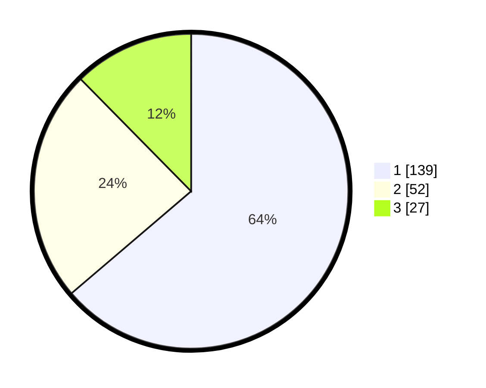

# Hasil

## Grafik

## Tabel

| No. | Nama Paslon    | Suara | Suara (raw) | Persentase |
|:--- |:-------------- | -----:| -----------:| ----------:|
| 1   | ANIES MUHAIMIN | 139   | [139][p-1]  | 63,76      |
| 2   | PRABOWO GIBRAN | 52    | [52][p-2]   | 23,85      |
| 3   | GANJAR MAHFUD  | 27    | [27][p-3]   | 12,39      |

[p-1]: https://github.com/gigit-pemilu/pemilu-2024-35-jawa-timur/blob/main/pilpres/hitung-suara/sub/35-jawa-timur/sub/28-pamekasan/sub/01-tlanakan/sub/2011-larangan-tokol/sub/018-tps/sub/paslon-1.txt
[p-2]: https://github.com/gigit-pemilu/pemilu-2024-35-jawa-timur/blob/main/pilpres/hitung-suara/sub/35-jawa-timur/sub/28-pamekasan/sub/01-tlanakan/sub/2011-larangan-tokol/sub/018-tps/sub/paslon-2.txt
[p-3]: https://github.com/gigit-pemilu/pemilu-2024-35-jawa-timur/blob/main/pilpres/hitung-suara/sub/35-jawa-timur/sub/28-pamekasan/sub/01-tlanakan/sub/2011-larangan-tokol/sub/018-tps/sub/paslon-3.txt

## Foto C Plano

https://sirekap-obj-formc.kpu.go.id/e434/pemilu/ppwp/35/28/01/20/11/3528012011018-20240215-122115--c15bafb7-5025-4570-a5ec-29d83032c24c.jpg

https://sirekap-obj-formc.kpu.go.id/e434/pemilu/ppwp/35/28/01/20/11/3528012011018-20240215-122331--6ae4324f-77ae-458f-a54e-edc154b29a14.jpg

https://sirekap-obj-formc.kpu.go.id/e434/pemilu/ppwp/35/28/01/20/11/3528012011018-20240215-122431--c60cf860-f42e-4e74-a581-6b5ba042cd6b.jpg

## Metadata

| Key        | Value               |
| ---------- | ------------------- |
| Time Stamp | 2024-02-24 22:31:28 |

