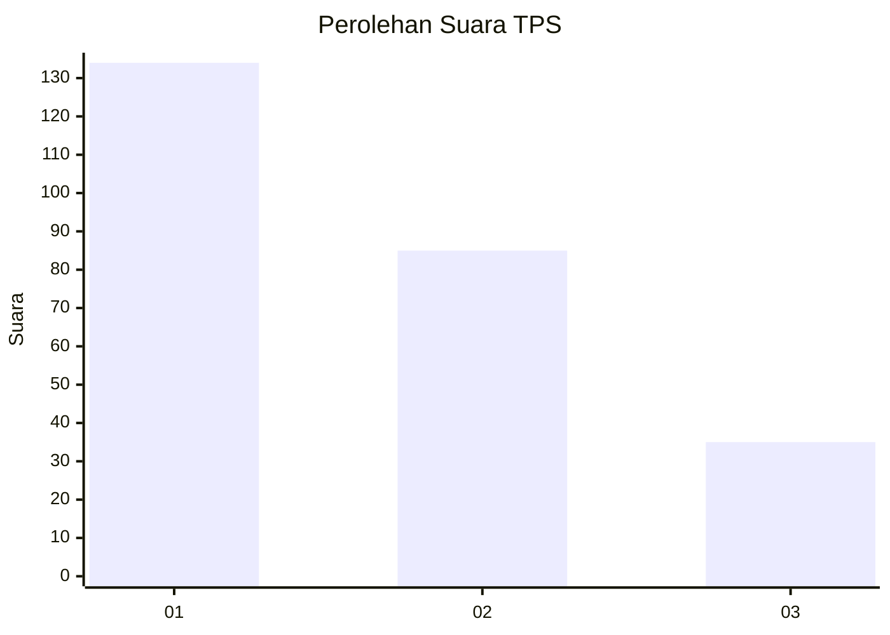
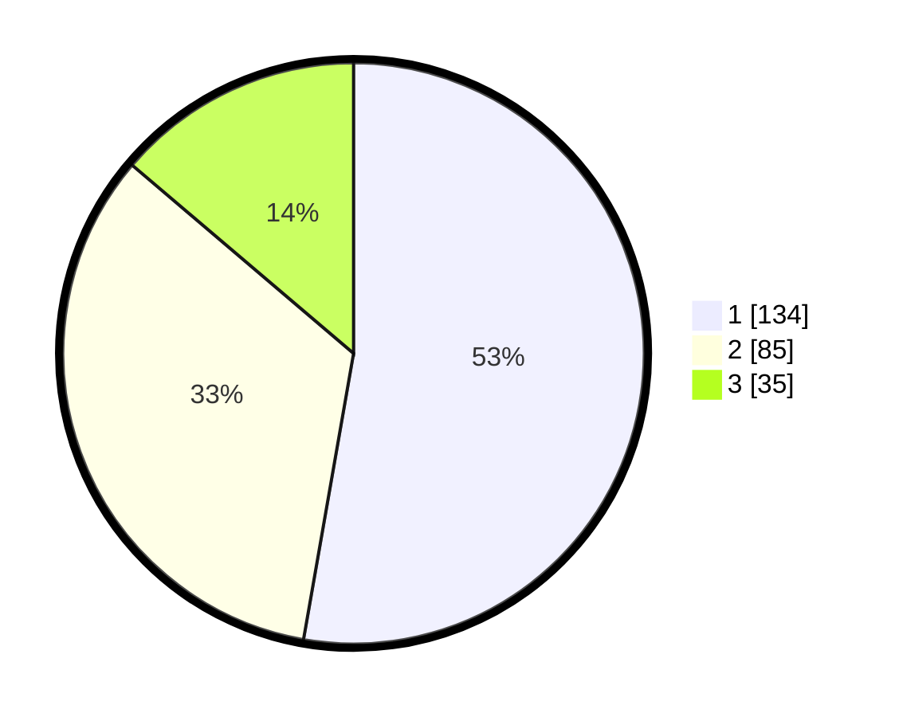

# Hasil

## Grafik

## Tabel

| No. | Nama Paslon    | Suara | Suara (raw) | Persentase |
|:--- |:-------------- | -----:| -----------:| ----------:|
| 1   | ANIES MUHAIMIN | 134   | [134][p-1]  | 52,76      |
| 2   | PRABOWO GIBRAN | 85    | [85][p-2]   | 33,46      |
| 3   | GANJAR MAHFUD  | 35    | [35][p-3]   | 13,78      |

[p-1]: https://github.com/gigit-pemilu/pemilu-2024/blob/main/pilpres/hitung-suara/sub/35-jawa-timur/sub/28-pamekasan/sub/01-tlanakan/sub/2011-larangan-tokol/sub/019-tps/sub/paslon-1.txt
[p-2]: https://github.com/gigit-pemilu/pemilu-2024/blob/main/pilpres/hitung-suara/sub/35-jawa-timur/sub/28-pamekasan/sub/01-tlanakan/sub/2011-larangan-tokol/sub/019-tps/sub/paslon-2.txt
[p-3]: https://github.com/gigit-pemilu/pemilu-2024/blob/main/pilpres/hitung-suara/sub/35-jawa-timur/sub/28-pamekasan/sub/01-tlanakan/sub/2011-larangan-tokol/sub/019-tps/sub/paslon-3.txt

## Foto C Plano

https://sirekap-obj-formc.kpu.go.id/ccf1/pemilu/ppwp/35/28/01/20/11/3528012011019-20240215-102829--c6144811-eaf8-4ebc-95df-d523b283eaa2.jpg

https://sirekap-obj-formc.kpu.go.id/ccf1/pemilu/ppwp/35/28/01/20/11/3528012011019-20240215-102618--2ed94b24-2681-4186-a392-3575c7f2c03d.jpg

https://sirekap-obj-formc.kpu.go.id/ccf1/pemilu/ppwp/35/28/01/20/11/3528012011019-20240215-103608--2559aa0a-f200-4c20-95ab-b9630501c099.jpg

## Metadata

| Key        | Value               |
| ---------- | ------------------- |
| Time Stamp | 2024-02-15 20:30:46 |

