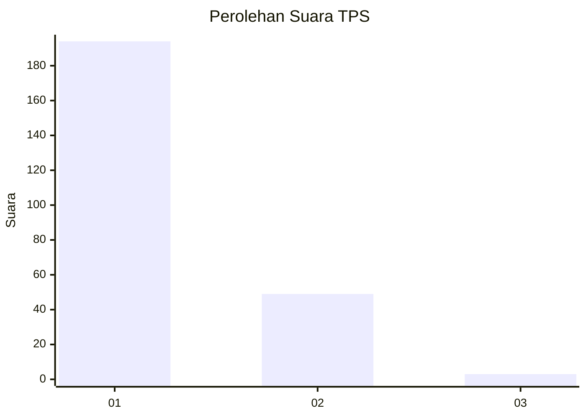
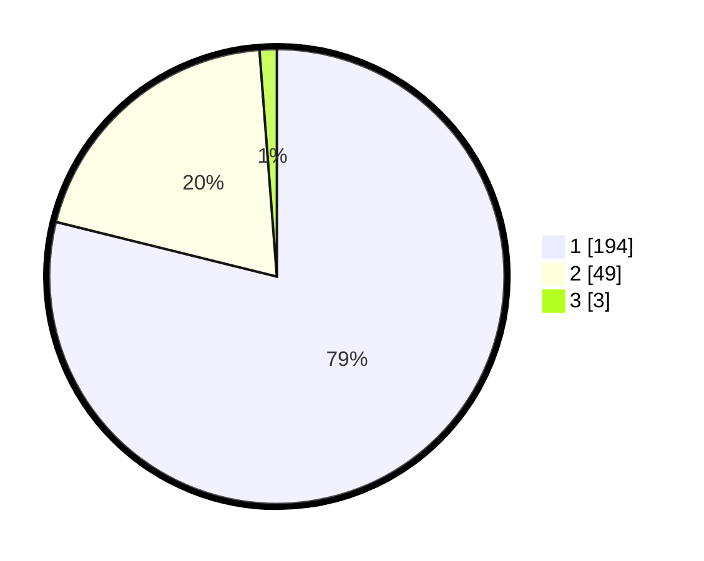

# Hasil

## Grafik

## Tabel

| No. | Nama Paslon    | Suara | Suara (raw) | Persentase |
|:--- |:-------------- | -----:| -----------:| ----------:|
| 1   | ANIES MUHAIMIN | 194   | [194][p-1]  | 78,86      |
| 2   | PRABOWO GIBRAN | 49    | [49][p-2]   | 19,92      |
| 3   | GANJAR MAHFUD  | 3     | [3][p-3]    | 1,22       |

[p-1]: https://github.com/gigit-pemilu/pemilu-2024-35-jawa-timur/blob/main/pilpres/hitung-suara/sub/35-jawa-timur/sub/28-pamekasan/sub/01-tlanakan/sub/2011-larangan-tokol/sub/021-tps/sub/paslon-1.txt
[p-2]: https://github.com/gigit-pemilu/pemilu-2024-35-jawa-timur/blob/main/pilpres/hitung-suara/sub/35-jawa-timur/sub/28-pamekasan/sub/01-tlanakan/sub/2011-larangan-tokol/sub/021-tps/sub/paslon-2.txt
[p-3]: https://github.com/gigit-pemilu/pemilu-2024-35-jawa-timur/blob/main/pilpres/hitung-suara/sub/35-jawa-timur/sub/28-pamekasan/sub/01-tlanakan/sub/2011-larangan-tokol/sub/021-tps/sub/paslon-3.txt

## Foto C Plano

https://sirekap-obj-formc.kpu.go.id/6fbb/pemilu/ppwp/35/28/01/20/11/3528012011021-20240215-013018--8a1cf70d-663d-4208-b667-b530f6a78e9e.jpg

https://sirekap-obj-formc.kpu.go.id/6fbb/pemilu/ppwp/35/28/01/20/11/3528012011021-20240215-013453--700fe546-0d90-468d-a674-c5dfdcc05e5b.jpg

https://sirekap-obj-formc.kpu.go.id/6fbb/pemilu/ppwp/35/28/01/20/11/3528012011021-20240215-013619--c3635489-b1b4-47ea-8e78-75505f46971f.jpg

## Metadata

| Key        | Value               |
| ---------- | ------------------- |
| Time Stamp | 2024-02-15 17:00:25 |

