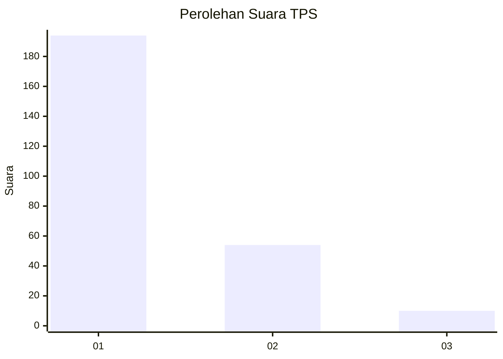
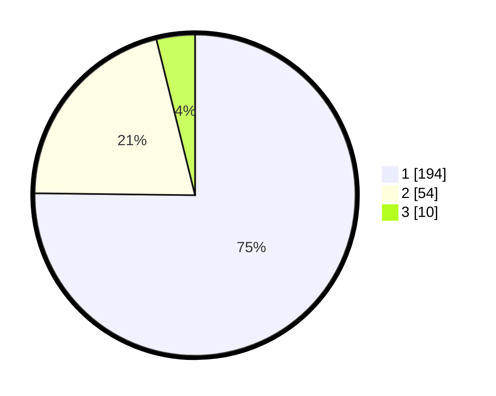

# Hasil

## Grafik

## Tabel

| No. | Nama Paslon    | Suara | Suara (raw) | Persentase |
|:--- |:-------------- | -----:| -----------:| ----------:|
| 1   | ANIES MUHAIMIN | 194   | [194][p-1]  | 75,19      |
| 2   | PRABOWO GIBRAN | 54    | [54][p-2]   | 20,93      |
| 3   | GANJAR MAHFUD  | 10    | [10][p-3]   | 3,88       |

[p-1]: https://github.com/gigit-pemilu/pemilu-2024-35-jawa-timur/blob/main/pilpres/hitung-suara/sub/35-jawa-timur/sub/28-pamekasan/sub/01-tlanakan/sub/2011-larangan-tokol/sub/022-tps/sub/paslon-1.txt
[p-2]: https://github.com/gigit-pemilu/pemilu-2024-35-jawa-timur/blob/main/pilpres/hitung-suara/sub/35-jawa-timur/sub/28-pamekasan/sub/01-tlanakan/sub/2011-larangan-tokol/sub/022-tps/sub/paslon-2.txt
[p-3]: https://github.com/gigit-pemilu/pemilu-2024-35-jawa-timur/blob/main/pilpres/hitung-suara/sub/35-jawa-timur/sub/28-pamekasan/sub/01-tlanakan/sub/2011-larangan-tokol/sub/022-tps/sub/paslon-3.txt

## Foto C Plano

https://sirekap-obj-formc.kpu.go.id/4e28/pemilu/ppwp/35/28/01/20/11/3528012011022-20240216-150200--02b96c8b-ec57-405b-bf47-8760272aadb6.jpg

https://sirekap-obj-formc.kpu.go.id/4e28/pemilu/ppwp/35/28/01/20/11/3528012011022-20240216-165509--f826b0b2-ce7b-42f3-b769-7f6245c36a5e.jpg

https://sirekap-obj-formc.kpu.go.id/4e28/pemilu/ppwp/35/28/01/20/11/3528012011022-20240216-150502--7a764af6-4f6b-4063-80b3-1ba27bf94e10.jpg

## Metadata

| Key        | Value               |
| ---------- | ------------------- |
| Time Stamp | 2024-02-16 17:00:00 |

