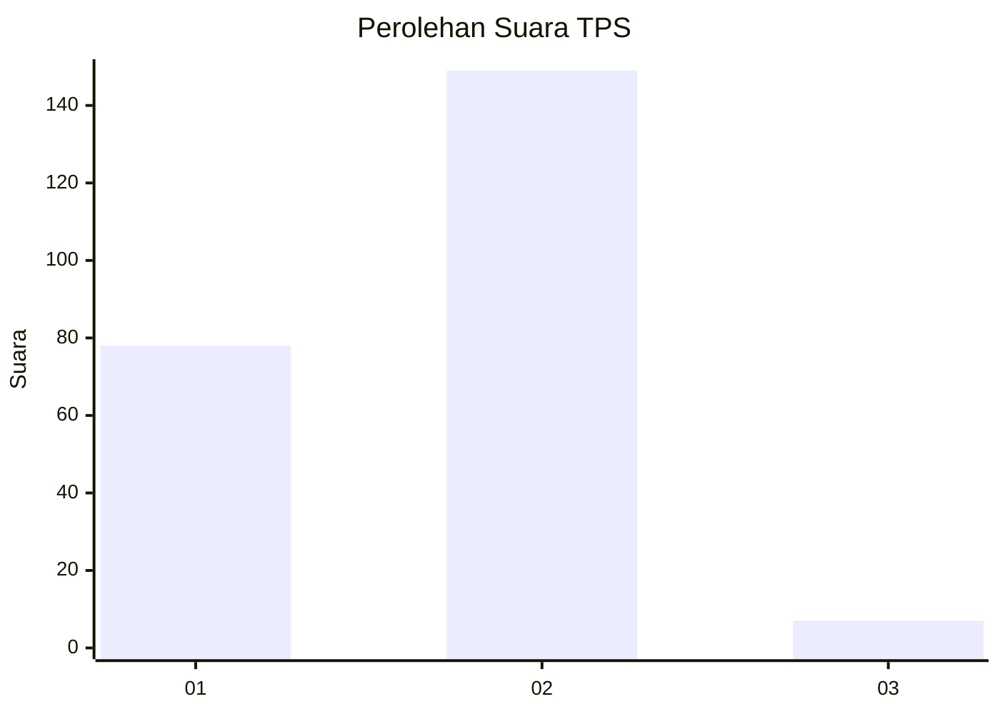
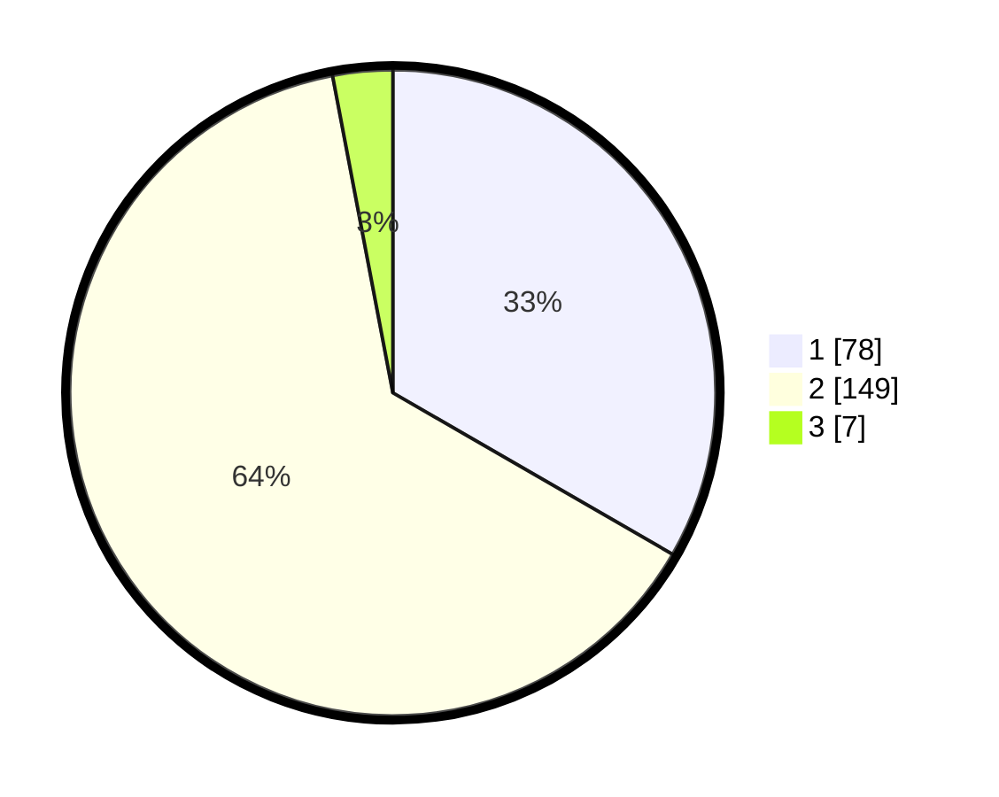

# Hasil

## Grafik

## Tabel

| No. | Nama Paslon    | Suara | Suara (raw) | Persentase |
|:--- |:-------------- | -----:| -----------:| ----------:|
| 1   | ANIES MUHAIMIN | 78    | [78][p-1]   | 33,33      |
| 2   | PRABOWO GIBRAN | 149   | [149][p-2]  | 63,68      |
| 3   | GANJAR MAHFUD  | 7     | [7][p-3]    | 2,99       |

[p-1]: https://github.com/gigit-pemilu/pemilu-2024/blob/main/pilpres/hitung-suara/sub/35-jawa-timur/sub/28-pamekasan/sub/01-tlanakan/sub/2012-ceguk/sub/002-tps/sub/paslon-1.txt
[p-2]: https://github.com/gigit-pemilu/pemilu-2024/blob/main/pilpres/hitung-suara/sub/35-jawa-timur/sub/28-pamekasan/sub/01-tlanakan/sub/2012-ceguk/sub/002-tps/sub/paslon-2.txt
[p-3]: https://github.com/gigit-pemilu/pemilu-2024/blob/main/pilpres/hitung-suara/sub/35-jawa-timur/sub/28-pamekasan/sub/01-tlanakan/sub/2012-ceguk/sub/002-tps/sub/paslon-3.txt

## Foto C Plano

https://sirekap-obj-formc.kpu.go.id/f502/pemilu/ppwp/35/28/01/20/12/3528012012002-20240215-011816--7a2f574f-e443-4cfb-b9fb-a6063924f70c.jpg

https://sirekap-obj-formc.kpu.go.id/f502/pemilu/ppwp/35/28/01/20/12/3528012012002-20240215-011949--943c782e-c960-4e9f-aefe-75957d1a33e6.jpg

https://sirekap-obj-formc.kpu.go.id/f502/pemilu/ppwp/35/28/01/20/12/3528012012002-20240215-012128--7d7d5fb4-467e-40bd-826a-5e183f6bbbc3.jpg

## Metadata

| Key        | Value               |
| ---------- | ------------------- |
| Time Stamp | 2024-02-19 10:00:00 |

