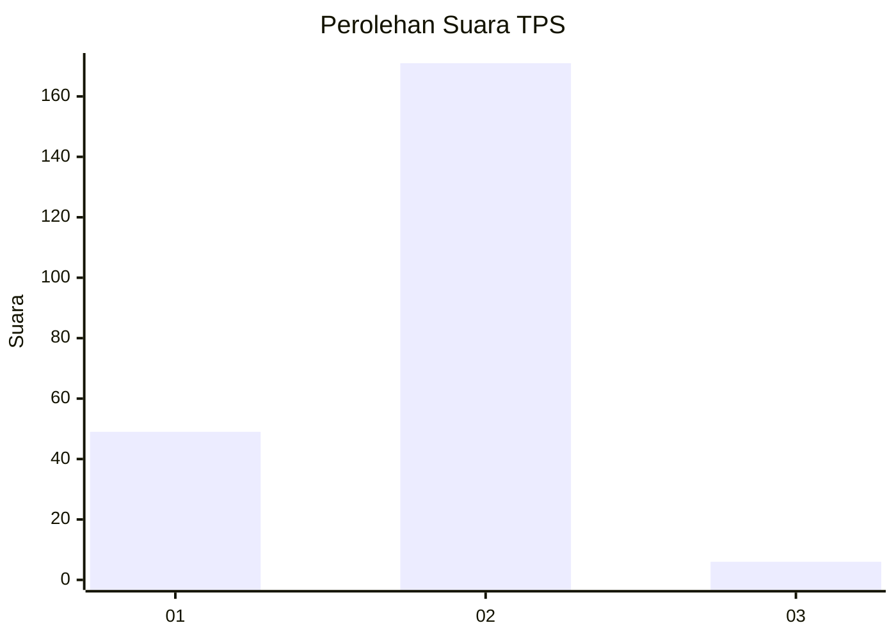

# Hasil

## Grafik

## Tabel

| No. | Nama Paslon    | Suara | Suara (raw) | Persentase |
|:--- |:-------------- | -----:| -----------:| ----------:|
| 1   | ANIES MUHAIMIN | 49    | [49][p-1]   | 21,68      |
| 2   | PRABOWO GIBRAN | 171   | [171][p-2]  | 75,66      |
| 3   | GANJAR MAHFUD  | 6     | [6][p-3]    | 2,65       |

[p-1]: https://github.com/gigit-pemilu/pemilu-2024/blob/main/pilpres/hitung-suara/sub/35-jawa-timur/sub/28-pamekasan/sub/01-tlanakan/sub/2012-ceguk/sub/003-tps/sub/paslon-1.txt
[p-2]: https://github.com/gigit-pemilu/pemilu-2024/blob/main/pilpres/hitung-suara/sub/35-jawa-timur/sub/28-pamekasan/sub/01-tlanakan/sub/2012-ceguk/sub/003-tps/sub/paslon-2.txt
[p-3]: https://github.com/gigit-pemilu/pemilu-2024/blob/main/pilpres/hitung-suara/sub/35-jawa-timur/sub/28-pamekasan/sub/01-tlanakan/sub/2012-ceguk/sub/003-tps/sub/paslon-3.txt

## Foto C Plano

https://sirekap-obj-formc.kpu.go.id/7f1c/pemilu/ppwp/35/28/01/20/12/3528012012003-20240215-064305--d6c6027b-321b-42aa-ac06-62f21ac04069.jpg

https://sirekap-obj-formc.kpu.go.id/7f1c/pemilu/ppwp/35/28/01/20/12/3528012012003-20240215-064505--a09dcea2-fdfb-40f0-8778-58dc9dd9786a.jpg

https://sirekap-obj-formc.kpu.go.id/7f1c/pemilu/ppwp/35/28/01/20/12/3528012012003-20240215-064615--31c1e845-9ba3-4c4a-b513-79f8191b82db.jpg

## Metadata

| Key        | Value               |
| ---------- | ------------------- |
| Time Stamp | 2024-02-15 21:01:18 |

