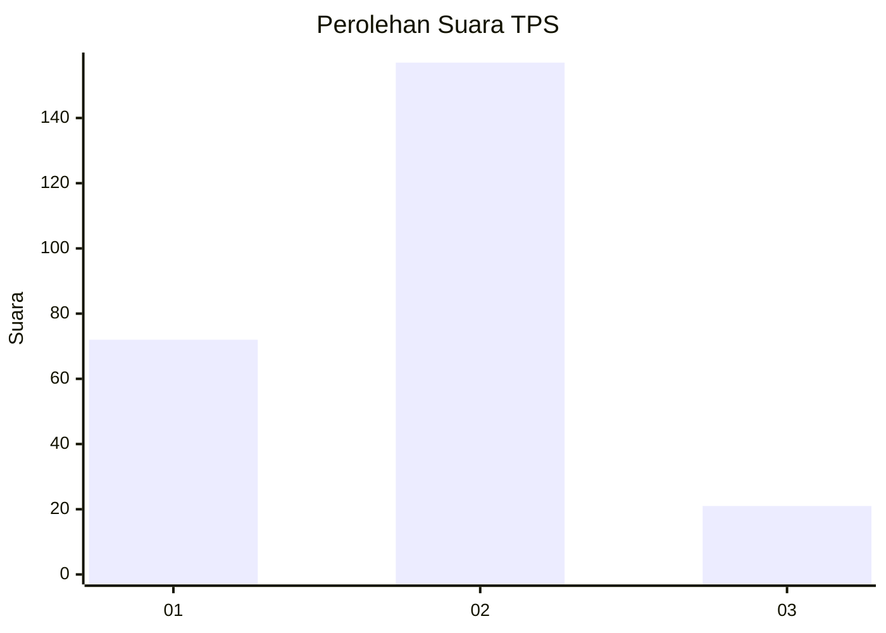
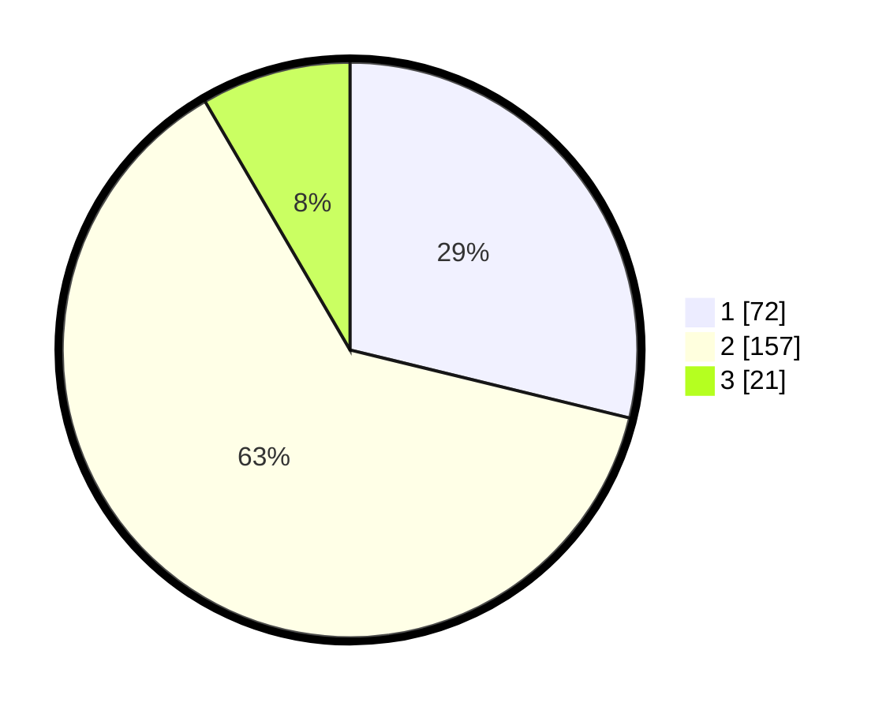

# Hasil

## Grafik

## Tabel

| No. | Nama Paslon    | Suara | Suara (raw) | Persentase |
|:--- |:-------------- | -----:| -----------:| ----------:|
| 1   | ANIES MUHAIMIN | 72    | [72][p-1]   | 28,80      |
| 2   | PRABOWO GIBRAN | 157   | [157][p-2]  | 62,80      |
| 3   | GANJAR MAHFUD  | 21    | [21][p-3]   | 8,40       |

[p-1]: https://github.com/gigit-pemilu/pemilu-2024/blob/main/pilpres/hitung-suara/sub/35-jawa-timur/sub/28-pamekasan/sub/01-tlanakan/sub/2015-gugul/sub/007-tps/sub/paslon-1.txt
[p-2]: https://github.com/gigit-pemilu/pemilu-2024/blob/main/pilpres/hitung-suara/sub/35-jawa-timur/sub/28-pamekasan/sub/01-tlanakan/sub/2015-gugul/sub/007-tps/sub/paslon-2.txt
[p-3]: https://github.com/gigit-pemilu/pemilu-2024/blob/main/pilpres/hitung-suara/sub/35-jawa-timur/sub/28-pamekasan/sub/01-tlanakan/sub/2015-gugul/sub/007-tps/sub/paslon-3.txt

## Foto C Plano

https://sirekap-obj-formc.kpu.go.id/4d23/pemilu/ppwp/35/28/01/20/15/3528012015007-20240215-012248--515c105e-3266-4ce5-ad3e-9081b9777e32.jpg

https://sirekap-obj-formc.kpu.go.id/4d23/pemilu/ppwp/35/28/01/20/15/3528012015007-20240215-012504--0d783834-f108-4be9-bb47-07d798ba125c.jpg

https://sirekap-obj-formc.kpu.go.id/4d23/pemilu/ppwp/35/28/01/20/15/3528012015007-20240215-012702--a44b6504-aa79-439a-b4d0-499aeaf947c6.jpg

## Metadata

| Key        | Value               |
| ---------- | ------------------- |
| Time Stamp | 2024-02-15 17:00:25 |

