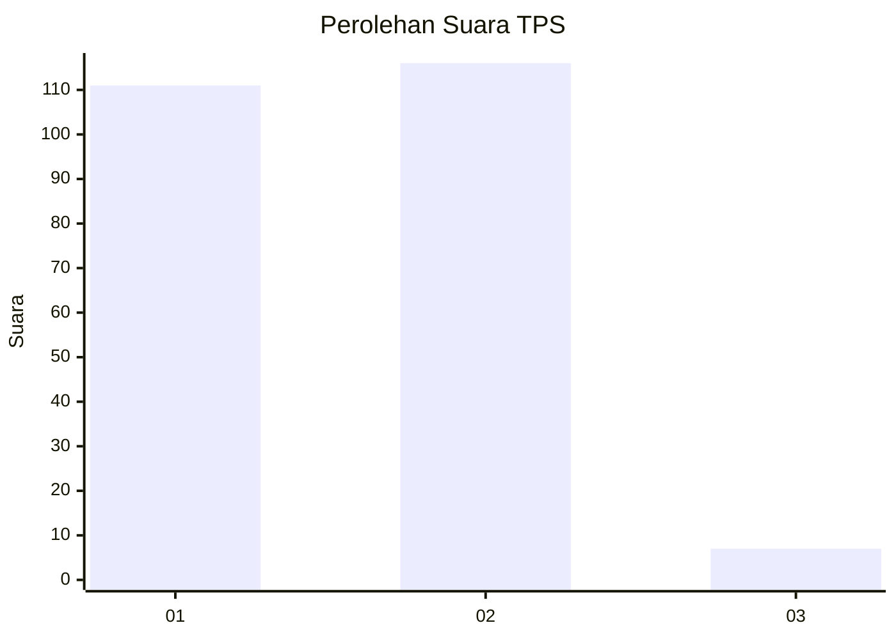
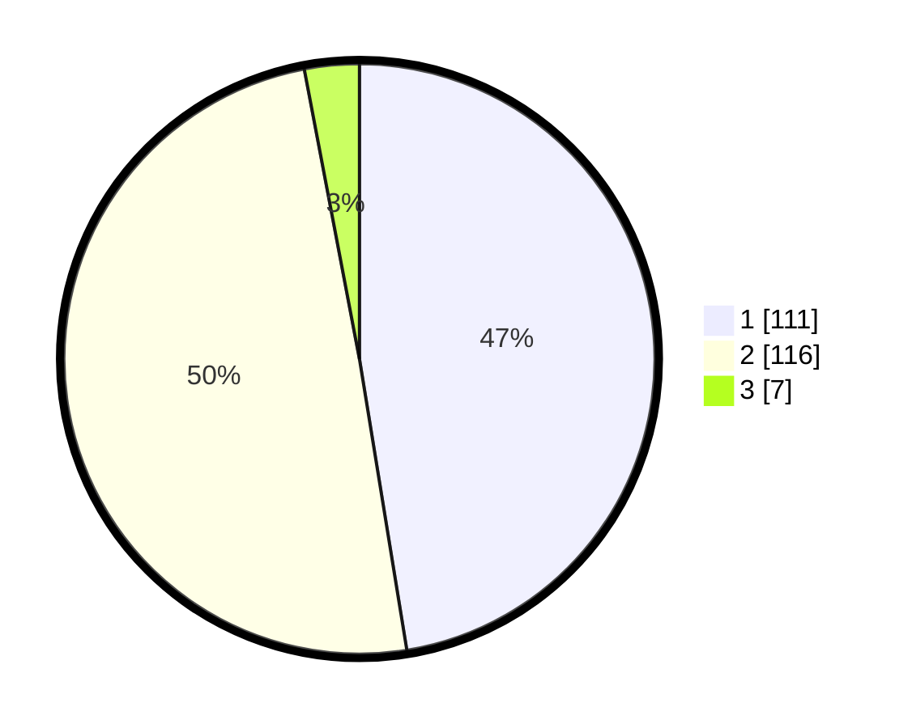

# Hasil

## Grafik

## Tabel

| No. | Nama Paslon    | Suara | Suara (raw) | Persentase |
|:--- |:-------------- | -----:| -----------:| ----------:|
| 1   | ANIES MUHAIMIN | 111   | [111][p-1]  | 47,44      |
| 2   | PRABOWO GIBRAN | 116   | [116][p-2]  | 49,57      |
| 3   | GANJAR MAHFUD  | 7     | [7][p-3]    | 2,99       |

[p-1]: https://github.com/gigit-pemilu/pemilu-2024-35-jawa-timur/blob/main/pilpres/hitung-suara/sub/35-jawa-timur/sub/28-pamekasan/sub/01-tlanakan/sub/2017-taro'an/sub/003-tps/sub/paslon-1.txt
[p-2]: https://github.com/gigit-pemilu/pemilu-2024-35-jawa-timur/blob/main/pilpres/hitung-suara/sub/35-jawa-timur/sub/28-pamekasan/sub/01-tlanakan/sub/2017-taro'an/sub/003-tps/sub/paslon-2.txt
[p-3]: https://github.com/gigit-pemilu/pemilu-2024-35-jawa-timur/blob/main/pilpres/hitung-suara/sub/35-jawa-timur/sub/28-pamekasan/sub/01-tlanakan/sub/2017-taro'an/sub/003-tps/sub/paslon-3.txt

## Foto C Plano

https://sirekap-obj-formc.kpu.go.id/5047/pemilu/ppwp/35/28/01/20/17/3528012017003-20240215-090413--c1a455f6-9b63-4fb9-99e9-2808b302b336.jpg

https://sirekap-obj-formc.kpu.go.id/5047/pemilu/ppwp/35/28/01/20/17/3528012017003-20240215-090613--1aa02712-8d8a-4c08-9422-fecae8fd325a.jpg

https://sirekap-obj-formc.kpu.go.id/5047/pemilu/ppwp/35/28/01/20/17/3528012017003-20240215-082655--aa3ee1af-526d-489d-ba47-4784d4aa4b4e.jpg

## Metadata

| Key        | Value               |
| ---------- | ------------------- |
| Time Stamp | 2024-02-16 13:30:32 |

